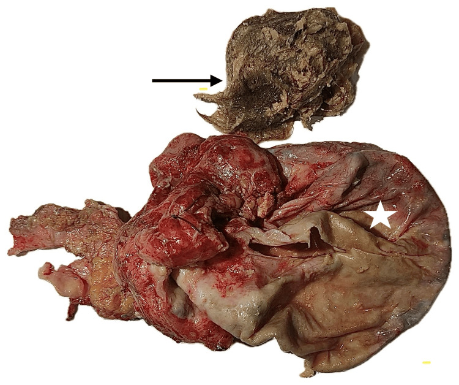

## 문제
A 65-year-old woman comes to the physician because of lower abdominal pain and bloating for 2 months. She has had a 4-kg weight loss during this period. Menopause occurred at age 52 years. Abdominal examination shows a firm mass arising from the pelvis. Pelvic ultrasonography shows a 12-cm complex right adnexal mass with a solid nodule in its wall. Serum CA 125 concentration is 48 U/mL (N<35). At laparotomy, the right ovarian cyst ruptures during removal. The opened specimen is shown. Microscopic examination of the solid mural nodule shows an invasive malignant tumor. Which of the following is the most likely type of this malignancy?

- A. Squamous cell carcinoma
- B. Adenocarcinoma
- C. Papillary thyroid carcinoma
- D. Malignant melanoma
- E. Carcinoid tumor

_Photograph of the opened surgical specimen — single-panel figure as published, star and arrow as in the original (PMC Open Access Subset, CC BY; no cropping or color change)_

## 정답 및 해설
> 정답: A

- **정답 핵심**: The opened cyst (star) contains a mass of matted hair with bone fragments (arrow) — a mature cystic teratoma (dermoid cyst). Malignant transformation occurs in about 1–2 % of these tumors, mainly in postmenopausal women with large (>10 cm), rapidly growing cysts with a solid mural component. About 80 % of these malignancies are squamous cell carcinomas, arising from the squamous epithelium that lines the cyst.
- **원리**: <b>What the specimen shows</b>: a mature cystic teratoma is a benign germ cell tumor that differentiates into tissues of all three germ layers, but ectoderm dominates: the cyst wall is lined by <b>keratinizing squamous epithelium with skin adnexa</b> (hair follicles, sebaceous glands), so the lumen fills with sebum and hair. Bone and teeth (mesoderm) often sit in a raised nodule called the Rokitansky protuberance.  <b>Why the cancer is usually squamous</b>: malignancy arises from the most abundant tissue — the squamous lining — through the same steps as skin cancer, so about 80 % are squamous cell carcinomas, often in the Rokitansky nodule. Adenocarcinomas, sarcomas, melanomas, and carcinoids together make up the rest.  <b>Who is at risk</b>: age over 45, size over 10 cm, rapid growth, a solid enhancing wall nodule, and raised SCC antigen or CA 125. Rupture spills malignant cells and worsens prognosis — hence the attempt to remove these cysts intact.
- **비교**: <table><thead><tr><th style="width:26%">Feature</th><th style="width:37%">Squamous cell carcinoma (answer)</th><th>Adenocarcinoma (closest rival)</th></tr></thead><tbody> <tr><td>Origin in the teratoma</td><td><b>Keratinizing squamous lining</b> — the dominant tissue</td><td>Glandular (respiratory or intestinal) elements</td></tr> <tr><td>Frequency among malignant transformations</td><td><b>About 80 %</b></td><td>About 5–10 %</td></tr> <tr><td>Typical marker</td><td>SCC antigen</td><td>CEA, CA 19-9</td></tr> <tr><td>Typical patient</td><td>Postmenopausal, cyst over 10 cm</td><td>Same age group, rarer</td></tr> </tbody></table> Ask "which tissue is most abundant in a dermoid?" and the answer follows: the skin-like lining becomes skin-type cancer.
- **오답 이유**:
  - (B) Adenocarcinoma is the second most common malignant transformation, arising from glandular elements in the teratoma. It would be the answer if the nodule formed glands with mucin and was CEA positive, but it accounts for only a small minority.
  - (C) Papillary thyroid carcinoma arises in struma ovarii, a teratoma composed mostly of thyroid tissue. It would fit a solid, brownish mass of thyroid follicles, sometimes with hyperthyroidism, rather than a hair-filled cyst.
  - (D) Melanoma can arise from melanocytes in the teratoma's skin elements, but it is rare. It would be the answer if the nodule were pigmented and S100/SOX10 positive.
  - (E) Carcinoid tumor arises in teratomas with intestinal or respiratory epithelium and can cause carcinoid syndrome without liver metastases. It fits a small yellow solid nodule with neuroendocrine markers, not an invasive keratinizing tumor.
- **함정**: Name the cyst first from the hair and bone; then the malignancy follows the dominant lining — squamous epithelium.
- **학습목표**: 털·뼈를 담은 성숙낭성기형종을 육안 표본으로 알아보고, 그 악성 변화의 가장 흔한 조직형이 편평세포암임을 안다
- **근거·출처**: Hackethal A et al. Squamous-cell carcinoma in mature cystic teratoma of the ovary: systematic review and analysis of published data. Lancet Oncol 2008;9:1173 · Robbins and Cotran Pathologic Basis of Disease, 10th ed. — germ cell tumors of the ovary · PMC12780604 Figure 2 — 65세 여 증례 보고의 적출 표본 (teacher-only) · 작성자 판독(2026-10-02): 터져 열린 난소 낭종(별)과 털·뼈 조각이 엉킨 덩어리(화살표)

## 출처
- Unexpected Malignancy: Squamous Cell Carcinoma Arising in an Ovarian Mature Cystic Teratoma Diagnosed Postoperatively. Cureus. 2025 Dec 8;17(12):e98775. doi: 10.7759/cureus.98775 (CC BY) — Figure 2 · CC BY · https://creativecommons.org/licenses/
