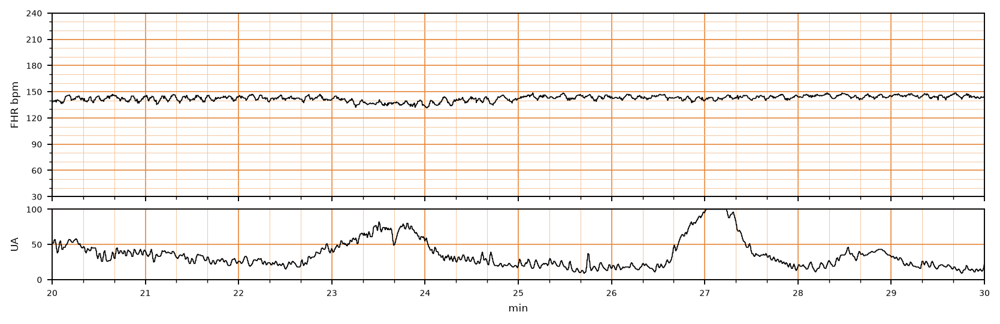

## 문제
A 28-year-old nulligravid woman at 40 weeks' gestation comes to the labor and delivery unit because of regular painful contractions for 6 hours. Her pregnancy has been uncomplicated. Her temperature is 36.9°C, pulse is 88/min, and blood pressure is 118/72 mm Hg. Fetal membranes are intact. On admission, the cervix was 3 cm dilated and 80% effaced with the vertex at -1 station. Four hours later, the cervix is 4 cm dilated, 90% effaced, and the vertex is at -1 station. Estimated fetal weight is 3,300 g. She requests epidural analgesia. A segment of the external fetal heart rate and uterine activity tracing is shown. Which of the following is the most appropriate next step in management?

- A. Maternal repositioning, oxygen, and an intravenous fluid bolus
- B. Fetal scalp blood sampling
- C. Administration of terbutaline
- D. Continue expectant management of labor
- E. Cesarean delivery for arrest of dilation

_Intrapartum fetal heart rate (top) and uterine activity (bottom), minutes 20 to 30 of the recording; bold vertical lines = 1 min (CTU-UHB Intrapartum Cardiotocography Database, PhysioNet, ODC-BY 1.0; 4 Hz raw data, no smoothing)_

## 정답 및 해설
> 정답: D

- **정답 핵심**: The tracing shows a baseline of about 140–145/min, moderate variability (amplitude about 6–10/min), and no decelerations, with three contractions in 10 minutes — a Category I tracing without tachysystole. Labor is in the latent phase (< 6 cm), in which progress of 1 cm over 4 hours is not abnormal; a prolonged latent phase in a nullipara is defined as more than 20 hours. With a reassuring fetal status and normal latent-phase progress, expectant management (with epidural analgesia as requested) is appropriate.
- **원리**: <b>Why 6 cm is the line</b>: contemporary labor curves (Zhang, Consortium on Safe Labor) showed that nulliparous women can take more than 6 hours to go from 4 to 5 cm and more than 3 hours from 5 to 6 cm, while after 6 cm dilation accelerates. Active labor is therefore defined as starting at <b>6 cm</b>, and arrest of dilation can be diagnosed only at <b>≥ 6 cm with ruptured membranes</b> and no change for ≥ 4 hours of adequate contractions (or ≥ 6 hours of oxytocin with inadequate contractions).  <b>Reading the tracing</b>: baseline 110–160/min, moderate variability (6–25/min), and no late, variable, or prolonged decelerations make it Category I; accelerations are not required. Three contractions in 10 minutes is within the normal ≤ 5 in 10 minutes, so there is no tachysystole to correct.  <b>So</b> nothing in the mother or fetus requires intervention: the fetus is well oxygenated, and slow latent-phase progress is normal physiology. Intervening here (cesarean, scalp sampling, tocolysis) adds risk without a target.
- **비교**: <table><thead><tr><th style="width:26%">Criterion</th><th style="width:37%">This patient — continue labor (answer)</th><th>Arrest of dilation — cesarean (closest rival)</th></tr></thead><tbody> <tr><td>Dilation</td><td><b>4 cm (latent phase)</b></td><td>≥ 6 cm (active phase)</td></tr> <tr><td>Membranes</td><td>Intact</td><td>Ruptured</td></tr> <tr><td>Time without change</td><td>Progress 3 → 4 cm in 4 h</td><td>No change ≥ 4 h with adequate contractions, or ≥ 6 h on oxytocin</td></tr> <tr><td>Fetal tracing</td><td>Category I</td><td>Not required to be abnormal — the diagnosis is about labor, not fetal status</td></tr> </tbody></table> Slow is not stopped: arrest is a diagnosis of the active phase only. Before 6 cm, the remedies for a slow latent phase are time, rest, amniotomy, or oxytocin — not cesarean.
- **오답 이유**:
  - (A) Intrauterine resuscitation (repositioning, fluids, oxygen) treats a Category II tracing with recurrent late or variable decelerations or minimal variability. It fits if the tracing showed recurrent late decelerations, not this Category I pattern.
  - (B) Fetal scalp blood sampling (rarely used now) assesses acidemia when a tracing is indeterminate, such as minimal variability without accelerations. It has no role with a reassuring Category I tracing and intact membranes.
  - (C) Terbutaline relaxes the uterus for tachysystole (> 5 contractions in 10 minutes) with fetal heart rate changes, or as a bridge before emergency delivery. It fits if the tracing showed 6–7 contractions in 10 minutes with decelerations.
  - (E) Cesarean for arrest of dilation requires ≥ 6 cm dilation with ruptured membranes and no cervical change for ≥ 4 hours despite adequate contractions; it would be correct if she stalled at 7 cm for 5 hours after membrane rupture.
- **함정**: Slow cervical change at 4 cm is latent phase — arrest of dilation cannot be diagnosed before 6 cm.
- **학습목표**: 6 cm 미만의 잠복기에서는 진행이 느려도 분만 정지로 보지 않으며, 범주 I 태아심박동이면 기대 관리로 분만을 계속 지켜본다
- **근거·출처**: American College of Obstetricians and Gynecologists, Society for Maternal-Fetal Medicine. Obstetric Care Consensus No. 1: Safe prevention of the primary cesarean delivery. Obstet Gynecol 2014;123:693 (reaffirmed) · ACOG Practice Bulletin No. 106: Intrapartum fetal heart rate monitoring. Obstet Gynecol 2009;114:192 · 작성자 판독(2026-10-03): 기록 20~30분 — 기저선 140~145 bpm, 중등도 변이도, 가속·감속 없음, 10분에 수축 3회

## 출처
- CTU-UHB Intrapartum Cardiotocography Database (PhysioNet, ODC-BY 1.0) · record 1193 · Open Data Commons Attribution License v1.0 · https://opendatacommons.org/licenses/by/1-0/
