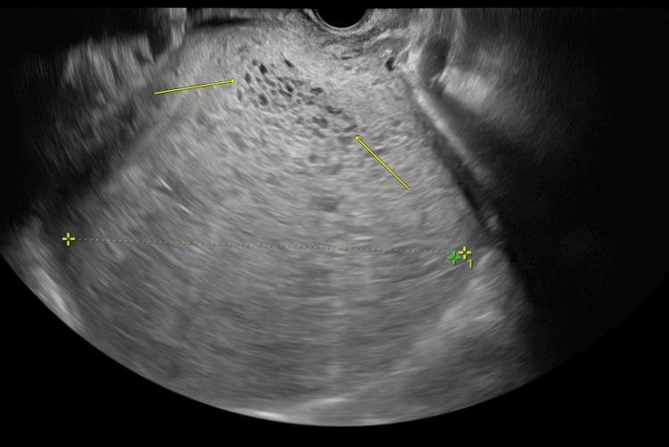

## 문제
47세 여자가 3주 동안 계속된 질 출혈과 두근거림으로 병원에 왔다. 마지막 월경은 14주 전이었다. 최근 2주 동안 손이 떨리고 더위를 참기 어려우며 체중이 3 kg 줄었다. 구역과 구토가 심하다. 갑상샘 질환을 앓은 적이 없고 복용하는 약도 없다. 혈압 148/88 mmHg, 맥박 118회/분, 체온 37.2°C 이다. 안구 돌출은 없고 갑상샘은 커져 있지 않으며 압통이 없다. 자궁은 임신 20주 크기로 커져 있다. 혈청 β-hCG 850,000 mIU/mL, TSH 0.01 µIU/mL 미만(참고치 0.4~4.0), 유리 T4 3.6 ng/dL(참고치 0.8~1.8) 이다. 질식 초음파는 그림과 같다. 이 환자의 갑상샘기능항진증의 기전으로 가장 적절한 것은?

- A. hCG 가 갑상샘자극호르몬 수용체를 자극한다
- B. 갑상샘자극호르몬 수용체 자극 항체가 생긴다
- C. 갑상샘 여포가 파괴되어 저장 호르몬이 새어 나온다
- D. 갑상샘 결절이 자율적으로 호르몬을 만든다
- E. 뇌하수체 선종이 갑상샘자극호르몬을 분비한다

_질식 초음파 — 출판된 증례 그림 한 컷 그대로, 화살표·측정 표시는 원 그림의 것 (PMC Open Access Subset, CC BY — 크롭·보정 없음)_

## 정답 및 해설
> 정답: A

- **정답 핵심**: 초음파에서 자궁강을 채운 고에코 종괴 안에 작은 낭성 공간이 벌집처럼 모여 있고(화살표) 태아는 보이지 않는다 — 완전포상기태다. β-hCG 가 85만으로 매우 높고, TSH 는 억제되었는데 유리 T4 가 높으며 안구돌출·갑상샘종이 없다. hCG 는 TSH 와 α 소단위가 같고 β 소단위·수용체 구조가 비슷해, 농도가 아주 높으면 TSH 수용체를 직접 자극한다. 기태 제거 뒤 hCG 가 떨어지면 갑상샘 기능도 정상화된다.
- **원리**: <b>왜 hCG 가 갑상샘을 자극하나</b>: TSH·LH·FSH·hCG 는 모두 같은 α 소단위에 서로 다른 β 소단위가 붙은 당단백 호르몬이다. hCG 의 β 소단위는 TSH β 와 구조가 닮았고, TSH 수용체와 LH/hCG 수용체도 같은 G 단백 결합 수용체 계열이다. 그래서 hCG 는 TSH 수용체에 약하게 결합한다 — 친화도는 TSH 의 수천분의 일이지만, 농도가 수십만 mIU/mL 가 되면 이 약한 결합만으로 갑상샘이 자극된다.  <b>정상 임신에서도 같은 일이 작게 일어난다</b>: 임신 10~12주 hCG 정점에 TSH 가 살짝 떨어지는 「임신 일과성 갑상샘중독」이 그것이다. 포상기태는 영양막이 지나치게 증식해 hCG 가 훨씬 높아 임상적 갑상샘기능항진증까지 간다.  <b>그래서</b> 갑상샘 자체에는 자가면역 소견(안구돌출·전갑상샘 점액부종·TSI)이 없고, 치료는 원인 제거다 — 흡입소파술 전 β 차단제로 증상을 조절하고(마취 중 갑상샘 폭풍 예방), 기태 제거 뒤 hCG 가 떨어지면 저절로 좋아진다.
- **비교**: <table><thead><tr><th style="width:26%">항목</th><th style="width:37%">hCG 매개(정답)</th><th>그레이브스병(가장 가까운 오답)</th></tr></thead><tbody> <tr><td>자극 물질</td><td><b>hCG</b>(TSH 와 α 소단위 공유)</td><td>TSH 수용체 자극 항체(TSI)</td></tr> <tr><td>갑상샘 밖 소견</td><td>없음</td><td><b>안구돌출·전갑상샘 점액부종</b></td></tr> <tr><td>갑상샘</td><td>대개 커지지 않음</td><td>미만성 갑상샘종·잡음</td></tr> <tr><td>경과</td><td>기태 제거로 hCG 가 떨어지면 정상화</td><td>항갑상샘제·방사성 요오드 필요</td></tr> </tbody></table> 두 경우 모두 TSH 수용체가 자극되어 TSH 가 억제되고 T4 가 오른다. 갈림은 「무엇이 수용체를 누르는가」이고, 그 단서가 hCG 수치·자궁 크기와 자가면역 소견의 유무다.
- **오답 이유**:
  - ② 갑상샘자극 항체는 그레이브스병의 기전이다. 안구돌출·미만성 갑상샘종·전갑상샘 점액부종이 있고 hCG 가 임신 주수에 맞는 수준이었다면 정답이 된다.
  - ③ 여포 파괴로 저장 호르몬이 새는 것은 아급성·무통성·산후 갑상샘염의 기전이다. 갑상샘 압통이나 분만 뒤 발생, 방사성 요오드 섭취율 감소가 있으면 정답이 된다.
  - ④ 자율기능 결절은 독성 결절이나 다결절성 갑상샘종에서 생긴다. 만져지는 결절과 섬광조영의 열결절이 있으면 정답이지만, 이 환자는 갑상샘이 커지지 않았다.
  - ⑤ TSH 분비 뇌하수체 선종이면 T4 가 높은데도 TSH 가 정상이거나 높다. 이 환자는 TSH 가 억제되어 있어 뇌하수체에서 TSH 가 과잉 분비되는 경우가 아니다.
- **함정**: TSH 억제·T4 상승을 보고 그레이브스병으로 가지 않는다 — 안구돌출·갑상샘종이 없고 hCG 가 85만이다.
- **학습목표**: 완전포상기태의 매우 높은 hCG 가 TSH 수용체를 교차 자극해 갑상샘기능항진증을 일으키는 기전을 설명한다
- **근거·출처**: Hershman JM. Physiological and pathological aspects of the effect of human chorionic gonadotropin on the thyroid. Best Pract Res Clin Endocrinol Metab 2004;18:249 · Williams Obstetrics, 26th ed. — Gestational trophoblastic disease · PMC13401662 Figure 3 — 47세 여 증례 보고의 질식 초음파 (teacher-only) · 작성자 판독(2026-10-03): 자궁강을 채운 고에코 종괴 안의 크기가 다양한 작은 무에코 낭성 공간 다발(벌집 모양), 태아·태낭 없음

## 출처
- Complete Molar Pregnancy With Hyperthyroidism, High-Output Heart Failure and Peptoniphilus Species Bacteremia: A Case Report. Cureus. 2026 Jun 25;18(6):e111523. doi: 10.7759/cureus.111523 (CC BY) — Figure 3 · CC BY · https://creativecommons.org/licenses/
