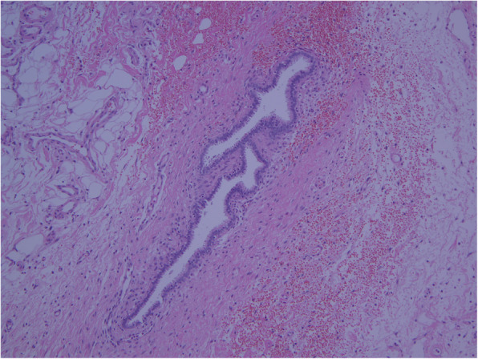

## 문제
36세 여자가 3시간 전 갑자기 시작된 아랫배 통증으로 응급실에 왔다. 몇 년 전부터 월경 때마다 아랫배가 심하게 아프고 성교통이 있었다. 지금은 월경 주기 2일째이다. 혈압 92/58 mmHg, 맥박 112회/분이다. 배 전체에 압통과 반발통이 있다. 소변 hCG 와 혈청 β-hCG 는 음성이다. 혈색소 8.6 g/dL 이다. 복부 초음파에서 골반과 간 주위에 다량의 복강 내 액체가 있다. 응급 복강경에서 약 1,500 mL 의 혈액이 고여 있었고, 양쪽 난소에 초콜릿색 낭종이 있으며, 오른쪽 골반 벽 복막에 출혈하는 갈색 병변이 있었다. 이 병변을 절제한 조직의 헤마톡실린-에오신 염색 소견은 그림과 같다. 진단은?

- A. 황체 낭종 파열
- B. 자궁내막증
- C. 난관 자궁외임신
- D. 복막 장액성 암종
- E. 결핵성 복막염

_헤마톡실린-에오신 염색 조직 절편, 원 배율 ×100 — 출판된 증례 그림 한 컷 그대로 (PMC Open Access Subset, CC BY — 크롭·보정 없음)_

## 정답 및 해설
> 정답: B

- **정답 핵심**: 그림은 섬유·지방조직 안에 원주상피로 덮인 길쭉한 샘이 있고, 샘 둘레를 세포가 촘촘한 간질이 감싸며 주변에 신선한 출혈이 있다 — 자궁 밖에 자궁내막의 샘과 간질이 함께 있는 자궁내막증이다. 월경통·성교통 병력, 양쪽 난소의 초콜릿 낭종, 월경 중 복막 병변의 출혈이 같은 방향을 가리킨다. hCG 가 음성이고 조직에 융모가 없어 자궁외임신이 아니다.
- **원리**: <b>왜 「샘 + 간질」 두 가지가 다 있어야 하나</b>: 자궁내막증은 기능하는 자궁내막 조직이 자궁 밖에 붙어 자라는 병이다. 진단 기준은 조직에서 <b>자궁내막 샘과 자궁내막 간질</b> 중 두 가지(또는 샘·간질·헤모시데린 탐식세포 중 둘)를 보는 것이다. 샘만 있으면 난관내막증·중피 함입과 구별이 안 되고, 간질이 있어야 「자궁내막」이라 말할 수 있다.  <b>왜 피가 나나</b>: 이 조직도 에스트로겐·프로게스테론에 반응해 월경 때 탈락하고 출혈한다. 출혈이 쌓이면 난소의 초콜릿 낭종, 복막의 갈색 병변·섬유화를 만들고, 드물게 병변이나 낭종이 터져 대량 혈복강이 된다. 프로스타글란딘과 염증이 월경통·성교통의 원인이다.  <b>그래서</b> 가임기 여성의 혈복강에서 hCG 가 음성이면 자궁외임신에서 벗어나 황체 출혈·자궁내막증 같은 원인을 찾는다. 조직에 융모(영양막에 덮인 돌기)가 있는지가 자궁외임신을 가르는 결정적 소견이다.
- **비교**: <table><thead><tr><th style="width:26%">항목</th><th style="width:37%">자궁내막증(정답)</th><th>자궁외임신(가장 가까운 오답)</th></tr></thead><tbody> <tr><td>hCG</td><td><b>음성</b></td><td>양성(혈청 β-hCG 상승)</td></tr> <tr><td>조직</td><td><b>자궁내막 샘 + 간질</b>, 헤모시데린 탐식세포</td><td>융모막 융모와 영양막 세포</td></tr> <tr><td>병력</td><td>월경통·성교통·불임, 월경 때 악화</td><td>무월경 뒤 질 출혈·편측 골반통</td></tr> <tr><td>복강경</td><td>초콜릿 낭종, 갈색·검은 복막 병변</td><td>부푼 난관, 난관 파열</td></tr> </tbody></table> 두 경우 모두 가임기 여성이 혈복강으로 쇼크에 빠질 수 있다. hCG 음성과 조직의 「융모 없는 샘·간질」이 답을 가른다.
- **오답 이유**:
  - ① 황체 낭종 파열도 hCG 음성 혈복강을 일으키지만 주기 후반(황체기)에 흔하고 조직은 황체화된 과립막세포다. 월경 주기 22일째이고 조직에 황체 세포가 있었다면 정답이다.
  - ③ 난관 자궁외임신은 가임기 혈복강의 가장 흔한 원인이지만 β-hCG 가 양성이고 조직에 융모가 보여야 한다. hCG 가 양성이고 난관에 융모가 있었다면 정답이 된다.
  - ④ 복막 장액성 암종은 유두 구조와 이형성이 심한 세포·사종체가 보이고 대개 폐경 후 복수와 CA 125 상승으로 온다. 조직에 핵 이형성이 큰 유두 증식이 있으면 정답이 된다.
  - ⑤ 결핵성 복막염은 건락괴사를 동반한 육아종과 다발성 복막 결절·복수가 특징이다. 발열·체중감소와 육아종이 조직에서 보였다면 정답이 된다.
- **함정**: 가임기 혈복강이라고 자궁외임신으로 가지 않는다 — hCG 음성, 조직은 융모 없는 자궁내막 샘과 간질이다.
- **학습목표**: 복막 조직에서 자궁내막 샘과 간질이 함께 보이면 자궁내막증으로 진단하고 융모가 없는 점으로 자궁외임신과 구별한다
- **근거·출처**: Zondervan KT, Becker CM, Missmer SA. Endometriosis. N Engl J Med 2020;382:1244 · Robbins and Cotran Pathologic Basis of Disease, 10th ed. — Endometriosis · PMC7504832 Fig. 2 — 36세 여 증례 보고의 복막 조직 (teacher-only) · 작성자 판독(2026-10-03): 섬유지방 조직 안에 원주상피 샘과 둘레의 세포성 간질, 신선 출혈

## 출처
- Endometriosis-induced massive hemoperitoneum misdiagnosed as ruptured ectopic pregnancy: a case report. J Med Case Rep. 2020 Sep 21;14:160. doi: 10.1186/s13256-020-02486-7 (CC BY) — Fig. 2 · CC BY · https://creativecommons.org/licenses/
