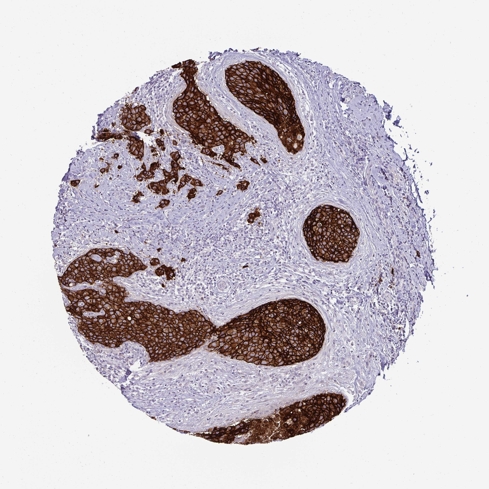

## 문제
A 24-year-old woman comes to the physician because of a painless lump in her left breast for 2 months. She has no personal history of serious illness. Her temperature is 36.8°C, pulse is 76/min, and blood pressure is 112/70 mm Hg. Examination shows a 3-cm firm, nontender mass in the upper outer quadrant of the left breast and a mobile 1.5-cm left axillary lymph node. Core needle biopsy of the mass shows invasive ductal carcinoma that is estrogen receptor-negative and progesterone receptor-negative. Staging CT shows no distant metastases. An immunohistochemical stain of the tumor for a growth factor receptor is shown. Neoadjuvant chemotherapy combined with a targeted monoclonal antibody is planned. Which of the following is the most appropriate test to obtain before starting the targeted therapy?

- A. Pulmonary function testing
- B. Audiometry
- C. Ophthalmologic examination
- D. Bone densitometry
- E. Echocardiography

_Immunohistochemical stain of a tissue microarray core (DAB brown chromogen, hematoxylin counterstain), original magnification (Human Protein Atlas, CC BY 4.0; no cropping or color adjustment)_

## 정답 및 해설
> 정답: E

- **정답 핵심**: The stain shows complete, intense brown membrane staining of nearly all tumor cells in the nests, with negative stroma — HER2 immunohistochemistry 3+, i.e., HER2-positive. The targeted antibody is trastuzumab (usually with pertuzumab), which can cause a decline in left ventricular ejection fraction and heart failure. Baseline LVEF by echocardiography (or MUGA) is required before starting, and it is repeated about every 3 months during therapy.
- **원리**: <b>Reading the stain</b>: HER2 (ERBB2) is a transmembrane receptor tyrosine kinase. Overexpression from gene amplification puts so many receptors on the cell surface that the antibody outlines every cell like chicken wire. <b>3+ = complete, intense circumferential membrane staining in &gt; 10 % of tumor cells</b> — positive without further testing; 2+ is equivocal and needs ISH; 0/1+ is negative (1+ and some 2+ now called "HER2-low").  <b>Why the heart</b>: cardiomyocytes use HER2 (with HER4, activated by neuregulin) as a survival signal under stress. Blocking it impairs repair of myocyte damage, so LVEF falls — typically without myocyte necrosis and often reversible when the drug is stopped (unlike the dose-dependent, irreversible cardiomyopathy of anthracyclines). The risk is highest when trastuzumab follows or accompanies anthracyclines.  <b>So</b> baseline LVEF is checked before treatment, and serial monitoring guides holding the drug if LVEF drops ≥ 10 points to below 50 %.
- **비교**: <table><thead><tr><th style="width:26%">Drug</th><th style="width:37%">Trastuzumab (answer)</th><th>Typical other organ toxicities (rivals)</th></tr></thead><tbody> <tr><td>Main toxicity</td><td><b>LVEF decline / heart failure</b></td><td>Bleomycin — pulmonary fibrosis; cisplatin — ototoxicity</td></tr> <tr><td>Dose relation</td><td>Not cumulative-dose related, often reversible</td><td>Bleomycin cumulative; cisplatin cumulative</td></tr> <tr><td>Baseline test</td><td><b>Echocardiography or MUGA</b></td><td>PFT with DLCO; audiometry</td></tr> <tr><td>Other</td><td>Infusion reactions</td><td>Ethambutol — visual exam; aromatase inhibitors — bone density</td></tr> </tbody></table> Each wrong option is the correct baseline test for a different drug — the stain identifies the target, the target identifies the drug, and the drug identifies the organ at risk.
- **오답 이유**:
  - (A) Pulmonary function testing with DLCO is the baseline test before bleomycin, which causes dose-related pulmonary fibrosis. It would be the answer for a young man starting BEP chemotherapy for testicular cancer.
  - (B) Audiometry is obtained before cisplatin because of cumulative sensorineural hearing loss. It fits a patient starting cisplatin-based therapy, such as for head and neck or germ cell tumors.
  - (C) Ophthalmologic examination is the baseline test before ethambutol (optic neuritis) or hydroxychloroquine (retinopathy). It would be correct if this patient were starting one of those drugs.
  - (D) Bone densitometry is the baseline before aromatase inhibitors in postmenopausal hormone receptor-positive breast cancer. This tumor is ER/PR-negative and the patient is premenopausal, so it does not apply.
- **함정**: Read the stain as HER2 3+ and connect trastuzumab to the heart — each other option is a baseline test for a different drug.
- **학습목표**: HER2 IHC 3+ 유방암에 트라스투주맙을 쓰기 전 좌심실 박출률을 평가해야 함을 안다(트라스투주맙의 심독성)
- **근거·출처**: Wolff AC et al. Human epidermal growth factor receptor 2 testing in breast cancer: ASCO–College of American Pathologists guideline update. J Clin Oncol 2023;41:3867 · NCCN Clinical Practice Guidelines in Oncology: Breast Cancer (2024) — HER2-targeted therapy and cardiac monitoring · Human Protein Atlas ERBB2 cancer tissue image (teacher-only) · 작성자 판독(2026-10-03): 종양 둥지의 거의 모든 세포에 완전하고 강한 갈색 세포막 염색(3+ 양상), 간질 음성

## 출처
- Human Protein Atlas, ERBB2 / Breast cancer (CC BY 4.0), https://images.proteinatlas.org/62555/141672_A_4_8.jpg · Creative Commons Attribution 4.0 International · https://www.proteinatlas.org/about/licence
