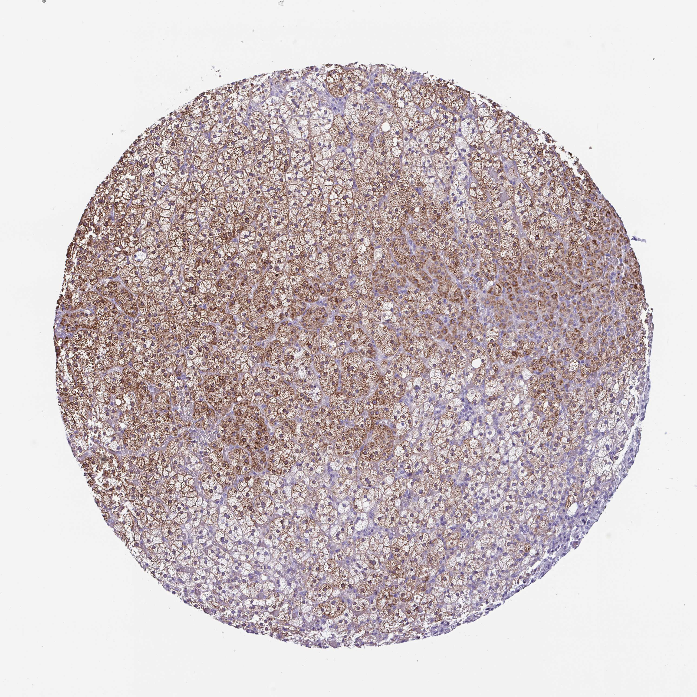

## 문제
A 53-year-old man undergoes radical nephrectomy with en bloc removal of the ipsilateral adrenal gland for a 7-cm mass in the upper pole of the left kidney found on CT during evaluation of hematuria. He has hypertension treated with amlodipine. Before surgery, his blood pressure was 136/84 mm Hg, serum potassium was 4.3 mEq/L, and an overnight 1-mg dexamethasone suppression test showed a morning serum cortisol of 1.2 µg/dL. Pathologic examination shows clear cell renal cell carcinoma confined to the kidney; the adrenal gland is free of tumor. A section of the uninvolved adrenal cortex is stained by immunohistochemistry with an antibody against 11β-hydroxylase, the enzyme that converts 11-deoxycortisol to cortisol, and is shown. Secretion of the hormone made by the predominant stained cell population is most directly regulated by which of the following?

- A. Angiotensin II from the renin-angiotensin system
- B. Acetylcholine from preganglionic sympathetic fibers
- C. Luteinizing hormone from the anterior pituitary
- D. Atrial natriuretic peptide from cardiac myocytes
- E. Adrenocorticotropic hormone from the anterior pituitary

_Immunohistochemical stain of a tissue microarray core (DAB brown chromogen, hematoxylin counterstain), original magnification (Human Protein Atlas, CC BY 4.0; no cropping or color adjustment)_

## 정답 및 해설
> 정답: E

- **정답 핵심**: The brown granular staining fills large cells with pale, lipid-laden (vacuolated) cytoplasm arranged in long radial cords — the zona fasciculata — and the more compact cells deeper in the cortex, while the thin layer of small cells just under the capsule (zona glomerulosa) stains weakly or not at all. 11β-Hydroxylase is the last enzyme of cortisol synthesis and is expressed in the fasciculata and reticularis. Cortisol secretion by the fasciculata is driven by ACTH through the MC2 receptor. The normal dexamethasone suppression and normal potassium confirm an intact axis and do not change this physiology.
- **원리**: <b>Why the zones differ</b>: the adrenal cortex is zoned by enzyme expression, not by different cell lineages alone. The <b>zona glomerulosa</b> (thin, subcapsular, small cells in round clusters) expresses <b>aldosterone synthase (CYP11B2)</b> and lacks 17α-hydroxylase; it responds to angiotensin II and plasma K⁺. The <b>zona fasciculata</b> (thickest, large lipid-rich "spongiocytes" in straight cords) expresses <b>11β-hydroxylase (CYP11B1)</b> and makes cortisol; the reticularis adds 17,20-lyase activity for androgens.  <b>Why ACTH</b>: ACTH binds MC2R on fasciculata cells → cAMP → protein kinase A → acute StAR-mediated cholesterol delivery to mitochondria and chronic induction of steroidogenic enzymes. The lipid droplets that make these cells look clear are the stored cholesterol esters they draw on.  <b>So</b> an antibody to the final cortisol enzyme highlights the cord-like clear cells, and the hormone those cells make is controlled by the hypothalamic–pituitary axis, which is why ACTH deficiency atrophies the fasciculata but spares aldosterone.
- **비교**: <table><thead><tr><th style="width:24%">Feature</th><th style="width:38%">Zona fasciculata — ACTH (answer)</th><th>Zona glomerulosa — angiotensin II (closest rival)</th></tr></thead><tbody> <tr><td>Position · shape</td><td>Middle, thickest; long straight cords</td><td>Thin, just under the capsule; round clusters</td></tr> <tr><td>Cells</td><td>Large, pale lipid-laden cytoplasm</td><td>Small, little lipid</td></tr> <tr><td>Key terminal enzyme</td><td><b>CYP11B1</b> (11-deoxycortisol → cortisol)</td><td><b>CYP11B2</b> (→ aldosterone)</td></tr> <tr><td>Main regulator</td><td>ACTH (MC2R → cAMP)</td><td>Angiotensin II, plasma K⁺</td></tr> </tbody></table> CYP11B1 and CYP11B2 are 93 % identical, but each zone expresses only one. Read the stained layer first, then name its enzyme and its regulator — not the other way round.
- **오답 이유**:
  - (A) Angiotensin II (with potassium) drives aldosterone secretion from the zona glomerulosa. It would be correct if the stain marked only the thin subcapsular layer of small cells, as an aldosterone synthase antibody does.
  - (B) Preganglionic sympathetic acetylcholine stimulates chromaffin cells of the adrenal medulla to release epinephrine. It would be correct if the stained cells were basophilic medullary cells in the center of the gland.
  - (C) Luteinizing hormone regulates steroid synthesis in testicular Leydig and ovarian theca cells. It would fit if the stain were 17α-hydroxylase in testis, but it does not control normal adrenal cortisol output.
  - (D) Atrial natriuretic peptide inhibits renin and aldosterone release rather than stimulating any cortical zone. It would matter if the question asked what suppresses glomerulosa secretion during volume expansion.
- **함정**: Seeing "adrenal" plus "hypertension" and jumping to aldosterone — the stained cells are the lipid-laden cords, not the subcapsular layer.
- **학습목표**: 부신 피질의 띠별 조직 구조와 효소 분포를 읽고, 속상대가 만드는 코르티솔이 ACTH 로 조절됨을 연결한다
- **근거·출처**: Melmed S, et al. Williams Textbook of Endocrinology, 14th ed. Ch. 15 The adrenal cortex (zonation and steroidogenic enzymes) · Ross MH, Pawlina W. Histology: A Text and Atlas, 8th ed. Ch. 21 Endocrine organs — adrenal gland · Human Protein Atlas, CYP11B1 / adrenal gland, tissue IHC (CC BY 4.0) · 작성자 판독(2026-10-04): 지질로 맑은 큰 세포의 긴 세포줄과 안쪽 치밀 세포에 과립상 갈색 염색, 피막 아래 얇은 소형 세포층은 약하거나 음성

## 출처
- Human Protein Atlas, CYP11B1 / Adrenal gland (CC BY 4.0), https://images.proteinatlas.org/49171/142127_B_5_5.jpg · Creative Commons Attribution 4.0 International · https://www.proteinatlas.org/about/licence
