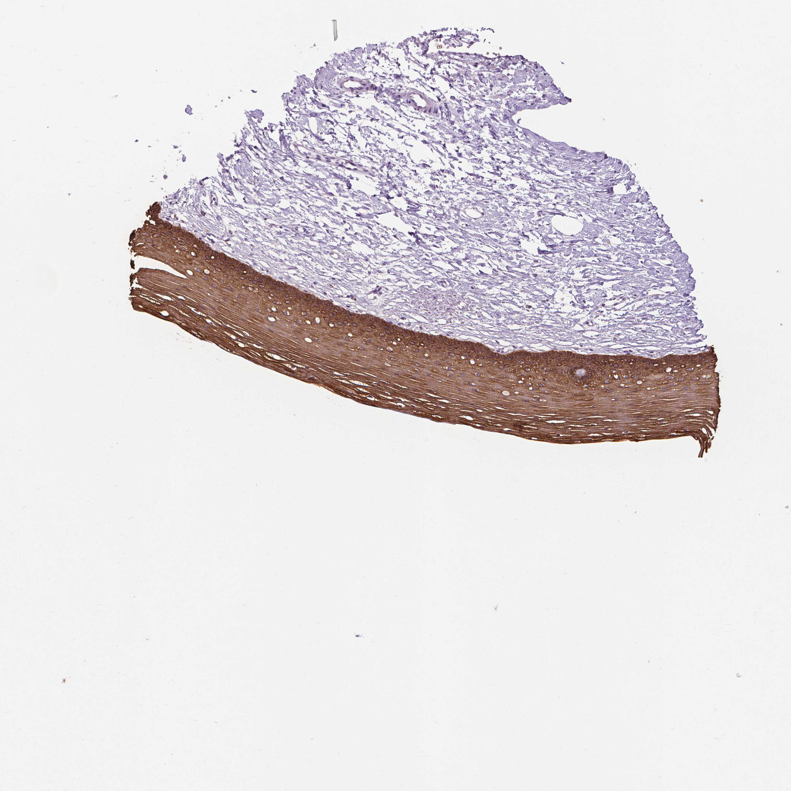

## 문제
40세 여자가 자궁경부암 선별검사 결과를 듣기 위해 산부인과에 왔다. 3년 전 자궁경부 세포검사는 정상이었다. 이번 세포검사에서 비정형 편평세포(ASC-US)가 나왔고 고위험 인유두종바이러스 16형이 양성이었다. 성교 후 출혈이나 이상 질 분비물은 없다. 흡연하지 않는다. 질확대경검사에서 편평원주접합부 전체가 보였고 아세트산을 바른 뒤 하얗게 변하는 부위는 없었다. 질확대경 아래에서 자궁경부 생검을 하였고 이형성은 없었다. 생검 조직에 사이토케라틴 5에 대한 면역조직화학염색을 하였고 결과는 그림과 같다. 갈색으로 염색된 상피로 가장 적절한 것은?

- A. 단층원주상피
- B. 이행상피
- C. 거짓중층섬모원주상피
- D. 비각화 중층편평상피
- E. 각화 중층편평상피

_조직 마이크로어레이 코어의 면역조직화학염색(DAB 갈색, 헤마톡실린 대조염색), 원 배율 (Human Protein Atlas, CC BY 4.0 — 크롭·보정 없음)_

## 정답 및 해설
> 정답: D

- **정답 핵심**: 그림에서 갈색으로 염색된 상피는 여러 층으로 두껍고, 바닥의 작은 기저세포에서 위로 갈수록 세포가 커지고 맑아진 뒤(글리코겐) 표면에서 납작해진다. 납작한 표층 세포에도 핵이 남아 있고 핵이 없는 각질층이 없다 — 비각화 중층편평상피, 곧 외자궁경부 상피다. 아래 간질은 염색되지 않는다.
- **원리**: <b>왜 「비각화」인가</b>: 중층편평상피는 기저층에서 분열한 세포가 위로 밀려 올라가며 분화한다. 피부(각화)에서는 과립층에서 케라토히알린 과립이 생기고 세포가 핵과 소기관을 잃어 <b>핵 없는 각질층</b>이 된다. 자궁경부·질·식도처럼 늘 젖어 있는 표면은 이 마지막 단계를 거치지 않아 <b>표층 세포가 납작해져도 핵이 남는다</b>.  <b>왜 중간층이 맑은가</b>: 에스트로겐 영향 아래 외자궁경부 중간층 세포는 글리코겐을 쌓아 세포질이 맑게 보인다. 루골 용액(요오드)으로 갈색이 되는 것도 이 글리코겐 때문이고, 이형성 상피는 글리코겐이 적어 염색되지 않는다.  <b>임상 연결</b>: 외자궁경부의 편평상피와 내자궁경관의 원주상피가 만나는 편평원주접합부에서 원주상피가 편평상피로 바뀌는 화생이 일어나며(변형대), HPV 가 미성숙 화생 세포의 기저층에 감염해 대부분의 자궁경부 편평상피 병변이 여기서 생긴다.
- **비교**: <table><thead><tr><th style="width:24%">항목</th><th style="width:38%">비각화 중층편평(정답)</th><th>각화 중층편평(가장 가까운 오답)</th></tr></thead><tbody> <tr><td>표층 세포의 핵</td><td><b>남아 있다</b></td><td>없다 — 핵 없는 각질층</td></tr> <tr><td>과립층</td><td>없음</td><td>있음(케라토히알린 과립)</td></tr> <tr><td>대표 부위</td><td>외자궁경부·질·식도·구강 점막</td><td>피부·외음부 피부</td></tr> <tr><td>중간층</td><td>글리코겐으로 맑음(에스트로겐)</td><td>가시세포층</td></tr> </tbody></table> 층이 여러 개라는 것만으로는 둘을 가를 수 없다 — 맨 위 세포에 핵이 있는지가 경계다. 자궁탈출로 오래 밖에 노출된 경부는 각화될 수 있다.
- **오답 이유**:
  - ① 단층원주상피는 한 층의 키 큰 점액 세포로 내자궁경관을 덮는다. 그림의 염색 상피가 한 층의 원주세포였다면, 곧 내자궁경관 생검이었다면 정답이 된다.
  - ② 이행상피는 방광·요관을 덮고 표층에 큰 우산세포가 있다. 생검이 방광에서 나왔고 표층에 둥글고 큰 세포가 덮여 있었다면 정답이 된다.
  - ③ 거짓중층섬모원주상피는 기관·기관지를 덮으며 모든 세포가 바닥막에 닿고 표면에 섬모가 있다. 기관지 생검이었다면 정답이 된다.
  - ⑤ 각화 중층편평상피는 표면에 핵 없는 각질층과 그 아래 과립층이 있다. 생검이 외음부 피부나 오래 탈출해 마른 자궁경부에서 나왔다면 정답이 된다.
- **함정**: 층이 많고 표면이 납작하다고 각화로 읽지 않는다 — 표층 세포에 핵이 남아 있다.
- **학습목표**: 자궁경부 생검 조직에서 중층편평상피의 층 구조와 표층 핵 유무로 비각화 중층편평상피를 알아본다
- **근거·출처**: Ross MH, Pawlina W. Histology: A Text and Atlas, 8th ed. Ch. 23 Female reproductive system — cervix · Kumar V, Abbas AK, Aster JC. Robbins and Cotran Pathologic Basis of Disease, 10th ed. Ch. 22 — cervix, transformation zone · Human Protein Atlas, KRT5 / cervix, tissue IHC (CC BY 4.0) · 작성자 판독(2026-10-04): 중층편평상피 전층 강한 염색, 중간층 맑음, 표층 세포 핵 유지, 간질 음성

## 출처
- Human Protein Atlas, KRT5 / Cervix (CC BY 4.0), https://images.proteinatlas.org/27/155113_B_9_3.jpg · Creative Commons Attribution 4.0 International · https://www.proteinatlas.org/about/licence
