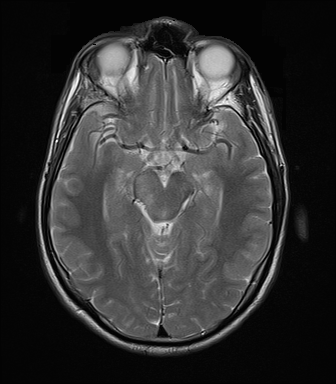

## 문제
29세 남자가 3주 전부터 아침에 심해지는 두통으로 신경과에 왔다. 구역은 있으나 구토는 없고 시야 이상도 없다. 과거력과 복용 약은 없다. 혈압 124/78 mmHg, 맥박 72회/분이다. 신경학적 검사에서 뇌신경, 근력, 감각, 협조운동이 모두 정상이고 안저 검사에서 유두부종은 없다. 뇌 자기공명영상의 T2 강조 축상 영상 중 한 단면은 그림과 같으며 이 단면에는 이상 신호가 없다. 이 단면 높이에서 뇌줄기의 앞(배쪽) 면으로 나오는 뇌신경이 손상되면 나타나는 소견으로 가장 적절한 것은?

- A. 아래를 볼 때 심해지는 수직 복시
- B. 바깥쪽을 볼 때 심해지는 수평 복시
- C. 같은 쪽 얼굴의 감각 저하
- D. 이마를 포함한 같은 쪽 얼굴 마비
- E. 같은 쪽 눈꺼풀 처짐과 동공 확대

_뇌 MRI 축상 영상, 표준 표시 방향(환자 오른쪽이 보는 사람 왼쪽) (The Cancer Imaging Archive, CC BY 4.0 — DICOM 변환, 크롭 없음)_

## 정답 및 해설
> 정답: E

- **정답 핵심**: 단면에는 앞쪽에 두 안구와 시신경이, 가운데에 앞쪽이 갈라진 하트 모양의 뇌줄기가 보인다 — 두 대뇌다리와 그 사이 다리사이오목, 뒤쪽의 가는 중간뇌수도관이 있는 중간뇌 높이다. 중간뇌 배쪽의 다리사이오목으로 나오는 뇌신경은 동안신경(III)이고, 손상되면 눈꺼풀올림근 마비로 눈꺼풀이 처지고 부교감 섬유 손상으로 동공이 커지며 눈이 아래·바깥으로 향한다.
- **원리**: <b>왜 단면 높이가 답을 정하나</b>: 뇌신경은 뇌줄기의 정해진 높이·면에서 나온다. 중간뇌에서는 <b>III 이 배쪽(다리사이오목)</b>으로, <b>IV 는 유일하게 등쪽</b>(아래둔덕 바로 아래)으로 나온다. 다리뇌에서는 V(중간 다리뇌 옆면), 다리뇌-숨뇌 경계에서 VI(앞쪽)·VII·VIII(옆쪽)이 나온다.  <b>영상에서 중간뇌 알아보기</b>: 축상 영상에서 중간뇌는 앞쪽이 두 대뇌다리로 갈라진 하트(또는 「미키마우스」) 모양이고, 뒤쪽에 가는 수도관이 있다. 같은 높이에 안구·시신경이 보이는 경우가 많다. 다리뇌는 앞쪽이 둥글고 크며 뒤에 넓은 4뇌실이 있다.  <b>동안신경 소견의 근거</b>: III 은 눈꺼풀올림근과 안쪽·위·아래곧은근·아래빗근을 맡고, 겉에 동공수축 부교감 섬유가 붙어 간다. 그래서 압박(동맥류·갈고리이랑 탈출)은 동공부터, 허혈(당뇨)은 동공을 남긴다.
- **비교**: <table><thead><tr><th style="width:22%">항목</th><th style="width:39%">동안신경 III(정답)</th><th>도르래신경 IV(가장 가까운 오답)</th></tr></thead><tbody> <tr><td>나오는 높이</td><td>중간뇌(위둔덕 높이)</td><td>중간뇌(아래둔덕 아래)</td></tr> <tr><td>나오는 면</td><td><b>배쪽 — 다리사이오목</b></td><td><b>등쪽</b> — 유일하게 뒤로 나와 교차</td></tr> <tr><td>손상 소견</td><td>눈꺼풀 처짐·동공 확대·눈이 아래 바깥</td><td>아래를 볼 때(계단 내려갈 때) 수직 복시, 머리를 반대쪽으로 기울임</td></tr> </tbody></table> 둘 다 중간뇌 신경이라 「높이」만으로는 갈리지 않는다 — 배쪽이냐 등쪽이냐가 경계다. 등쪽 면을 물었다면 IV 가 답이다.
- **오답 이유**:
  - ① 아래를 볼 때 심해지는 수직 복시는 도르래신경(IV) 손상이다. 같은 중간뇌라도 등쪽 면으로 나오는 신경을 물었다면 정답이 된다.
  - ② 바깥쪽을 볼 때의 수평 복시는 갓돌림신경(VI) 손상이다. 단면이 다리뇌-숨뇌 경계 높이였고 그 앞쪽 신경을 물었다면 정답이 된다.
  - ③ 얼굴 감각 저하는 삼차신경(V) 손상이다. 단면이 앞쪽이 둥글고 큰 다리뇌 중간 높이였고 옆면 신경을 물었다면 정답이 된다.
  - ④ 이마를 포함한 얼굴 마비는 말초성 얼굴신경(VII) 손상이다. 다리뇌-숨뇌 경계 옆쪽(소뇌다리뇌각)에서 나오는 신경을 물었다면 정답이 된다.
- **함정**: 안구가 보이는 단면이라 시신경·눈 운동을 막연히 떠올리지 말고, 뇌줄기 모양으로 높이를 먼저 정한다.
- **학습목표**: 뇌 MRI 축상 단면에서 중간뇌 높이를 알아보고, 그 배쪽에서 나오는 동안신경 손상의 소견을 연결한다
- **근거·출처**: Blumenfeld H. Neuroanatomy through Clinical Cases, 3rd ed. Ch. 12–13 Brainstem and cranial nerves · Haines DE. Neuroanatomy in Clinical Context, 10th ed. — MRI correlations of the midbrain · 작성자 판독(2026-10-04): T2 축상, 중간뇌 높이 — 대뇌다리·다리사이오목·수도관·안구, 이 단면에 병변 없음

## 출처
- The Cancer Imaging Archive (CC BY 4.0) · series …48436872 · Creative Commons Attribution 4.0 International · https://www.cancerimagingarchive.net/data-usage-policies-and-restrictions/
