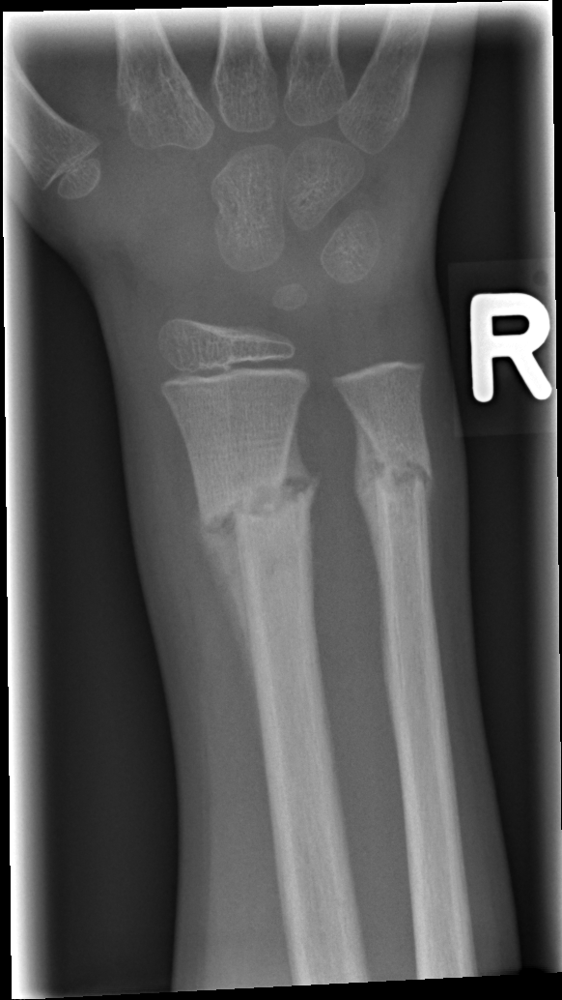

## 문제
A 6-year-old boy is brought to the emergency department by his father because of pain in the right wrist. The father says the boy fell off a couch at home last night and has been holding his arm since then. The boy is quiet and answers questions only with nods. He has no history of fractures, and his growth has been normal. His temperature is 36.8°C, pulse is 104/min, and blood pressure is 102/64 mm Hg. Examination shows mild swelling and tenderness of the distal right forearm without deformity. Radial pulse, capillary refill, and sensation in the hand are normal. There are several bruises on the back and buttocks, some purple and some yellow-green. The sclerae are white, and the teeth are normal. An anteroposterior x-ray of the right wrist and forearm is shown. Which of the following is the most appropriate next step in management?

- A. Obtain an MRI of the wrist to evaluate the growth plates
- B. Splint the forearm and report suspected physical abuse to child protective services
- C. Apply a short arm cast and arrange outpatient orthopedic follow-up
- D. Perform closed reduction under procedural sedation
- E. Obtain serum calcium, phosphate, and alkaline phosphatase levels before any further evaluation

_Anteroposterior radiograph of the right wrist and distal forearm, unaltered apart from scaling (GRAZPEDWRI-DX, figshare, CC BY 4.0)_

## 정답 및 해설
> 정답: B

- **정답 핵심**: The x-ray shows transverse metaphyseal fractures of the distal radius and ulna with periosteal new bone along the shafts and sclerosis at the fracture lines — findings of healing that take at least 7–14 days to appear in a child. A fracture that is weeks old does not fit a fall "last night," and bruises of different colors on protected areas (back, buttocks) add to the concern. The fracture itself is nondisplaced and needs only immobilization, but a history inconsistent with the injury is a mandatory-reporting trigger; physicians must report a reasonable suspicion, not a proven case.
- **원리**: <b>Why periosteal reaction dates a fracture</b>: after a fracture, the periosteum (thick and loosely attached in children) lifts and its osteoprogenitor cells lay down new bone. This subperiosteal new bone first becomes visible on radiographs at about <b>7–14 days</b>; soft callus and sclerosis of the fracture margins follow, and remodeling takes weeks to months. A fresh fracture shows a sharp line with soft-tissue swelling but no periosteal bone.  <b>Why that matters here</b>: the most important red flag for abuse is a <b>history that does not explain the injury</b> — wrong mechanism, wrong developmental stage, or wrong timing (delay in seeking care). Bruises on the back, buttocks, ears, or neck (the "TEN-4" regions) and bruises of different ages strengthen the concern.  <b>So</b> the duty is to protect the child: treat the fracture, ensure safety (often admission), and report. A skeletal survey is mandatory under age 2 and selectively used in older children; the report is not a diagnosis but the trigger for investigation.
- **비교**: <table><thead><tr><th style="width:24%">Feature</th><th style="width:38%">Report suspected abuse (answer)</th><th>Cast and routine follow-up (closest rival)</th></tr></thead><tbody> <tr><td>Fracture age on x-ray</td><td><b>Periosteal new bone — ≥ 7–14 days old</b></td><td>Sharp line, no periosteal reaction — hours old</td></tr> <tr><td>Fit with history</td><td>Does not fit "fell last night"</td><td>Fits a fall on an outstretched hand</td></tr> <tr><td>Other findings</td><td>Bruises of different ages on back and buttocks</td><td>Bruises only over bony shins or forehead</td></tr> </tbody></table> The same transverse distal forearm fracture is common after accidental falls; it is the mismatch between timing on the x-ray and the story — not the fracture pattern — that changes the next step.
- **오답 이유**:
  - (A) MRI of the physis is used when a Salter-Harris injury is suspected but not seen on x-ray. It would fit if there were growth-plate tenderness with a normal radiograph; here the fracture and its age are already clear.
  - (C) Casting with outpatient follow-up is right for a fresh, nondisplaced fracture whose story fits. It would be correct if the film showed a sharp fracture line without periosteal new bone and no other injuries.
  - (D) Closed reduction is needed for an angulated or displaced forearm fracture beyond acceptable limits for age. It fits if the radius were angulated more than about 15–20 degrees, not for this nondisplaced healing fracture.
  - (E) Bone mineral tests are part of the evaluation for rickets or metabolic bone disease that can mimic abuse. They would come first if the metaphyses were frayed and cupped or there were multiple fractures without bruising, but not before reporting.
- **함정**: A common distal forearm fracture pattern feels accidental — but periosteal new bone means it is not from last night.
- **학습목표**: 소아 골절의 골막 신생골로 골절 시기를 추정하고, 병력과 맞지 않는 골절과 다른 시기의 멍이 있으면 아동학대를 신고한다
- **근거·출처**: Christian CW; Committee on Child Abuse and Neglect, AAP. The evaluation of suspected child physical abuse. Pediatrics 2015;135:e1337 · Pierce MC, et al. Validation of a clinical decision rule to predict abuse in young children based on bruising characteristics (TEN-4-FACESp). JAMA Netw Open 2021;4:e215832 · Kleinman PK. Diagnostic Imaging of Child Abuse, 3rd ed. — dating of fractures · 작성자 판독(2026-10-04): 원위 요골·척골 골간단 횡 골절, 골막 신생골과 경화(치유 중), 골감소, 전위 경미

## 출처
- GRAZPEDWRI-DX (figshare, CC BY 4.0) · Creative Commons Attribution 4.0 International · https://creativecommons.org/licenses/by/4.0/
