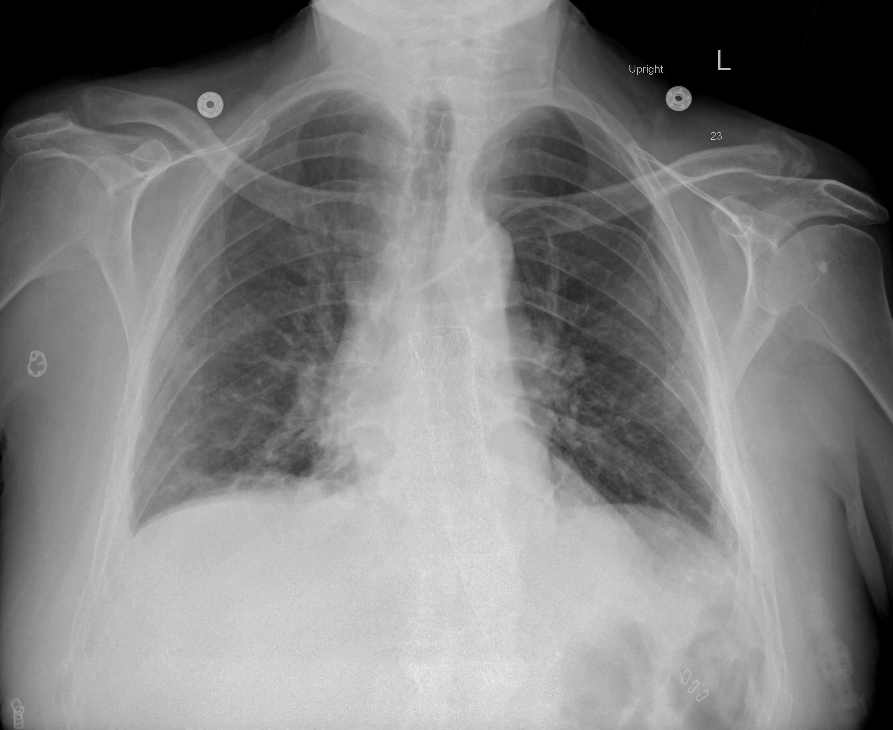

## 문제
A 64-year-old man comes to the emergency department because of fever, cough, and progressive shortness of breath for 6 days. He has hypertension treated with lisinopril. He has never smoked. Temperature is 38.6°C (101.5°F), pulse is 104/min, respirations are 26/min, and blood pressure is 132/78 mm Hg. Crackles are heard over both lung bases. Hemoglobin concentration is 14.1 g/dL. Arterial blood gas analysis on room air shows pH 7.47, PaCO2 32 mm Hg, and PaO2 54 mm Hg. After 20 minutes of breathing 100% oxygen through a tightly fitted non-rebreather mask, PaO2 is 68 mm Hg. An upright anteroposterior chest radiograph is shown. Which of the following is the most likely mechanism of this patient's hypoxemia?

- A. Perfusion of alveoli that are filled with exudate and not ventilated
- B. Regional ventilation-perfusion mismatch from narrowed airways
- C. Reduced alveolar ventilation from depressed respiratory drive
- D. Diffusion limitation across a thickened alveolar-capillary membrane
- E. Reduced partial pressure of oxygen in the inspired air

_Upright anteroposterior chest radiograph, unaltered apart from scaling (The Cancer Imaging Archive, CC BY 4.0; no cropping or window adjustment)_

## 정답 및 해설
> 정답: A

- **정답 핵심**: The radiograph shows ill-defined hazy and reticular opacities in both lower zones, more on the right — airspace filling. The A-a gradient on room air is about 150 − 32/0.8 − 54 ≈ 56 mm Hg, so hypoventilation and low inspired oxygen are excluded. The decisive clue is that 100% oxygen raises PaO2 only to 68 mm Hg: blood that passes alveoli full of fluid never meets the added oxygen, which is the signature of intrapulmonary shunt.
- **원리**: <b>Why oxygen separates the mechanisms</b>: in low V/Q units and in diffusion limitation, the alveoli are still ventilated. Breathing 100 % O₂ washes out nitrogen and raises alveolar PO₂ to about 670 mm Hg even in poorly ventilated units, so end-capillary blood becomes fully saturated and PaO₂ climbs to several hundred mm Hg.  <b>In a shunt</b>, the alveoli are filled with exudate, pus, or edema (pneumonia, ARDS) or collapsed. Their ventilation is zero, so no inspired gas — however rich in oxygen — reaches that blood. Because hemoglobin in the well-ventilated units is already almost fully saturated, those units cannot add much extra O₂ content to compensate. Mixed arterial PaO₂ therefore rises only slightly.  <b>Practical rule</b>: a shunt fraction above about 30 % makes PaO₂ almost unresponsive to FiO₂. Treatment must reopen alveoli (PEEP, prone positioning) rather than just raise FiO₂.
- **비교**: <table><thead><tr><th style="width:24%">Feature</th><th style="width:38%">Intrapulmonary shunt (answer)</th><th>V/Q mismatch (closest rival)</th></tr></thead><tbody> <tr><td>Ventilation of affected units</td><td>Zero — alveoli filled or collapsed</td><td>Reduced but present</td></tr> <tr><td>A-a gradient</td><td>Increased</td><td>Increased</td></tr> <tr><td>Response to 100 % O₂</td><td><b>Poor</b> (here 54 → 68 mm Hg)</td><td>Large — PaO₂ often &gt; 300 mm Hg</td></tr> <tr><td>Typical setting</td><td>Lobar or bilateral airspace disease, ARDS</td><td>Asthma, COPD, pulmonary embolism</td></tr> </tbody></table> Both widen the A-a gradient; only the response to supplemental oxygen tells them apart. An elevated gradient alone never decides it.
- **오답 이유**:
  - (B) V/Q mismatch from narrowed airways also widens the A-a gradient, but PaO2 rises steeply on 100% oxygen. It would be the answer in an asthma attack with clear lungs and PaO2 above 300 mm Hg on oxygen.
  - (C) Hypoventilation raises PaCO2 and keeps the A-a gradient normal. It would be correct after an opioid overdose with PaCO2 of 60 mm Hg and a normal gradient, not with PaCO2 of 32 mm Hg here.
  - (D) Diffusion limitation worsens hypoxemia mainly during exercise and corrects readily with supplemental oxygen. It fits interstitial fibrosis with exertional desaturation, not this poor oxygen response.
  - (E) Low inspired oxygen lowers PaO2 with a normal A-a gradient, as at high altitude. It would apply if the patient were breathing thin air, not room air at sea level with a gradient near 56 mm Hg.
- **함정**: Choosing V/Q mismatch because it is the commonest cause of hypoxemia — the failure of 100% oxygen to raise PaO2 points to shunt.
- **학습목표**: 양측 폐포 음영과 100 % 산소에 잘 오르지 않는 PaO2 로 폐내 단락에 의한 저산소혈증을 다른 기전과 구별한다
- **근거·출처**: West JB, Luks AM. West's Respiratory Physiology: The Essentials, 11th ed. Ch. 5 Ventilation-perfusion relationships (shunt and response to 100% O2) · Loscalzo J, et al. Harrison's Principles of Internal Medicine, 21st ed. Ch. 285 Disturbances of respiratory function · 작성자 판독(2026-10-05): 양측 하폐야(오른쪽 우세)의 경계 불분명한 흐린 음영과 망상 음영 증가, 기흉·대량 흉수 없음

## 출처
- COVID-19-AR, The Cancer Imaging Archive (CC BY 4.0) · series …62945405 · Creative Commons Attribution 4.0 International · https://www.cancerimagingarchive.net/data-usage-policies-and-restrictions/
