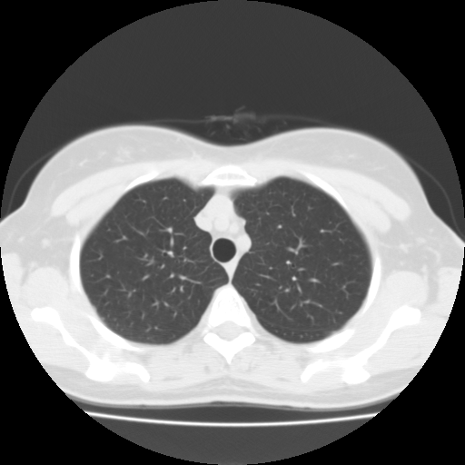

## 문제
60세 여자가 건강검진에서 흉부 CT 를 받은 뒤 결과를 듣기 위해 호흡기내과에 왔다. 30갑년 흡연자로 2년 전에 끊었다. 기침, 객혈, 체중 감소는 없다. 고혈압으로 암로디핀을 복용한다. 혈압 128/78 mmHg, 맥박 74회/분, 호흡 16회/분, 산소포화도(실내 공기) 97 % 이다. 목과 빗장뼈위 림프절은 만져지지 않는다. 흉부 CT(조영제 없이, 절편 두께 3 mm)의 폐 꼭대기 높이 단면은 그림과 같다. 담당 의사는 같은 검사에서 기관 옆 종격동 림프절의 크기를 평가하려 하였는데 그림의 영상에서는 종격동 구조가 서로 구별되지 않았다. 다음으로 해야 할 것으로 가장 적절한 것은?

- A. 양전자방출단층촬영(PET-CT)을 시행한다
- B. 흉부 자기공명영상을 시행한다
- C. 같은 영상을 종격동창으로 바꿔 다시 본다
- D. 조영제를 주사하고 흉부 CT 를 다시 찍는다
- E. 같은 영상을 1 mm 절편으로 다시 재구성한다

_흉부 CT 축상면, 폐 꼭대기 높이, 저장된 폐창 설정 그대로, 표준 표시 방향(환자 오른쪽이 보는 사람 왼쪽), 원본 크기 (The Cancer Imaging Archive, CC BY 4.0 — DICOM 변환, 크롭 없음)_

## 정답 및 해설
> 정답: C

- **정답 핵심**: 그림은 폐창(창 너비 약 1,500 HU, 창 중심 약 −600 HU)으로 표시된 영상이다. 폐실질의 혈관 가지는 잘 보이지만, 지방(−100 HU)·혈관(40 HU 안팎)·림프절(30~50 HU)이 모두 창의 위쪽 끝에 몰려 똑같이 하얗게 보인다. 이미 얻은 CT 자료의 HU 값은 그대로 있으므로, 창 너비를 350~400 HU, 창 중심을 40 HU 안팎으로 바꾼 종격동창으로 다시 보면 방사선을 더 쓰지 않고 지방 속 림프절의 크기를 잴 수 있다.
- **원리**: <b>CT 영상은 숫자다</b>: CT 의 각 화소는 X선 감쇠를 물 0, 공기 −1,000 으로 맞춘 하운스필드 값(HU)을 가진다. 모니터는 256단계 남짓의 회색만 보여 줄 수 있어서, 「어느 HU 범위를 회색으로 펼칠지」를 정하는 것이 <b>창(window)</b>이다 — 창 중심(level) 근처를 가운데 회색으로 두고, 창 너비(width) 밖의 값은 모두 검정이나 흰색으로 잘라 버린다.  <b>폐창</b>은 너비가 넓고(약 1,500) 중심이 낮아(약 −600) 공기(−1,000)와 폐조직(−700~−900)의 미세한 차이를 펼쳐 보여 준다. 대신 −150 HU 이상인 지방·근육·혈관·림프절은 모두 흰색 한 덩어리가 된다 — 그림의 종격동처럼.  <b>종격동창</b>(너비 350~400, 중심 40)은 지방(−100)과 연부조직(30~60)을 서로 다른 회색으로 펼친다. 창은 표시 설정일 뿐이라 저장된 자료에서 언제든 바꿀 수 있고, 판독의는 같은 검사를 폐창·종격동창·뼈창으로 차례로 본다.
- **비교**: <table><thead><tr><th style="width:22%">구분</th><th style="width:39%">종격동창으로 다시 보기(정답)</th><th>조영증강 CT 재촬영(가장 가까운 오답)</th></tr></thead><tbody> <tr><td>해결하는 문제</td><td>표시 설정 — 연부조직 HU 가 흰색으로 잘림</td><td>혈관과 연부조직의 HU 가 비슷함</td></tr> <tr><td>추가 방사선 · 조영제</td><td><b>없음</b></td><td>있음 — 방사선 재노출, 조영제 위험</td></tr> <tr><td>이 영상에서</td><td>기관 옆 지방 속 림프절이 회색으로 드러남</td><td>창을 바꾸지 않으면 조영 후에도 하얗게 보임</td></tr> <tr><td>필요한 때</td><td>먼저 — 모든 종격동 평가의 출발점</td><td>종격동창으로 봐도 폐문 혈관과 림프절이 구별되지 않을 때</td></tr> </tbody></table> 종격동 구조가 「안 보이는」 원인이 자료가 아니라 표시라면 고칠 곳도 표시다. 조영제는 창을 맞춘 뒤에도 남는 혈관-림프절 구별 문제에만 답한다.
- **오답 이유**:
  - ① PET-CT 는 림프절의 대사 활성으로 폐암의 종격동 병기를 평가한다. 폐에 고형 결절이 있어 수술 전 병기 결정이 필요할 때라면 고를 수 있지만, 크기 측정을 위한 첫 단계는 아니다.
  - ② 흉부 자기공명영상은 흉벽·척추관 침범이나 폐첨부 종양의 상완신경얼기 침범을 볼 때 쓴다. 폐첨부 종양이 신경을 침범했는지 물었다면 고려하지만 종격동 림프절 크기에는 필요 없다.
  - ④ 조영제를 주사하고 다시 찍으면 혈관과 림프절의 대비는 좋아지지만 방사선과 조영제 위험이 더해진다. 종격동창으로 봐도 폐문 혈관과 림프절이 구별되지 않을 때 정답이 된다.
  - ⑤ 1 mm 절편 재구성은 작은 결절의 경계·간질 변화를 자세히 보는 데 쓴다. 폐창에서 아주 작은 결절의 모양을 봐야 할 때라면 맞지만, 종격동 연부조직이 하얗게 잘리는 문제는 풀지 못한다.
- **함정**: 종격동이 안 보이니 조영제가 필요하다고 보는 것 — 그림은 폐창이라 연부조직이 흰색으로 잘렸을 뿐이다.
- **학습목표**: 흉부 CT 가 폐창으로 표시되었음을 읽고, 종격동 연부조직을 평가하려면 재촬영이 아니라 창 너비·창 중심을 바꿔야 함을 안다
- **근거·출처**: Webb WR, Brant WE, Major NM. Fundamentals of Body CT, 5th ed. Ch. 1 Introduction to CT (Hounsfield units and window settings) · Brant WE, Helms CA. Fundamentals of Diagnostic Radiology, 5th ed. Ch. 3 CT: principles and windowing · 작성자 판독(2026-10-05): 비조영 흉부 CT 폐창, 폐실질 이상 없음, 종격동 대혈관·연부조직이 균일한 흰색으로 구별되지 않음

## 출처
- LIDC-IDRI, The Cancer Imaging Archive (CC BY 3.0) · series …03408531 · Creative Commons Attribution 3.0 Unported · https://www.cancerimagingarchive.net/data-usage-policies-and-restrictions/
