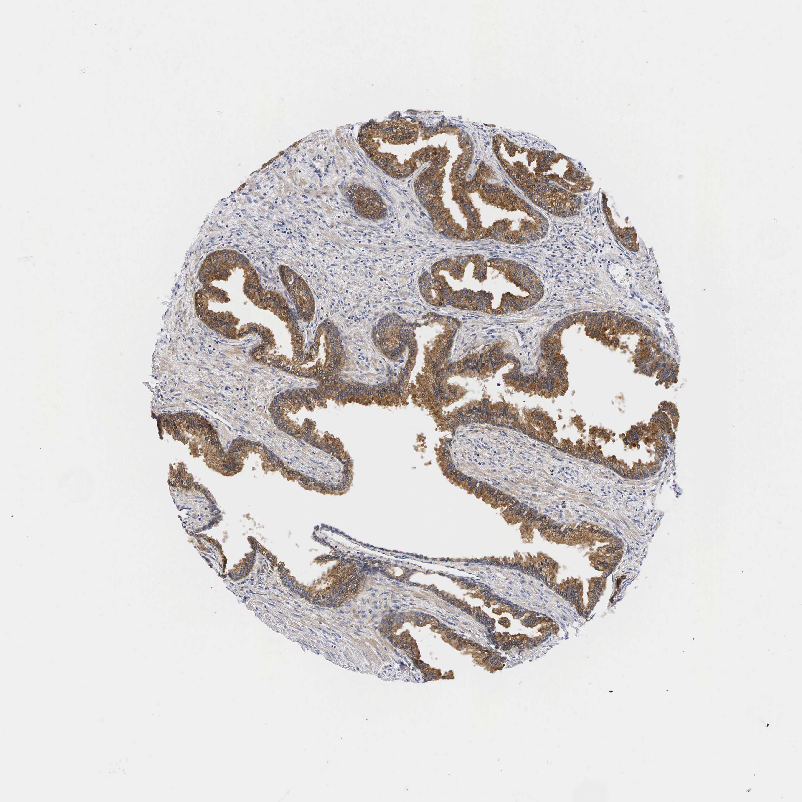

## 문제
68세 남자가 2년 동안 점점 심해진 빈뇨, 야간뇨, 약한 소변 줄기로 비뇨의학과에 왔다. 1년 전부터 탐술로신을 복용하여 소변 줄기는 조금 나아졌지만 야간뇨는 하룻밤 3회로 남아 있다. 요폐나 혈뇨는 없었다. 직장수지검사에서 전립선은 고무처럼 단단하고 매끈하게 커져 있으며 결절은 없다. 경직장초음파에서 전립선 부피는 62 mL 이다. 혈청 전립선특이항원(PSA)이 6.2 ng/mL 로 높아 전립선 조직검사를 하였고 악성 세포는 없었다. 혈청 크레아티닌은 1.0 mg/dL 이다. 조직검사 검체에 PSA 에 대한 면역조직화학염색을 하였고 결과는 그림과 같다. 그림에서 갈색으로 염색된 세포 구획을 줄여 전립선 부피를 줄이기 위해 탐술로신에 더할 약으로 가장 적절한 것은?

- A. 미라베그론
- B. 피나스테리드
- C. 실로도신
- D. 타다라필
- E. 옥시부티닌

_조직 마이크로어레이 코어의 면역조직화학염색(DAB 갈색, 헤마톡실린 대조염색), 원 배율 (Human Protein Atlas, CC BY 4.0 — 크롭·보정 없음)_

## 정답 및 해설
> 정답: B

- **정답 핵심**: 그림에서 갈색으로 염색된 것은 유두 모양으로 주름진 샘의 내강 분비상피이고, 샘 사이의 섬유근육 간질과 바닥세포층은 염색되지 않는다. 이 샘상피는 다이하이드로테스토스테론(DHT)에 의존해 자라므로, 5α-환원효소 억제제인 피나스테리드가 6~12개월에 걸쳐 전립선 부피를 약 20~30 % 줄이고 혈청 PSA 를 약 절반으로 낮춘다. 부피가 30~40 mL 를 넘는 비대증에서 알파차단제와 함께 쓰면 요폐와 수술 위험이 준다.
- **원리**: <b>전립선의 두 구획</b>: 전립선비대증은 <b>샘상피</b>와 <b>섬유근육 간질</b>이 함께 늘어난 결절성 증식이다. 샘의 내강 분비상피는 PSA(칼리크레인 3, 정액 응고물을 녹이는 세린 단백분해효소)를 만들어 내강으로 분비하고, 그 바깥의 납작한 바닥세포와 간질의 평활근은 PSA 를 만들지 않는다 — 그래서 그림에서 내강 세포만 갈색이다.  <b>왜 피나스테리드인가</b>: 간질 세포의 2형 5α-환원효소가 테스토스테론을 DHT 로 바꾸고, DHT 가 성장인자를 통해 샘상피의 증식과 생존을 유지한다. 이 효소를 막으면 DHT 가 약 70 % 줄어 <b>샘상피가 위축</b>되고 부피와 PSA 가 함께 줄어든다(그래서 복용 중 PSA 는 2배로 보정해 해석한다).  <b>알파차단제는 다른 구획</b>을 겨냥한다 — 간질과 방광목 평활근의 α1A 수용체를 막아 긴장을 풀어 며칠 만에 증상을 줄이지만 부피는 줄이지 않는다.
- **비교**: <table><thead><tr><th style="width:22%">구분</th><th style="width:39%">피나스테리드(정답)</th><th>실로도신(가장 가까운 오답)</th></tr></thead><tbody> <tr><td>표적 구획</td><td><b>샘상피</b>(그림의 갈색 세포) — DHT 의존</td><td>간질·방광목 평활근(염색되지 않은 부분)</td></tr> <tr><td>작용</td><td>2형 5α-환원효소 억제 → DHT 약 70 % 감소</td><td>α1A 수용체 차단 → 평활근 이완</td></tr> <tr><td>전립선 부피 · PSA</td><td>약 20~30 % 감소 · 약 50 % 감소</td><td>변화 없음</td></tr> <tr><td>효과 시점</td><td>6~12개월</td><td>수일</td></tr> </tbody></table> 이미 탐술로신을 쓰는 환자에게 같은 계열의 실로도신을 더해도 부피는 줄지 않는다. 「부피를 줄인다」는 물음은 샘상피를 겨냥하는 약을 고르라는 뜻이다.
- **오답 이유**:
  - ① 미라베그론은 β3 작용제로 배뇨근을 이완해 과민방광 증상을 줄인다. 항무스카린제를 쓸 수 없는 고령의 저장 증상이라면 정답이 될 수 있다.
  - ③ 실로도신은 탐술로신과 같은 α1A 차단제로 평활근 긴장만 푼다. 탐술로신을 부작용으로 바꿔야 하는 상황이었다면 대안이 되지만 부피는 줄이지 않는다.
  - ④ 타다라필은 PDE5 억제로 평활근을 이완해 하부요로증상과 발기부전을 함께 줄인다. 발기부전이 동반되어 두 증상을 함께 다룰 때라면 고를 수 있다.
  - ⑤ 옥시부티닌은 무스카린 차단으로 방광 과민 증상(절박뇨)을 줄인다. 잔뇨가 적고 절박뇨가 주 증상인 저장 증상이라면 더할 수 있지만 부피는 줄이지 않는다.
- **함정**: 이미 쓰는 알파차단제를 하나 더 고르는 것 — 그림의 갈색 세포(샘상피)를 줄이는 약을 묻고 있다.
- **학습목표**: 전립선 조직에서 PSA 를 만드는 내강 분비상피와 염색되지 않는 섬유근육 간질을 구별하고, 각 구획을 겨냥하는 약을 연결한다
- **근거·출처**: Partin AW, et al. Campbell-Walsh-Wein Urology, 12th ed. Ch. 145 Benign prostatic hyperplasia: etiology, pathophysiology, and natural history; Ch. 146 Medical management · McConnell JD, et al. The long-term effect of doxazosin, finasteride, and combination therapy on the clinical progression of BPH (MTOPS). N Engl J Med 2003;349:2387 (PMID 14681504) · Human Protein Atlas, KLK3 / prostate, tissue IHC (CC BY 4.0) · 작성자 판독(2026-10-05): 양성 샘의 내강 분비상피 세포질 염색, 바닥세포층·섬유근육 간질 음성

## 출처
- Human Protein Atlas, KLK3 / Prostate (CC BY 4.0), https://images.proteinatlas.org/70/200_A_3_5.jpg · Creative Commons Attribution 4.0 International · https://www.proteinatlas.org/about/licence
