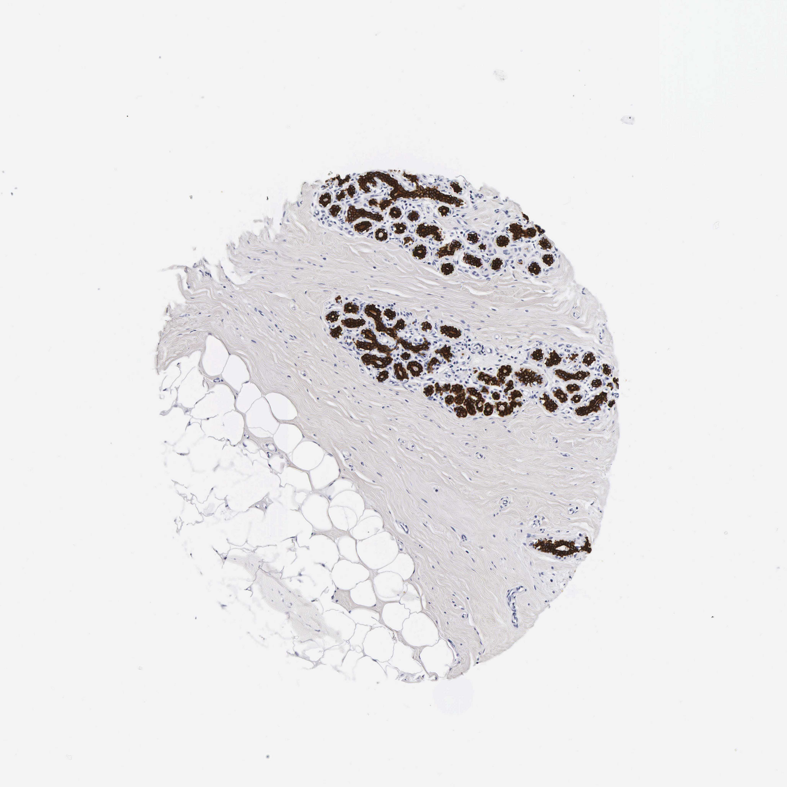

## 문제
A 45-year-old woman undergoes excision of a 2-cm, mobile, rubbery mass in the upper outer quadrant of the left breast that has been present for 3 years without change in size. She has no family history of breast or ovarian cancer. Mammography showed a well-circumscribed oval mass without calcifications, and core needle biopsy showed a fibroadenoma. The excised mass is a fibroadenoma with clear margins. A section of the adjacent normal breast tissue, including lobules, dense collagenous stroma, and fat, is stained by immunohistochemistry with an antibody against an intermediate filament protein and is shown. In a poorly differentiated metastatic tumor of unknown primary site, strong staining for this same class of intermediate filament would most strongly indicate which of the following tumor types?

- A. Sarcoma
- B. Melanoma
- C. Lymphoma
- D. Glioma
- E. Carcinoma

_Immunohistochemical stain of a tissue microarray core (DAB brown chromogen, hematoxylin counterstain), original magnification (Human Protein Atlas, CC BY 4.0; no cropping or color adjustment)_

## 정답 및 해설
> 정답: E

- **정답 핵심**: Only the epithelial cells of the lobular acini and ducts are stained; the collagenous stroma, adipocytes, and vessels are negative. An intermediate filament restricted to epithelium is a cytokeratin (here keratin 18, a simple-epithelium keratin of luminal cells). Cytokeratin positivity in an undifferentiated tumor identifies it as a carcinoma.
- **원리**: <b>Why intermediate filaments mark cell lineage</b>: unlike actin and tubulin, which every cell uses, intermediate filaments are encoded by a large gene family whose members are expressed in a <b>tissue-specific</b> way, and tumors usually keep the filament of the cell they came from. Epithelial cells use <b>cytokeratins</b> (keratin 8/18 in simple and glandular epithelia, keratin 5/14 in basal and squamous cells); mesenchymal cells such as fibroblasts, endothelium, and adipocytes use <b>vimentin</b>; muscle uses desmin; astrocytes use GFAP; neurons use neurofilaments.  <b>Reading this image</b>: the stain fills the cells lining the small acini and ducts but leaves the surrounding fibroblast-rich collagen and fat empty — the pattern of an epithelium-only filament, not vimentin.  <b>Clinical use</b>: in a metastasis that looks like sheets of undifferentiated cells, a first IHC panel of pan-cytokeratin (carcinoma), S-100/SOX10 (melanoma), CD45 (lymphoma), and vimentin/desmin (sarcoma) assigns the lineage before organ-specific markers are chosen.
- **비교**: <table><thead><tr><th style="width:22%">Feature</th><th style="width:39%">Cytokeratin → carcinoma (answer)</th><th>Vimentin → sarcoma (closest rival)</th></tr></thead><tbody> <tr><td>Normal cells stained</td><td><b>Epithelium only</b> — acini and ducts</td><td>Fibroblasts, endothelium, adipocytes (stroma)</td></tr> <tr><td>Pattern in this image</td><td>Matches — stroma and fat negative</td><td>Would stain the collagenous stroma and vessels</td></tr> <tr><td>Tumor indicated</td><td>Carcinoma (epithelial origin)</td><td>Sarcoma (mesenchymal origin)</td></tr> </tbody></table> Melanoma and many lymphomas are also vimentin-positive and cytokeratin-negative, so a cytokeratin-positive pattern points to epithelium whichever way the question is asked.
- **오답 이유**:
  - (A) Sarcomas arise from mesenchymal cells and express vimentin, which would stain the stroma and vessels. This would be correct if the antibody had labeled the fibroblasts and fat rather than the glands.
  - (B) Melanoma cells express vimentin with S-100, SOX10, and HMB-45, and are typically cytokeratin-negative. It would be the answer if the panel had shown S-100 or SOX10 positivity.
  - (C) Lymphomas are identified by CD45 (leukocyte common antigen) and lack cytokeratin. It would be correct if the tumor cells had stained for CD45, with the stromal lymphocytes as internal control.
  - (D) Gliomas express glial fibrillary acidic protein, the intermediate filament of astrocytes. It would be correct if the stain had been GFAP in a brain tumor, not a filament confined to breast epithelium.
- **함정**: Answering "breast cancer" from the organ — the question asks what the filament class says about lineage, which the stain pattern (epithelium only) answers.
- **학습목표**: 정상 유방 조직에서 샘상피만 염색되는 중간섬유를 사이토케라틴으로 읽고, 미분화 종양의 기원 판별에 연결한다
- **근거·출처**: Kumar V, Abbas AK, Aster JC. Robbins and Cotran Pathologic Basis of Disease, 10th ed. Ch. 7 Neoplasia (immunohistochemistry and intermediate filaments) · Alberts B, et al. Molecular Biology of the Cell, 7th ed. Ch. 16 The cytoskeleton (intermediate filaments) · Human Protein Atlas, KRT18 / breast, tissue IHC (CC BY 4.0) · 작성자 판독(2026-10-05): 소엽 샘꽈리·관 상피의 강한 세포질 염색, 교원질 간질·지방 음성

## 출처
- Human Protein Atlas, KRT18 / Breast (CC BY 4.0), https://images.proteinatlas.org/8/1730_B_2_4.jpg · Creative Commons Attribution 4.0 International · https://www.proteinatlas.org/about/licence
