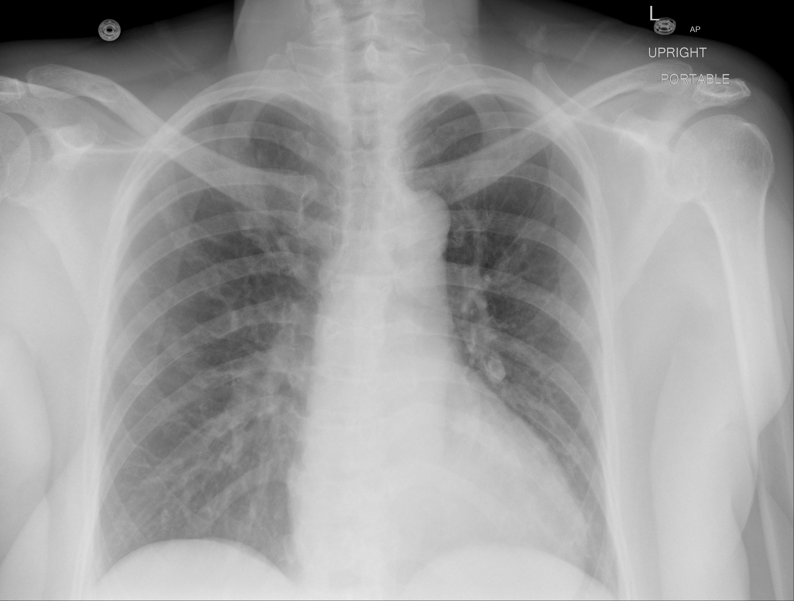

## 문제
51세 여자가 2일 전부터 생긴 호흡곤란과 숨을 들이쉴 때 심해지는 오른쪽 가슴 통증으로 응급실에 왔다. 3주 전 오른쪽 무릎 인공관절 치환술을 받은 뒤 대부분 누워 지냈다. 오른쪽 종아리가 붓고 아프다. 기침, 가래, 발열은 없다. 혈압 118/76 mmHg, 맥박 112회/분, 호흡 24회/분, 체온 37.2 °C, 산소포화도(실내 공기) 89 % 이다. 양쪽 폐음은 깨끗하다. 오른쪽 종아리 둘레가 왼쪽보다 3 cm 크다. 혈청 크레아티닌 0.8 mg/dL 이고, 심전도는 동빈맥 외에 이상이 없다. 기립 자세에서 찍은 휴대용 흉부 X선은 그림과 같다. 진단을 위해 다음으로 시행할 검사로 가장 적절한 것은?

- A. 조영제 없는 고해상도 흉부 CT
- B. CT 폐동맥조영술
- C. 혈장 D-이량체 측정
- D. 환기-관류 폐스캔
- E. 경흉부 심장초음파

_기립 자세 AP 휴대용 흉부 X선, 위치 표지는 원본의 것, 크기 조정만 (The Cancer Imaging Archive, CC BY 4.0 — 크롭·창 조절 없음)_

## 정답 및 해설
> 정답: B

- **정답 핵심**: 흉부 X선은 국소 경화·흉수·기흉 없이 거의 깨끗하다. 그런데 실내 공기 산소포화도는 89 % 이다 — 「사진에 비해 심한 저산소혈증」이다. 최근 하지 대수술·부동, 한쪽 종아리 부종(심부정맥혈전증 징후), 빈맥이 있어 Wells 점수는 약 9점으로 폐색전증 가능성이 높다. 가능성이 높으면 D-이량체가 음성이어도 배제할 수 없으므로 바로 CT 폐동맥조영술을 한다. 콩팥 기능이 정상이라 조영제 사용에 걸림이 없다.
- **원리**: <b>검사 전 확률이 검사를 고른다</b>: D-이량체는 민감도가 높고 특이도가 낮은 검사다. 그래서 「음성이면 배제」하는 데에만 쓰고, 그 음성 예측도는 검사 전 확률이 낮을 때만 믿을 수 있다. Wells 점수가 높은(폐색전증 가능성 높음) 환자에서는 D-이량체가 음성이어도 잔여 확률이 커서 영상 검사를 피할 수 없으므로, D-이량체는 시간만 끈다. 게다가 수술 3주 뒤에는 수술 자체로 D-이량체가 오르기 쉬워 양성이어도 의미가 적다.  <b>흉부 X선의 역할</b>: 폐색전증의 흉부 X선은 대부분 정상이거나 비특이적이다. 사진을 찍는 이유는 폐렴·기흉·심부전처럼 같은 증상을 내는 다른 병을 낮추는 것이다. <b>깨끗한 사진 + 설명되지 않는 저산소혈증</b>은 오히려 폐혈관 문제(색전)를 가리킨다.  <b>CT 폐동맥조영술</b>은 분절 동맥까지의 충만결손을 직접 보여 주고 대안 진단도 함께 본다. 조영제 금기(심한 콩팥 기능 저하·조영제 과민)나 임신에서는 환기-관류 스캔이 대안이다.
- **비교**: <table><thead><tr><th style="width:22%">구분</th><th style="width:39%">CT 폐동맥조영술(정답)</th><th>D-이량체(가장 가까운 오답)</th></tr></thead><tbody> <tr><td>쓰는 상황</td><td>검사 전 확률 높음(Wells &gt; 4) 또는 D-이량체 양성</td><td>검사 전 확률 낮음·중간에서 배제용</td></tr> <tr><td>이 환자</td><td>Wells 약 9점 — 바로 시행</td><td>음성이어도 배제 불가, 수술 3주 뒤라 양성은 무의미</td></tr> <tr><td>답해 주는 것</td><td>색전의 존재·위치, 대안 진단</td><td>「아니다」만 말할 수 있다</td></tr> </tbody></table> 가능성이 낮을 때는 D-이량체 → (양성이면) CT, 가능성이 높을 때는 곧바로 CT 다. 어느 쪽으로 물어도 「검사 전 확률이 먼저」로 정리된다.
- **오답 이유**:
  - ① 조영제 없는 고해상도 CT 는 간질성 폐질환의 폐실질을 보는 검사라 폐동맥 안의 혈전을 보여 주지 못한다. 만성 호흡곤란과 마른 수포음이 있었다면 선택했을 것이다.
  - ③ D-이량체는 검사 전 확률이 낮거나 중간인 환자에서 음성일 때 폐색전증을 배제하는 검사다. 수술력·종아리 부종이 없는 저위험 환자였다면 첫 검사로 맞다.
  - ④ 환기-관류 폐스캔은 조영제를 쓸 수 없을 때(심한 콩팥 기능 저하, 조영제 과민, 임신)의 대안이다. 크레아티닌이 2.5 mg/dL 였다면 이것을 골랐을 것이다.
  - ⑤ 경흉부 심장초음파는 저혈압이 동반된 고위험 폐색전증에서 CT 로 옮길 수 없을 때 우심실 부하를 보는 데 쓴다. 혈압이 80/50 mmHg 이고 불안정했다면 정답에 가깝다.
- **함정**: D-이량체부터 고르는 것 — 검사 전 확률이 높은 환자에서는 음성이어도 배제하지 못한다.
- **학습목표**: 임상적으로 폐색전증 가능성이 높은 환자에서 흉부 X선이 깨끗하면 D-이량체를 건너뛰고 CT 폐동맥조영술로 확인함을 안다
- **근거·출처**: Loscalzo J, et al. Harrison's Principles of Internal Medicine, 21st ed. Ch. 279 Deep venous thrombosis and pulmonary thromboembolism · Konstantinides SV, et al. 2019 ESC Guidelines for the diagnosis and management of acute pulmonary embolism. Eur Heart J 2020;41:543-603 (PMID 31504429) · 작성자 판독(2026-10-06): 기립 AP 휴대용 흉부 X선 — 국소 경화·간유리 음영 없음, 흉수·기흉 없음, 하폐야 기관지혈관 음영만 약간 두드러짐

## 출처
- COVID-19-AR, The Cancer Imaging Archive (CC BY 4.0) · series …94288885 · Creative Commons Attribution 4.0 International · https://www.cancerimagingarchive.net/data-usage-policies-and-restrictions/
