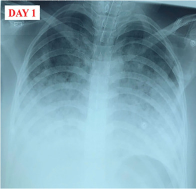

## 문제
A 27-year-old woman is transferred to the intensive care unit 6 hours after an emergency cesarean delivery performed under general anesthesia. During induction of anesthesia, gastric contents were seen in the oropharynx before the endotracheal tube was placed. Three hours after surgery, she developed severe dyspnea and chest tightness and was reintubated. She received 1 L of crystalloid and no blood products. Temperature is 37.9°C (100.2°F), pulse is 118/min, and blood pressure is 124/76 mm Hg. Crackles are heard over both lung fields. There is no jugular venous distention or peripheral edema. The uterus is firm, and vaginal bleeding is minimal. Platelet count is 228,000/mm3, and plasma fibrinogen concentration is 410 mg/dL. Transthoracic echocardiography shows a left ventricular ejection fraction of 60%. Arterial blood gas analysis during mechanical ventilation with an FiO2 of 1.0 shows a PaO2 of 78 mm Hg. A portable chest x-ray obtained after reintubation is shown. Which of the following is the most likely cause of this patient's respiratory failure?

- A. Chemical pneumonitis from aspirated gastric contents
- B. Amniotic fluid embolism
- C. Peripartum cardiomyopathy
- D. Transfusion-related acute lung injury
- E. Acute pulmonary thromboembolism

_Portable anteroposterior chest radiograph — one panel cropped from a two-panel published case figure; the panel label is from the original (PMC Open Access Subset, CC BY; no other adjustment)_

## 정답 및 해설
> 정답: A

- **정답 핵심**: The radiograph shows diffuse bilateral airspace opacities, worse at the bases, with an endotracheal tube and central line in place. With a PaO2/FiO2 ratio of 78 within hours of a known aspiration event during induction, this is aspiration (chemical) pneumonitis progressing to severe ARDS — Mendelson syndrome. Normal blood pressure, platelets, and fibrinogen argue against amniotic fluid embolism; a normal ejection fraction and no venous congestion argue against a cardiogenic cause; no blood products were given.
- **원리**: <b>Why gastric acid injures the lung so fast</b>: aspirated gastric juice with pH below about 2.5 burns the airway and alveolar epithelium within minutes. A first phase of direct chemical injury is followed 4–6 hours later by neutrophil influx and cytokine release, which disrupts the alveolar-capillary barrier. Protein-rich fluid floods the alveoli, producing bilateral opacities and shunt physiology — the definition of ARDS (acute onset, bilateral opacities not explained by effusion or collapse, PaO2/FiO2 ≤ 300 not fully explained by heart failure).  <b>Why pregnancy raises the risk</b>: progesterone relaxes the lower esophageal sphincter, the gravid uterus raises intragastric pressure, and gastric emptying is slow in labor. This is why regional anesthesia, antacid prophylaxis, and rapid-sequence induction with cricoid pressure are standard for cesarean delivery.  <b>Antibiotics</b>: the initial injury is sterile; antibiotics are not routinely required unless the patient had bowel obstruction or fails to improve after 48 hours (secondary bacterial pneumonia).
- **비교**: <table><thead><tr><th style="width:22%">Feature</th><th style="width:39%">Aspiration pneumonitis (answer)</th><th>Amniotic fluid embolism (closest rival)</th></tr></thead><tbody> <tr><td>Timing</td><td>Hours after a witnessed aspiration</td><td>During labor, delivery, or within 30 min after</td></tr> <tr><td>Hemodynamics</td><td>Stable (here 124/76 mm Hg)</td><td><b>Abrupt hypotension</b>, often cardiac arrest</td></tr> <tr><td>Coagulation</td><td>Normal (fibrinogen 410 mg/dL)</td><td>DIC — fibrinogen falls, uterine bleeding</td></tr> <tr><td>Lungs</td><td>Bilateral opacities, severe hypoxemia</td><td>Hypoxemia, later bilateral opacities</td></tr> </tbody></table> Both cause hypoxemia with bilateral infiltrates after delivery. Shock and coagulopathy in the first minutes point to embolism; a stable patient with a witnessed aspiration points to chemical pneumonitis.
- **오답 이유**:
  - (B) Amniotic fluid embolism causes sudden hypoxemia, hypotension, and DIC around delivery. It would be the answer if she had collapsed in the operating room with oozing from the incision and a fibrinogen of 90 mg/dL.
  - (C) Peripartum cardiomyopathy causes pulmonary edema from left ventricular systolic failure late in pregnancy or months postpartum. It would be correct with an ejection fraction of 30% and raised jugular venous pressure.
  - (D) Transfusion-related acute lung injury produces noncardiogenic edema within 6 hours of a plasma-containing transfusion. It would be the answer if she had received fresh frozen plasma or red cells for hemorrhage.
  - (E) Pulmonary embolism causes hypoxemia often with a near-normal chest radiograph. It would be favored by unilateral leg swelling and clear lung fields rather than diffuse bilateral airspace opacities.
- **함정**: Choosing amniotic fluid embolism because the respiratory failure followed delivery — stable blood pressure and normal fibrinogen argue against it.
- **학습목표**: 전신마취 제왕절개 뒤 양측 폐 음영과 심한 저산소혈증을 흡인성 화학 폐렴염(멘델슨 증후군)으로 진단하고 양수색전증·주산기 심근병증과 구별한다
- **근거·출처**: Loscalzo J, et al. Harrison's Principles of Internal Medicine, 21st ed. Ch. 301 Acute respiratory distress syndrome · Cunningham FG, et al. Williams Obstetrics, 26th ed. Ch. 20 Obstetrical anesthesia (aspiration) and Ch. 41 Obstetrical hemorrhage (amniotic fluid embolism) · Short-term corticosteroid therapy in aspiration pneumonitis complicated by ARDS: a case report. Medicine (Baltimore) 2026;105(8):e47816 (PMC12928926) — 27-year-old woman after cesarean delivery under general anesthesia, PaO2/FiO2 78.4 · 작성자 판독(2026-10-06): 기관삽관 상태의 AP 흉부 X선 — 양측 폐야 전반의 미만성 폐포 음영(아래쪽 우세), 기관내관·중심정맥관

## 출처
- Short-term corticosteroid therapy in aspiration pneumonitis complicated by acute respiratory distress syndrome: A case report. Medicine (Baltimore). 2026 Feb 20;105(8):e47816. doi: 10.1097/MD.0000000000047816 (CC BY) — Figure 1. · CC BY · https://creativecommons.org/licenses/
