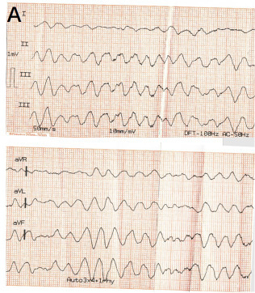

## 문제
71세 남자가 반복되는 가슴 불편감으로 입원해 심전도 감시를 받던 중 갑자기 의식을 잃었다. 심방세동으로 전극도자 절제술을 받은 적이 있고 만성폐쇄폐질환이 있다. 의료진이 바로 도착했을 때 반응이 없고 정상 호흡이 없으며 경동맥 맥박이 만져지지 않아 가슴압박을 시작하였다. 정맥로는 이미 확보되어 있다. 수동 제세동기의 패드를 붙이고 가슴압박을 잠시 멈추었을 때 기록된 사지유도 심전도는 그림과 같다. 다음 처치로 가장 적절한 것은?

- A. 동기화 심율동전환
- B. 아미오다론 300 mg 정맥 주사
- C. 에피네프린 1 mg 정맥 주사
- D. 경피 심박조율
- E. 비동기 전기충격(제세동)

_사지·증강 유도 심전도, 50 mm/s · 10 mm/mV — 출판된 증례 그림에서 심전도 패널만 크롭, 패널 문자와 기록 설정값은 원 그림의 것 (PMC Open Access Subset, CC BY — 그 밖의 보정 없음)_

## 정답 및 해설
> 정답: E

- **정답 핵심**: 심전도에는 P 파·QRS·T 파를 구별할 수 없고 진폭과 모양이 계속 바뀌는 불규칙한 파동만 있다 — 심실세동이다. 맥박이 없는 심실세동은 제세동 가능 리듬이므로, 가슴압박을 하면서 가능한 한 빨리 비동기 전기충격을 주는 것이 첫 처치다. 에피네프린과 아미오다론은 전기충격 뒤에도 리듬이 지속될 때 쓴다.
- **원리**: <b>왜 전기충격이 먼저인가</b>: 심실세동은 심실 근육이 여러 곳에서 제각각 탈분극하는 상태라 심장이 피를 내보내지 못한다. 충분한 전류를 한꺼번에 흘리면 심근 대부분을 동시에 탈분극시켜 무질서한 회로를 끊고, 굴결절 같은 정상 박동원이 다시 주도할 기회를 준다. 성공률은 쓰러진 뒤 1분이 지날 때마다 약 7~10 % 씩 떨어지므로 약물이나 기도 확보보다 앞선다.  <b>왜 「비동기」인가</b>: 동기화 심율동전환은 QRS 의 R 파를 감지해 그 순간에 충격을 준다(T 파 위 취약기에 충격을 주어 심실세동을 일으키지 않으려고). 심실세동에는 감지할 R 파가 없으므로 동기화 모드에서는 충격이 나가지 않거나 늦어진다.  <b>약물의 자리</b>: 제세동 가능 리듬에서 에피네프린은 2번째 충격 뒤, 아미오다론(300 mg)은 3번째 충격 뒤에도 리듬이 지속될 때 준다.
- **비교**: <table><thead><tr><th style="width:22%">구분</th><th style="width:39%">비동기 제세동(정답)</th><th>동기화 심율동전환(가장 가까운 오답)</th></tr></thead><tbody> <tr><td>대상</td><td>무맥 심실세동·무맥 심실빈맥</td><td>맥박이 있는 불안정 빈맥(심방세동, 단형 심실빈맥)</td></tr> <tr><td>충격 시점</td><td>버튼을 누르는 즉시</td><td>R 파를 감지한 순간 — T 파 취약기 회피</td></tr> <tr><td>이 환자</td><td>무맥 + 심실세동 → 즉시</td><td>감지할 R 파가 없어 충격이 지연된다</td></tr> </tbody></table> 맥박이 있으면 동기화, 맥박이 없으면 비동기다. 다형 심실빈맥도 동기화가 어려워 비동기로 준다.
- **오답 이유**:
  - ① 동기화 심율동전환은 맥박이 있으면서 저혈압·의식 저하가 동반된 단형 심실빈맥이나 심방세동에서 R 파에 맞춰 충격을 주는 방법이다. 맥박이 만져졌다면 정답이 된다.
  - ② 아미오다론 300 mg 은 제세동 가능 리듬에서 세 번째 충격 뒤에도 심실세동이 지속될 때 준다. 이미 세 차례 전기충격을 했다면 다음 처치로 맞다.
  - ③ 에피네프린 1 mg 은 무수축·무맥 전기활동에서는 즉시, 심실세동에서는 두 번째 충격 뒤에 준다. 심전도가 평탄한 무수축이었다면 정답이다.
  - ④ 경피 심박조율은 맥박이 있는 증상성 서맥(완전 방실차단 등)에서 아트로핀이 듣지 않을 때 쓴다. 맥박 30회/분의 완전 방실차단이었다면 고려한다.
- **함정**: 동기화 심율동전환을 고르는 것 — 심실세동에는 감지할 R 파가 없어 충격이 늦어진다.
- **학습목표**: 무맥 환자의 심전도에서 심실세동을 읽고, 제세동 가능 리듬의 첫 처치가 비동기 전기충격임을 안다
- **근거·출처**: Panchal AR, et al. 2020 American Heart Association Guidelines for CPR and ECC, Part 3: Adult basic and advanced life support. Circulation 2020;142:S366-S468 (PMID 33081529) · Loscalzo J, et al. Harrison's Principles of Internal Medicine, 21st ed. Ch. 306 Cardiovascular collapse, cardiac arrest, and sudden cardiac death · Coronary artery spasm with recurrent ventricular fibrillation: case report (PMC13303025) — 71-year-old man, Figure 3A limb-lead ECG during ventricular fibrillation · 작성자 판독(2026-10-06): 사지·증강 유도(50 mm/s) — P·QRS·T 구별 없이 진폭·모양이 계속 바뀌는 불규칙한 파동, 심실세동

## 출처
- Case Report: Recurrent ventricular fibrillation induced by multivessel coronary artery spasm: a case supporting ICD for secondary prevention. Front Physiol. 2026 Jun 12;17:1808973. doi: 10.3389/fphys.2026.1808973 (CC BY) — Figure 3 · CC BY · https://creativecommons.org/licenses/
