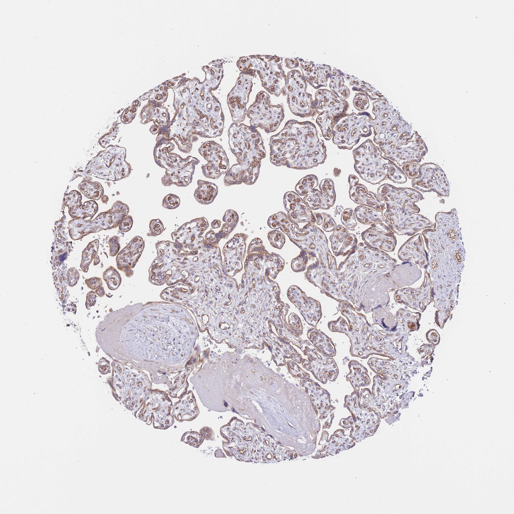

## 문제
A 39-year-old woman, gravida 2, para 2, delivers a healthy newborn vaginally at term after an uncomplicated pregnancy. She had no hypertension or diabetes, and the prenatal ultrasonographic examinations were normal. The placenta is delivered intact with a three-vessel umbilical cord and is sent for histologic examination as part of a teaching study. A photomicrograph of a section of the placenta stained by immunohistochemistry is shown. The tissue fragments in the section are separated by clear spaces that contain a few scattered red blood cells. In the living placenta, the blood within these spaces is delivered directly by which of the following vessels?

- A. Maternal spiral arteries
- B. Umbilical arteries
- C. Umbilical vein
- D. Fetal capillaries within the villi
- E. Maternal uterine veins

_Immunohistochemical stain of a tissue microarray core (DAB brown chromogen, hematoxylin counterstain), original magnification (Human Protein Atlas, CC BY 4.0; no cropping or color adjustment)_

## 정답 및 해설
> 정답: A

- **정답 핵심**: The section shows many small chorionic villi — rounded fragments covered by a trophoblast layer, with fetal capillaries in a loose stroma — floating in clear spaces. Those clear spaces are the intervillous space. The human placenta is hemochorial: maternal blood leaves the remodeled spiral arteries and pours directly into the intervillous space, bathing the trophoblast. Fetal blood never enters this space; it stays inside the villous capillaries.
- **원리**: <b>Two circulations that never mix</b>: fetal blood reaches the placenta through the two umbilical arteries, branches into the stem villi, and runs through capillaries inside the terminal villi. Exchange occurs across the thin villous wall — syncytiotrophoblast, a little stroma, and fetal endothelium. Oxygenated fetal blood returns through the single umbilical vein.  <b>Maternal side</b>: in early pregnancy, extravillous trophoblast invades the decidua and replaces the muscle of about 100 spiral arteries, turning them into wide, low-resistance funnels. Maternal blood spurts from these openings into the intervillous space, flows around the villi, and drains back through endometrial (uterine) veins. Because maternal blood touches the chorionic trophoblast directly, the placenta is called hemochorial.  <b>Clinical link</b>: failure of spiral artery remodeling leaves narrow, high-resistance vessels and underperfuses the intervillous space — the root of preeclampsia and fetal growth restriction.
- **비교**: <table><thead><tr><th style="width:22%">Feature</th><th style="width:39%">Maternal spiral arteries (answer)</th><th>Umbilical arteries (closest rival)</th></tr></thead><tbody> <tr><td>Whose blood</td><td>Mother's, oxygenated</td><td>Fetus's, deoxygenated</td></tr> <tr><td>Where it goes</td><td><b>Into the intervillous space</b> around the villi</td><td>Into capillaries inside the villi</td></tr> <tr><td>In this section</td><td>Clear spaces between villi</td><td>Small vessels within the villous stroma</td></tr> </tbody></table> "Arteries" alone does not decide it: the umbilical arteries are arteries too, but their blood stays inside the villi. The space outside the villi belongs to the mother.
- **오답 이유**:
  - (B) The umbilical arteries carry deoxygenated fetal blood to the placenta, but it runs inside the villous capillaries. They would be the answer if the question asked about the vessels within the villous stroma.
  - (C) The umbilical vein returns oxygenated blood from the villous capillaries to the fetus. It would be correct if asked which vessel carries the most highly oxygenated blood in the fetal circulation.
  - (D) Fetal capillaries lie inside the villi, separated from maternal blood by the villous membrane. They would be the answer if the question asked where fetal blood takes up oxygen.
  - (E) Maternal uterine veins drain blood out of the intervillous space after it has passed around the villi. They would be correct if the question asked how blood leaves the space rather than enters it.
- **함정**: Choosing the umbilical arteries because they are the arteries that reach the placenta — their blood stays inside the villi, not in the spaces between them.
- **학습목표**: 태반 조직 절편에서 융모와 융모사이공간을 구별하고, 융모사이공간의 혈액이 모체 나선동맥에서 직접 들어옴(혈액융모태반)을 안다
- **근거·출처**: Cunningham FG, et al. Williams Obstetrics, 26th ed. Ch. 5 Implantation and placental development (intervillous space, spiral artery remodeling) · Moore KL, Persaud TVN, Torchia MG. The Developing Human, 11th ed. Ch. 7 Placenta and fetal membranes (placental circulation) · 작성자 판독(2026-10-06): 말단 융모 단면 — 융모 표면 영양막층과 융모 안 태아 모세혈관, 융모 사이의 빈 공간에 적혈구 몇 개

## 출처
- Human Protein Atlas, PSG1 / Placenta (CC BY 4.0), https://images.proteinatlas.org/46327/114450_A_3_7.jpg · Creative Commons Attribution 4.0 International · https://www.proteinatlas.org/about/licence
