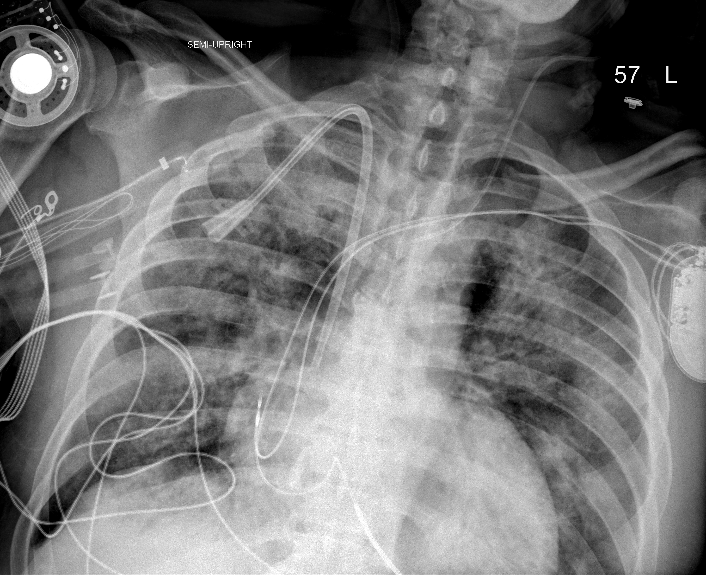

## 문제
A 60-year-old man is being treated in the intensive care unit for acute respiratory distress syndrome due to COVID-19 pneumonia. He has been hospitalized for 7 days and was intubated 6 days ago. He has received dexamethasone but no antibiotics during this hospitalization or in the past year. Over the past 24 hours, he has developed a temperature of 38.9°C and increasing amounts of thick yellow tracheal secretions, and the fraction of inspired oxygen needed to keep his oxygen saturation above 92% has increased from 0.4 to 0.6. His blood pressure is 124/72 mm Hg without vasopressors, and pulse is 104/min. Coarse crackles are heard over both lung bases. Leukocyte count is 16,800/mm3; two days ago, it was 9,200/mm3. Serum creatinine concentration is 0.9 mg/dL. In this unit, more than 20% of Staphylococcus aureus isolates are methicillin-resistant. A portable chest radiograph is shown. Tracheal aspirate and blood cultures are obtained. Which of the following is the most appropriate empiric antibiotic regimen?

- A. Ceftriaxone and azithromycin
- B. Vancomycin and ceftriaxone
- C. Vancomycin, piperacillin-tazobactam, and amikacin
- D. Vancomycin and piperacillin-tazobactam
- E. Piperacillin-tazobactam alone

_Semi-upright portable anteroposterior chest radiograph; the position text and side marker are from the original, unaltered apart from scaling (The Cancer Imaging Archive, CC BY 4.0; no cropping or window adjustment)_

## 정답 및 해설
> 정답: C

- **정답 핵심**: The radiograph shows diffuse bilateral reticular and patchy airspace opacities with multiple monitoring lines. After more than 48 hours of mechanical ventilation, he has a new fever, purulent secretions, worsening oxygenation and a rising leukocyte count — ventilator-associated pneumonia (VAP). He has two risk factors for multidrug-resistant (MDR) VAP listed in the IDSA/ATS guideline: five or more days of hospitalization before the onset of VAP and ARDS preceding VAP. Empiric therapy should therefore cover methicillin-resistant S aureus (vancomycin; the unit MRSA rate above 20% is a second reason) and Pseudomonas aeruginosa with two antipseudomonal agents from different classes (piperacillin-tazobactam plus amikacin), then be narrowed once cultures return.
- **원리**: <b>Why VAP needs broader coverage than community pneumonia</b>: after several days in hospital, the oropharynx and the endotracheal tube become colonized by hospital flora — S aureus (including MRSA), P aeruginosa, Enterobacterales and Acinetobacter. Secretions pooling above the cuff are micro-aspirated along the tube, so the pathogens of VAP are those of the unit, not those of the community.  <b>Why two antipseudomonal drugs</b>: the goal of the empiric regimen is that at least one drug is active against the organism. When the risk of resistance is high, a second antipseudomonal agent from a different class (a β-lactam plus an aminoglycoside or a fluoroquinolone) raises the chance that the first 48–72 hours are covered. It is not for synergy and is stopped once susceptibilities are known.  <b>MDR risk factors (IDSA/ATS 2016)</b>: IV antibiotics in the past 90 days, septic shock at VAP onset, ARDS preceding VAP, ≥ 5 days of hospitalization before VAP, and acute renal replacement therapy. Without any of them, and in a unit with low resistance, one antipseudomonal agent (with or without an MRSA agent) is enough.
- **비교**: <table><thead><tr><th style="width:22%">Feature</th><th style="width:39%">Vancomycin + piperacillin-tazobactam + amikacin (correct)</th><th>Vancomycin + piperacillin-tazobactam (closest distractor)</th></tr></thead><tbody> <tr><td>Antipseudomonal agents</td><td>Two, from different classes</td><td>One</td></tr> <tr><td>Who gets it</td><td>Any MDR risk factor (here: ≥ 5 days in hospital, preceding ARDS) or high unit gram-negative resistance</td><td>No MDR risk factor but unit MRSA &gt; 10–20%</td></tr> <tr><td>After cultures</td><td>De-escalate to one active drug</td><td>Narrow or stop vancomycin if MRSA is not grown</td></tr> </tbody></table> Both regimens cover MRSA; the difference is whether the patient's risk of resistant gram-negative organisms justifies a second antipseudomonal drug for the first days.
- **오답 이유**:
  - (A) Ceftriaxone and azithromycin is a regimen for community-acquired pneumonia requiring admission; it misses MRSA and P aeruginosa and would be chosen only for pneumonia present at hospital arrival.
  - (B) Vancomycin with ceftriaxone covers MRSA and pneumococcus but not P aeruginosa; it would suit meningitis or community pneumonia with MRSA risk, not pneumonia acquired on a ventilator.
  - (D) Vancomycin with piperacillin-tazobactam alone is appropriate when MRSA coverage is needed but there is no risk factor for MDR gram-negative organisms, for example VAP on day 3 in a patient without preceding ARDS.
  - (E) Piperacillin-tazobactam alone fits early VAP in a unit where MRSA is uncommon and the patient has no MDR risk factors; here both MRSA and gram-negative resistance must be covered.
- **함정**: Stopping at vancomycin plus one antipseudomonal drug — the days in hospital and the preceding ARDS are the MDR risk factors that call for a second gram-negative agent.
- **학습목표**: 인공호흡기 관련 폐렴에서 다제내성 위험인자(입원 5일 이상, 선행 ARDS)가 있으면 MRSA 약제와 계열이 다른 항녹농균제 2개로 경험적 치료를 시작함을 안다
- **근거·출처**: Kalil AC, et al. Management of adults with hospital-acquired and ventilator-associated pneumonia: 2016 clinical practice guidelines by the IDSA and ATS. Clin Infect Dis 2016;63:e61-e111 (PMID 27418577) · Loscalzo J, et al. Harrison's Principles of Internal Medicine, 21st ed. Ch. 126 Pneumonia (health care-associated and ventilator-associated pneumonia) · 작성자 판독(2026-10-07): 반기립 AP 휴대용 흉부 X선 — 양측 미만성 망상·반점상 공기공간 음영, 오른쪽 카테터·감시선 다수, 기흉 없음

## 출처
- COVID-19-AR, The Cancer Imaging Archive (CC BY 4.0) · series …48424473 · Creative Commons Attribution 4.0 International · https://www.cancerimagingarchive.net/data-usage-policies-and-restrictions/
