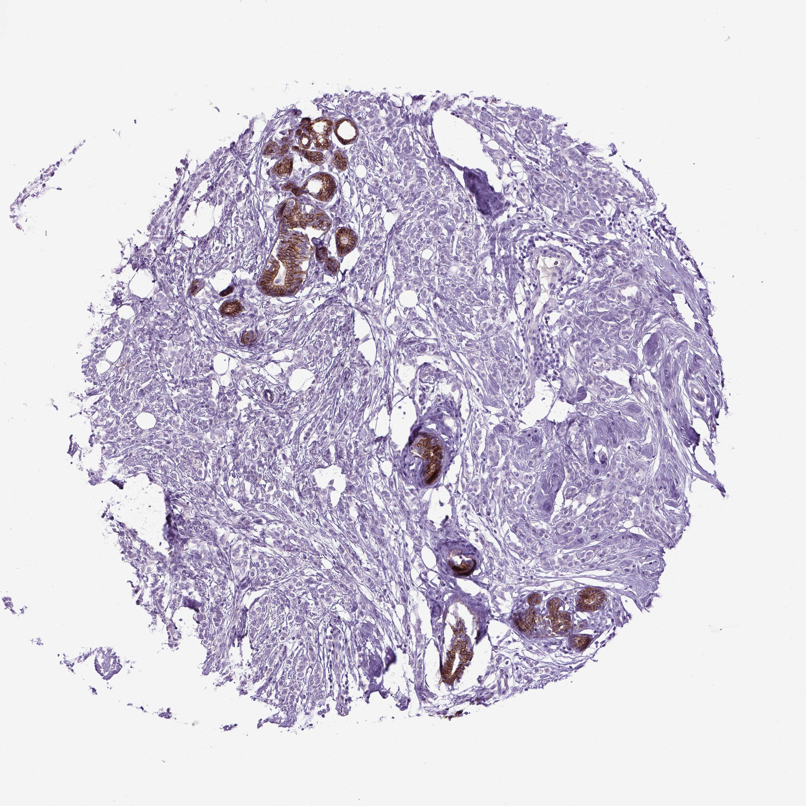

## 문제
49세 여자가 2개월 전부터 오른쪽 유방 위바깥쪽이 두꺼워진 느낌이 있어 내원하였다. 통증이나 젖꼭지 분비물은 없고, 가족력은 없다. 진찰에서 경계가 불분명한 3 cm 크기의 단단한 부위가 만져지고 겨드랑이 림프절은 만져지지 않는다. 유방촬영술에서 뚜렷한 종괴가 보이지 않았고, 초음파에서 경계가 불분명한 저에코 병변이 있었다. 중심부바늘생검에서 침윤성 암종이 확인되었으며 에스트로겐 수용체 양성, HER2 음성이다. 유방 종양 조직 절편의 E-cadherin 면역조직화학염색 결과는 그림과 같다. 이 종양이 침윤성 관암종에 비해 더 잘 전이하는 부위는?

- A. 폐 실질
- B. 뇌 실질
- C. 간 실질
- D. 흉막
- E. 복막과 위장관

_조직 마이크로어레이 코어의 면역조직화학염색(DAB 갈색, 헤마톡실린 대조염색), 원 배율 (Human Protein Atlas, CC BY 4.0 — 크롭·보정 없음)_

## 정답 및 해설
> 정답: E

- **정답 핵심**: 그림에서 남아 있는 정상 관·소엽 상피는 세포막이 진한 갈색으로 염색되어(내부 양성 대조) 염색이 제대로 되었음을 보여 주고, 간질 사이로 흩어져 침윤한 종양 세포는 세포막 염색이 없다 — E-cadherin 소실, 즉 침윤성 소엽암종이다. 촬영에서 종괴가 뚜렷하지 않은 것도 소엽암의 특징이다. 소엽암종은 관암종에 비해 복막·후복막, 위장관, 난소, 수막으로 잘 퍼지고, 폐·뇌 실질 전이는 상대적으로 적다.
- **원리**: <b>E-cadherin 과 세포의 응집</b>: E-cadherin 은 상피세포끼리 붙잡는 부착연접의 칼슘 의존성 막단백이다. 침윤성 소엽암종은 그 유전자(CDH1)의 돌연변이·결실로 이 단백이 없어져, 종양 세포가 서로 떨어진 채 한 줄 또는 낱개로 간질을 파고든다. 그래서 덩어리(종괴)를 만들지 않아 유방촬영에서 잘 안 보이고, 만져도 경계가 불분명하다.  <b>왜 전이 장소가 다른가</b>: 응집하지 않는 세포는 장막면을 따라 얇게 퍼지기 쉽다. 그래서 소엽암은 복막에 판처럼 깔리거나 위·대장 벽을 따라 스며들어(위암의 선위염형 침윤처럼) 장폐색·수신증으로 나타나고, 난소(크루켄베르크형)·수막에도 간다. 관암종은 응집된 덩어리로 혈행 전이하여 폐·간·뇌 실질에 결절을 만든다. 뼈는 두 조직형 모두 흔하다.  <b>임상적 의미</b>: 소엽암 병력이 있는 환자의 새 복부 증상은 위장관 전이를 먼저 의심하고, 위 생검에서 반지세포 모양 세포가 보이면 원발 위암과 구별하려고 ER·GATA3 염색을 한다.
- **비교**: <table><thead><tr><th style="width:22%">구분</th><th style="width:39%">침윤성 소엽암종(이 종양)</th><th>침윤성 관암종(가장 흔한 조직형)</th></tr></thead><tbody> <tr><td>E-cadherin</td><td>소실 — 세포가 흩어져 한 줄로 침윤</td><td>보존 — 관·덩어리 형성</td></tr> <tr><td>영상</td><td>종괴 없이 구조 왜곡·비대칭, 다발성·양측성 많음</td><td>가시 돋친 종괴·미세석회화</td></tr> <tr><td>잘 가는 전이 장소</td><td>복막·후복막, 위장관, 난소, 수막, 뼈</td><td>폐·간·뇌 실질, 뼈</td></tr> </tbody></table> 같은 유방암이라도 「응집하는가」가 전이 양상을 가른다. 장막면을 타고 번지는 곳은 소엽암, 실질 결절은 관암으로 정리하면 어느 방향으로 물어도 대응된다.
- **오답 이유**:
  - ① 폐 실질 결절 전이는 응집된 종양 덩어리가 혈행으로 퍼지는 침윤성 관암종에서 더 흔하다. 종양 세포의 세포막이 E-cadherin 에 진하게 염색되었다면 정답에 가깝다.
  - ② 뇌 실질 전이는 관암종, 특히 HER2 양성·삼중음성 유방암에서 흔하다. 이 종양은 HER2 음성 소엽암이라 실질보다 수막 쪽으로 가는 경향이 있다.
  - ③ 간 실질의 결절성 전이는 관암종에서 더 흔하다. 소엽암도 간에 갈 수 있지만, 관암종보다 「더 잘 가는」 곳은 아니다 — E-cadherin 이 보존된 종양이라면 맞다.
  - ④ 흉막 전이와 악성 흉수는 관암종에서도 흔해 두 조직형을 가르는 특징이 아니다. 관암종의 흉벽 국소 재발이 흉막으로 번진 경우라면 떠올릴 수 있다.
- **함정**: 소엽암을 진단하고도 유방암 일반의 전이 장소(폐·간·뇌)를 고르는 것 — 응집하지 않는 소엽암은 장막면(복막·위장관)을 따라 퍼진다.
- **학습목표**: E-cadherin 이 소실된 침윤성 소엽암종이 관암종과 달리 복막·위장관·난소로 잘 전이함을 안다
- **근거·출처**: Kumar V, Abbas AK, Aster JC. Robbins and Cotran Pathologic Basis of Disease, 10th ed. Ch. 23 The breast — invasive lobular carcinoma (CDH1 loss, discohesive growth, metastatic pattern) · Human Protein Atlas — CDH1 antibody staining in breast cancer tissue microarray (teacher-only) · 작성자 판독(2026-10-07): 정상 관·소엽은 세포막 양성(내부 대조), 간질로 흩어져 침윤한 종양 세포는 음성 — E-cadherin 소실

## 출처
- Human Protein Atlas, CDH1 / Breast cancer (CC BY 4.0), https://images.proteinatlas.org/87/158147_A_6_7.jpg · Creative Commons Attribution 4.0 International · https://www.proteinatlas.org/about/licence
