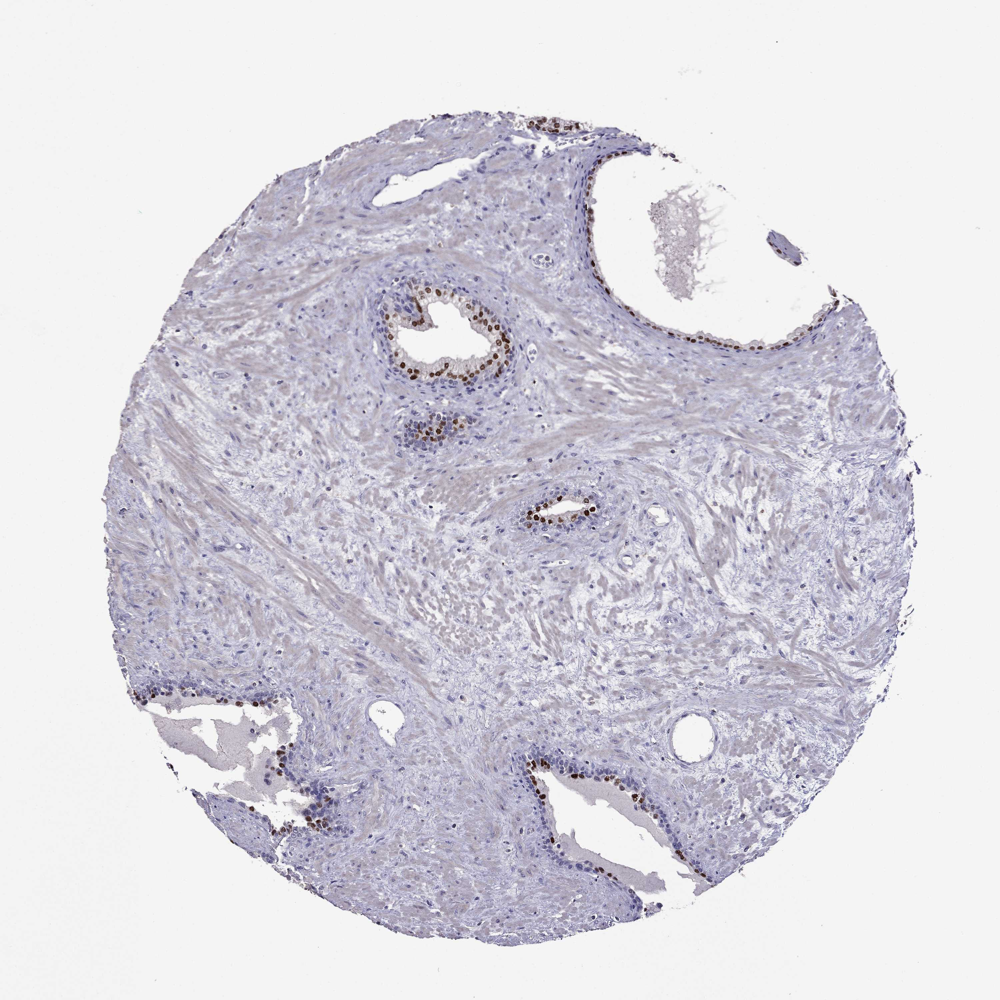

## 문제
A 63-year-old man comes to the physician for a follow-up examination 2 months after transurethral resection of the prostate for acute urinary retention. Before surgery, he had a weak urinary stream and nocturia three times nightly for 2 years. His serum prostate-specific antigen concentration was 3.1 ng/mL, and digital rectal examination showed a smooth, symmetrically enlarged prostate without nodules. He now voids well. The resected tissue was reviewed in a teaching study. A photomicrograph of a section of the prostate stained by immunohistochemistry for NKX3.1, a nuclear transcription factor, is shown. The cells with brown-stained nuclei are which of the following?

- A. Basal epithelial cells
- B. Stromal smooth muscle cells
- C. Neuroendocrine cells
- D. Urothelial cells
- E. Luminal secretory epithelial cells

_Immunohistochemical stain of a tissue microarray core (DAB brown chromogen, hematoxylin counterstain), original magnification (Human Protein Atlas, CC BY 4.0; no cropping or color adjustment)_

## 정답 및 해설
> 정답: E

- **정답 핵심**: The section shows benign prostatic glands set in fibromuscular stroma. The brown nuclei form a continuous row lining the gland lumens; beneath them is a flattened, unstained cell layer, and the stroma is unstained. The stained cells are the luminal secretory epithelial cells, which express NKX3.1 (an androgen-regulated homeobox transcription factor) and produce prostate-specific antigen and acid phosphatase. The unstained cells along the basement membrane are basal cells.
- **원리**: <b>A two-layered gland</b>: each benign prostatic gland has an inner layer of tall columnar luminal (secretory) cells and an outer layer of flat basal cells resting on the basement membrane, surrounded by smooth muscle–rich stroma. A few scattered neuroendocrine cells sit among the luminal cells. Luminal cells carry the androgen receptor and make PSA, prostatic acid phosphatase and NKX3.1; basal cells express p63 and high-molecular-weight cytokeratin (34βE12) and lack PSA.  <b>Why the layers matter clinically</b>: prostatic adenocarcinoma is a proliferation of luminal-type cells without a basal layer. On a needle biopsy, the absence of basal cells — shown by loss of p63/HMWCK staining, often together with AMACR overexpression — supports cancer, whereas a retained basal layer favors benign mimics such as atrophy or adenosis.  <b>Why NKX3.1 is useful</b>: because it is nearly restricted to prostatic luminal epithelium and is retained in most prostate cancers, a nuclear NKX3.1 stain helps prove prostatic origin in a metastasis of unknown primary, even when PSA staining is weak after androgen deprivation.
- **비교**: <table><thead><tr><th style="width:22%">Feature</th><th style="width:39%">Luminal secretory cells (correct)</th><th>Basal cells (closest distractor)</th></tr></thead><tbody> <tr><td>Position</td><td>Line the lumen, tall columnar</td><td>Flat layer on the basement membrane, beneath the luminal cells</td></tr> <tr><td>Markers</td><td>NKX3.1, PSA, androgen receptor</td><td>p63, high-molecular-weight cytokeratin</td></tr> <tr><td>In adenocarcinoma</td><td>Proliferate (the cancer cell type)</td><td>Lost — their absence supports cancer</td></tr> </tbody></table> A nuclear stain lining the lumen means luminal cells; a stain hugging the basement membrane (p63) means basal cells, and its loss is the clue to carcinoma.
- **오답 이유**:
  - (A) Basal cells form the flat outer layer beneath the luminal cells and are stained by p63 or high-molecular-weight cytokeratin, not NKX3.1. They would be the answer if the stain were p63.
  - (B) Stromal smooth muscle cells surround the glands and stain with desmin or smooth muscle actin. They would be correct if the brown signal filled the spindle cells between the glands.
  - (C) Neuroendocrine cells are scattered singly among luminal cells and stain with chromogranin or synaptophysin; they would fit a stain showing only rare isolated positive cells.
  - (D) Urothelial cells line the prostatic urethra and large periurethral ducts and stain with GATA3 and p63; they would fit a multilayered surface epithelium rather than small glands.
- **함정**: Assuming the stained row must be the basal layer because it is the 'edge' of the gland — the brown nuclei face the lumen, and the basal cells beneath them are unstained.
- **학습목표**: 전립선 샘이 내강 분비상피와 바닥세포의 두 층으로 이루어지고, NKX3.1 은 내강 분비상피 핵을 표지하며 암에서는 바닥세포가 소실됨을 안다
- **근거·출처**: Kumar V, Abbas AK, Aster JC. Robbins and Cotran Pathologic Basis of Disease, 10th ed. Ch. 21 The lower urinary tract and male genital system — prostate (glandular architecture, adenocarcinoma lacking basal cells) · Human Protein Atlas — NKX3-1 antibody staining in normal prostate tissue microarray (teacher-only) · 작성자 판독(2026-10-07): 양성 샘 내강 분비상피의 핵 양성, 그 아래 납작한 바닥세포와 섬유근육 간질은 음성

## 출처
- Human Protein Atlas, NKX3-1 / Prostate (CC BY 4.0), https://images.proteinatlas.org/78571/165671_A_1_5.jpg · Creative Commons Attribution 4.0 International · https://www.proteinatlas.org/about/licence
