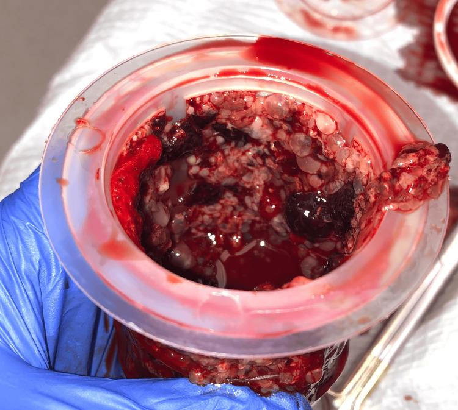

## 문제
A 46-year-old woman, gravida 4, para 3, comes to the emergency department because of headache and vaginal spotting for 4 days. Her last menstrual period was 13 weeks ago. One year ago, her blood pressure at a routine visit was 118/76 mm Hg. She takes no medications. Today, her blood pressure is 164/106 mm Hg, and pulse is 98/min. The uterus is palpable at the level of the umbilicus. There is no peripheral edema. Urinalysis shows 3+ protein. Serum creatinine concentration is 0.8 mg/dL, and serum thyroid-stimulating hormone concentration is within the reference range. Serum beta-hCG concentration is markedly increased. Transvaginal ultrasonography shows an intrauterine mass with multiple small cystic spaces. After blood pressure control, suction curettage is performed; a photograph of the evacuated uterine contents is shown. Which of the following is the most likely underlying cause of this patient's hypertension?

- A. Lupus nephritis
- B. Hydatidiform mole
- C. Chronic essential hypertension
- D. Pheochromocytoma
- E. Primary aldosteronism

_Photograph of the evacuated uterine contents in a specimen container — single-panel figure as published (PMC Open Access Subset, CC BY; no cropping or color adjustment)_

## 정답 및 해설
> 정답: B

- **정답 핵심**: The photograph shows numerous translucent, grape-like vesicles mixed with blood clot and no recognizable fetal tissue — hydropic chorionic villi of a hydatidiform mole. The uterus is much larger than dates (umbilicus at 13 weeks), beta-hCG is markedly increased and ultrasonography shows a multicystic intrauterine mass. Hypertension with proteinuria before 20 weeks of gestation in a woman who was normotensive a year earlier is preeclampsia occurring too early for an ordinary pregnancy; the classic explanation is a molar pregnancy, whose excess abnormal trophoblast drives the placental mechanism of preeclampsia ahead of schedule.
- **원리**: <b>Why preeclampsia usually waits until 20 weeks</b>: preeclampsia begins in the placenta. When cytotrophoblast fails to remodel the spiral arteries, the placenta becomes relatively ischemic and releases antiangiogenic factors such as soluble fms-like tyrosine kinase-1 (sFlt-1) and soluble endoglin. These bind VEGF and PlGF in the maternal circulation, causing endothelial dysfunction — hypertension, glomerular endotheliosis with proteinuria, and cerebral symptoms. Enough placental mass and enough mismatch between demand and supply to raise these factors normally appear only in the second half of pregnancy.  <b>Why a mole brings it forward</b>: in a hydatidiform mole the trophoblast proliferates excessively and the villi swell with fluid instead of developing a vascularized placenta. The trophoblastic mass is large early, and the same antiangiogenic imbalance appears in the first trimester. The very high hCG also explains hyperemesis, theca lutein cysts and, occasionally, hyperthyroidism (hCG shares a subunit with TSH).  <b>Clinical rule</b>: preeclampsia before 20 weeks should prompt ultrasonography and hCG measurement for molar pregnancy; treatment of the hypertension is supportive, and the definitive treatment is evacuation of the uterus.
- **비교**: <table><thead><tr><th style="width:22%">Feature</th><th style="width:39%">Hydatidiform mole (correct)</th><th>Chronic essential hypertension (closest distractor)</th></tr></thead><tbody> <tr><td>Blood pressure before pregnancy</td><td>Normal — 118/76 mm Hg a year earlier</td><td>Elevated before pregnancy or before 20 weeks</td></tr> <tr><td>Proteinuria</td><td>Present (early preeclampsia)</td><td>Absent unless preeclampsia is superimposed, usually after 20 weeks</td></tr> <tr><td>Uterus and hCG</td><td>Large for dates, markedly high hCG, multicystic mass</td><td>Size appropriate for dates, hCG appropriate</td></tr> </tbody></table> Hypertension found before 20 weeks is chronic hypertension unless the pregnancy itself is abnormal; when proteinuria, a large uterus and very high hCG accompany it, the trophoblast is the cause.
- **오답 이유**:
  - (A) Lupus nephritis can cause hypertension with proteinuria in early pregnancy; it would be favored by rash, arthritis, active urinary sediment and low complement rather than a multicystic uterine mass.
  - (C) Chronic essential hypertension is the usual cause of hypertension before 20 weeks; it would fit if her blood pressure had already been elevated before pregnancy and there were no proteinuria or large-for-dates uterus.
  - (D) Pheochromocytoma causes paroxysmal hypertension with headache, sweating and palpitations in any trimester; it would be likely with episodic symptoms, normal hCG for dates and elevated plasma metanephrines.
  - (E) Primary aldosteronism causes hypertension with hypokalemia and suppressed renin; it would be suspected with low serum potassium and no proteinuria, and it does not enlarge the uterus.
- **함정**: Calling hypertension before 20 weeks chronic hypertension without noticing the normal pre-pregnancy pressure, the proteinuria and the large uterus — early preeclampsia points to a mole.
- **학습목표**: 임신 20주 이전에 생긴 전자간증 양상의 고혈압이 포상기태를 시사함을 알고, 흡입소파 검체의 포도알 모양 소포를 연결한다
- **근거·출처**: Cunningham FG, et al. Williams Obstetrics, 26th ed. Ch. 13 Gestational trophoblastic disease (clinical findings, early-onset preeclampsia) · ACOG Practice Bulletin No. 222. Gestational hypertension and preeclampsia. Obstet Gynecol 2020;135:e237-e260 (PMID 32443079) · PMC13090612 Figure 3 — case report of a 46-year-old woman (teacher-only) · 작성자 판독(2026-10-08): 흡입소파 자궁 내용물 — 반투명한 포도알 모양 소포가 무수히 섞이고 혈괴 동반, 태아 조직 안 보임

## 출처
- Preeclampsia as the Presenting Symptom in Molar Pregnancy: A Case Report. Cureus. 2026 Mar 18;18(3):e105470. doi: 10.7759/cureus.105470 (CC BY) — Figure 3 · CC BY · https://creativecommons.org/licenses/
