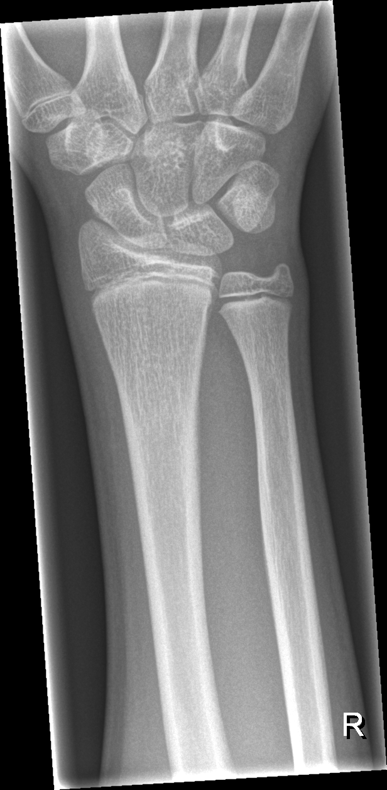

## 문제
14세 남자가 1일 전 농구를 하다 넘어지며 오른손을 뻗어 바닥을 짚은 뒤 생긴 손목 통증으로 내원하였다. 손목을 움직이면 엄지 쪽이 아프다고 한다. 진찰에서 해부학적 코담배갑에 압통이 있고, 엄지를 축 방향으로 밀면 통증이 심해진다. 원위 요골 성장판 부위에는 압통·부종·변형이 없고, 손가락의 감각과 모세혈관 재충만 시간은 정상이다. 오른쪽 손목 전후면 X선은 그림과 같고, 측면 X선에서도 골절선이나 전위는 보이지 않았다. 다음 처치로 가장 적절한 것은?

- A. 주상골 골절로 보고 즉시 관혈적 정복과 내고정을 한다
- B. 원위 요골 성장판 손상으로 보고 장상지 석고를 6주 한다
- C. 진통제만 처방하고 운동을 바로 다시 하도록 한다
- D. 엄지를 포함한 부목으로 고정하고 10~14일 뒤 재촬영한다
- E. 탄력붕대를 감고 통증이 남을 때만 다시 오게 한다

_오른쪽 손목·원위 전완 전후면 X선, 위치 표지는 원본의 것, 크기 조정만 (GRAZPEDWRI-DX, figshare, CC BY 4.0)_

## 정답 및 해설
> 정답: D

- **정답 핵심**: X선에서 원위 요골·척골의 성장판은 열려 있고 요골·척골·주상골의 피질은 끊긴 곳이 없으며 전위도 없다. 그러나 손을 뻗어 짚고 넘어진 뒤 코담배갑 압통과 엄지 축 방향 압박통이 있으면 주상골 골절을 의심해야 하고, 주상골 골절은 첫 X선에서 상당수가 보이지 않는다. 그래서 첫 X선이 정상이어도 엄지를 포함한 부목으로 고정하고 10~14일 뒤 다시 찍거나(골절선 주변 흡수로 선이 드러난다) 가능하면 MRI 로 확인한다.
- **원리**: <b>왜 주상골은 놓치면 안 되는가</b>: 주상골의 혈액은 대부분 원위부(결절 쪽)에서 들어와 근위부로 거꾸로 흐른다. 허리(중간부)나 근위부가 부러지면 근위 조각으로 가는 혈류가 끊겨 <b>무혈성 괴사</b>와 <b>불유합</b>이 생기고, 진단이 늦어 고정하지 않은 채 움직이면 그 위험이 커진다. 불유합이 진행하면 손목 관절 전체가 무너지는 관절염(SNAC 손목)으로 이어진다.  <b>왜 첫 X선이 정상일 수 있는가</b>: 주상골은 비스듬히 놓인 작은 뼈이고 전위 없는 골절선은 머리카락처럼 가늘어 일반 전후면·측면에서 겹쳐 보이지 않는다. 1~2주 지나면 골절선 가장자리가 흡수되어 넓어져 보이므로 재촬영에서 드러난다. MRI 는 첫날에도 골수 부종으로 골절을 보여 준다.  <b>그래서 원칙</b>: 임상적으로 의심되면 정상 X선을 「골절 없음」으로 받아들이지 않는다 — 엄지까지 고정해 주상골의 움직임을 막은 채 재촬영이나 MRI 로 확정한다. 청소년도 성장판이 닫혀 가는 나이라 성인형 주상골 골절이 생긴다.
- **비교**: <table><thead><tr><th style="width:22%">구분</th><th style="width:39%">잠복 주상골 골절(이 환자)</th><th>원위 요골 성장판 손상(Salter-Harris I형, 가장 가까운 오답)</th></tr></thead><tbody> <tr><td>압통 위치</td><td>코담배갑, 엄지 축 방향 압박통</td><td>원위 요골 성장판 둘레(손목 등쪽·요측 바로 위)</td></tr> <tr><td>X선</td><td>정상일 수 있음 — 10~14일 뒤 골절선</td><td>정상이거나 성장판이 약간 넓어짐, 뒤에 골막 반응</td></tr> <tr><td>처치</td><td>엄지 포함 부목 → 재촬영 또는 MRI</td><td>단상지 고정 3~4주 뒤 재평가</td></tr> </tbody></table> 두 경우 모두 「X선 정상 + 국소 압통」이면 고정한다. 어디를 누를 때 아픈지가 고정 범위(엄지 포함 여부)와 확인 방법을 정한다.
- **오답 이유**:
  - ① 즉시 관혈적 정복과 내고정은 X선이나 CT·MRI 에서 전위된(1 mm 이상) 주상골 골절이나 근위부 골절이 확인되었을 때의 치료다. 아직 골절 자체가 확인되지 않았다.
  - ② 장기간 석고 고정은 원위 요골 성장판 둘레에 압통·부종이 있어 성장판 손상을 의심할 때의 처치다(대개 단상지 3~4주면 충분하다). 이 환자는 성장판 부위가 멀쩡하고 압통이 코담배갑에 있다.
  - ③ 진통제만 주고 운동에 복귀시키는 것은 압통과 압박통이 모두 없는 가벼운 타박에서만 가능하다. 여기서는 숨은 골절이 움직임으로 불유합이 될 수 있다.
  - ⑤ 탄력붕대만 감고 증상에 맡기는 것은 코담배갑 압통이 없는 단순 염좌에 맞다. 압통이 없고 축 방향 압박통도 없었다면 이 처치가 적절하다.
- **함정**: 정상 X선을 「골절 없음」으로 읽고 고정하지 않는 것 — 코담배갑 압통이면 X선이 정상이어도 주상골 골절로 보고 고정한다.
- **학습목표**: 코담배갑 압통이 있는데 첫 X선이 정상이면 잠복 주상골 골절로 보고 엄지 포함 부목 고정 뒤 재촬영(또는 MRI)함을 안다
- **근거·출처**: Azar FM, Beaty JH. Campbell's Operative Orthopaedics, 14th ed. Ch. Fractures and dislocations of the wrist (scaphoid fractures — occult fracture, immobilization, repeat imaging) · American College of Radiology. ACR Appropriateness Criteria: Acute Hand and Wrist Trauma, 2018 update (suspected scaphoid fracture with normal radiographs) · 작성자 판독(2026-10-08): 14.1세 남 오른쪽 손목 전후면 — 원위 요골·척골 성장판 열림, 요골·척골·주상골 피질 연속, 골절선·전위·연부조직 종창 없음

## 출처
- GRAZPEDWRI-DX (figshare, CC BY 4.0) · Creative Commons Attribution 4.0 International · https://creativecommons.org/licenses/by/4.0/
