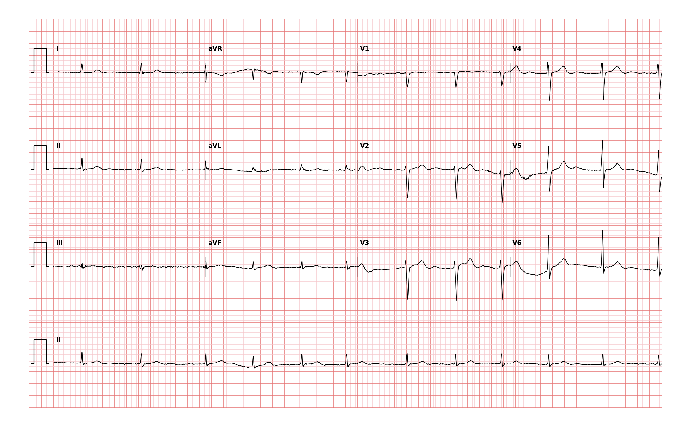

## 문제
A 78-year-old woman comes to the physician because of progressive shortness of breath on exertion and ankle swelling for 6 months. Two years ago, she underwent surgery for bilateral carpal tunnel syndrome. She has no history of hypertension, and her blood pressure has been 110 to 120/70 mm Hg at previous visits. Today, her blood pressure is 108/68 mm Hg, and pulse is 82/min and irregular. Jugular venous pressure is elevated, and there is 2+ pitting edema of both ankles. No murmur is heard. Serum N-terminal pro-B-type natriuretic peptide concentration is increased. Echocardiography shows a left ventricular wall thickness of 17 mm, a left ventricular ejection fraction of 55%, and biatrial enlargement; the aortic valve opens normally. An ECG is shown. Which of the following is the most likely cause of this patient's heart failure?

- A. Constrictive pericarditis
- B. Aortic stenosis
- C. Transthyretin cardiac amyloidosis
- D. Hypertensive heart disease
- E. Hypertrophic cardiomyopathy

_Standard 12-lead ECG, 25 mm/s and 10 mm/mV, with a lead II rhythm strip — drawn from the original digital signal, no annotation (PhysioNet, CC BY 4.0)_

## 정답 및 해설
> 정답: C

- **정답 핵심**: The ECG shows atrial fibrillation (irregularly irregular RR intervals without P waves) and low QRS voltage in all limb leads (each under 5 mm), while echocardiography shows a 17-mm-thick left ventricular wall. A thick wall on echocardiography with low voltage on the ECG is a voltage-mass mismatch: the wall is thick not because myocytes have grown but because something non-conducting has infiltrated it. In an elderly patient with heart failure with preserved ejection fraction, biatrial enlargement and a history of bilateral carpal tunnel syndrome, the most likely infiltrate is transthyretin amyloid.
- **원리**: <b>Why voltage and wall thickness normally move together</b>: QRS voltage is generated by depolarizing myocytes. In pressure-overload hypertrophy (hypertension, aortic stenosis) and in hypertrophic cardiomyopathy each myocyte enlarges, so the wall thickens and the ECG shows high voltage (LVH criteria).  <b>Why amyloid breaks the rule</b>: in amyloidosis misfolded protein fibrils are deposited between myocytes. The wall becomes thick and stiff, but the extra mass is electrically silent, and the fibrils also separate and injure the myocytes that remain. The result is a thick wall with low or normal voltage, restrictive filling with preserved ejection fraction, biatrial enlargement and frequent atrial fibrillation.  <b>Why transthyretin</b>: wild-type transthyretin amyloid accumulates with age, especially in men but also in elderly women; it is deposited early in the transverse carpal ligament, so bilateral carpal tunnel syndrome often precedes heart failure by years. The diagnosis is made noninvasively with bone-tracer scintigraphy (99mTc-pyrophosphate) after a monoclonal protein is excluded by serum and urine immunofixation and free light chains (to rule out AL amyloid). Tafamidis stabilizes the transthyretin tetramer and reduces mortality.
- **비교**: <table><thead><tr><th style="width:22%">Feature</th><th style="width:39%">Transthyretin cardiac amyloidosis (correct)</th><th>Hypertensive heart disease (closest distractor)</th></tr></thead><tbody> <tr><td>Blood pressure history</td><td>Normal or low — 110 to 120/70 mm Hg</td><td>Long-standing hypertension</td></tr> <tr><td>ECG voltage vs wall thickness</td><td>Low voltage despite a 17-mm wall (mismatch)</td><td>High voltage proportional to the thick wall</td></tr> <tr><td>Extracardiac clue</td><td>Bilateral carpal tunnel syndrome</td><td>Hypertensive retinopathy, kidney disease</td></tr> </tbody></table> Whenever the wall is thick, read the voltage: concordant high voltage means myocyte hypertrophy, low voltage means infiltration.
- **오답 이유**:
  - (A) Constrictive pericarditis also causes preserved ejection fraction and elevated venous pressure, but the wall thickness is normal; it would be favored by prior cardiac surgery or radiation, a thick pericardium and a pericardial knock.
  - (B) Aortic stenosis causes concentric hypertrophy in the elderly; it would be the answer with a harsh systolic ejection murmur and a calcified valve with reduced opening on echocardiography.
  - (D) Hypertensive heart disease thickens the wall by myocyte hypertrophy and raises QRS voltage; it would be likely with long-standing hypertension and LVH voltage criteria on the ECG.
  - (E) Hypertrophic cardiomyopathy usually shows high voltage and deep T-wave inversions with asymmetric septal hypertrophy; it would be favored in a younger patient with a family history and an outflow murmur.
- **함정**: Attributing a thick left ventricle in an elderly patient to hypertension without checking the ECG voltage — low voltage with a thick wall points to amyloid.
- **학습목표**: 좌심실 벽이 두꺼운데 QRS 전위가 낮은 불일치가 침윤성 심근병증(아밀로이드증)을 시사함을 안다
- **근거·출처**: Arbelo E, et al. 2023 ESC Guidelines for the management of cardiomyopathies. Eur Heart J 2023;44:3503-3626 (cardiac amyloidosis — red flags, diagnostic algorithm) · Loscalzo J, et al. Harrison's Principles of Internal Medicine, 21st ed. Ch. Amyloidosis; Ch. Cardiomyopathy and myocarditis · Chapman-Shaoxing/Ningbo 12-lead ECG database — expert label AF + low QRS voltage (teacher-only) · 작성자 판독(2026-10-09): 리듬 띠 II 불규칙하게 불규칙한 RR·P 파 없음(약 80회/분), 사지유도 QRS 모두 5 mm 미만, 흉부유도 보존

## 출처
- Chapman-Shaoxing/Ningbo 12-lead ECG database (PhysioNet, CC BY 4.0) · record JS02929 · Creative Commons Attribution 4.0 International · https://physionet.org/content/ecg-arrhythmia/1.0.0/
