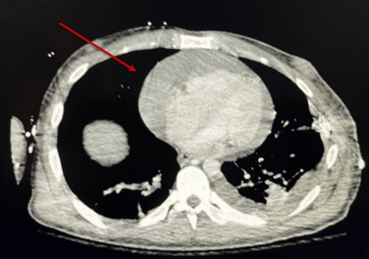

## 문제
33세 남자가 2일 전부터 숨이 차고 어지러워 응급실에 왔다. 15일 전 오토바이 사고로 가슴을 부딪혔고, 당시 갈비뼈 골절 외에 특별한 손상이 없어 퇴원하였다. 혈압 82/60 mmHg, 맥박 124회/분, 호흡 28회/분, 체온 36.8 °C 이다. 앉은 자세에서 목정맥이 확장되어 있고 심음이 작게 들린다. 들숨 때 수축기 혈압이 18 mmHg 떨어진다. 양쪽 폐의 호흡음은 대칭적이다. 혈색소는 12.8 g/dL 이다. 흉부 CT 는 그림과 같다. 가장 적절한 처치는?

- A. 정맥 이뇨제 투여
- B. 정맥 혈전용해제 투여
- C. 응급 관상동맥조영술
- D. 초음파 유도 심낭천자
- E. 양쪽 흉관 삽입

_흉부 조영증강 CT 축상면 — 출판된 증례 그림 한 컷 그대로, 화살표는 원 그림의 것 (PMC Open Access Subset, CC BY — 크롭·보정 없음)_

## 정답 및 해설
> 정답: D

- **정답 핵심**: CT 에서 심장 둘레 전체를 넓은 고리 모양의 액체가 감싸고 있다(대량 심낭 삼출). 저혈압·빈맥·목정맥 확장·작은 심음(Beck 3징후)과 들숨 때 수축기 혈압이 10 mmHg 넘게 떨어지는 기이맥이 있어 심장눌림증이다. 흉부 둔상 뒤 몇 주에 걸쳐 심낭 삼출이 천천히 늘어 지연성으로 생길 수 있다. 쇼크를 동반한 심장눌림증은 즉시 심낭천자로 액체를 빼서 압력을 낮춘다.
- **원리**: <b>왜 액체가 심장을 멈추게 하는가</b>: 심낭은 잘 늘어나지 않는 섬유막이다. 액체가 천천히 차면 심낭이 늘어나 꽤 많은 양을 견디지만, 한계를 넘으면 심낭 압력이 급히 올라 심방·심실의 이완기 압력과 같아진다. 그러면 심장이 이완기에 충분히 채워지지 못해 일회박출량이 줄고, 빈맥으로 버티다 저혈압에 이른다.  <b>왜 기이맥이 생기는가</b>: 들숨 때 흉강 압력이 낮아져 우심실로 들어오는 혈액이 늘어난다. 심낭이 꽉 차 있으면 우심실은 바깥으로 늘어날 수 없어 심실중격을 왼쪽으로 민다(심실 상호의존). 좌심실 충만이 줄어 들숨 때 수축기 혈압이 10 mmHg 넘게 떨어진다.  <b>그래서 처치</b>: 수액은 잠깐 충만압을 올려 버티게 할 뿐이고, 이뇨제·혈관확장제는 충만압을 낮춰 오히려 쇼크를 악화한다. 액체를 빼면 몇십 mL 만으로도 압력이 급히 떨어지므로 초음파 유도 심낭천자가 첫 처치이고, 응고된 혈액이나 계속되는 출혈이면 수술적 심낭 창을 낸다.
- **비교**: <table><thead><tr><th style="width:22%">구분</th><th style="width:39%">심장눌림증 — 심낭천자(정답)</th><th>혈흉 — 흉관 삽입(가장 가까운 오답)</th></tr></thead><tbody> <tr><td>CT 의 주 소견</td><td>심장 둘레 전체의 대량 액체</td><td>한쪽 흉강 아래의 대량 액체, 폐 허탈</td></tr> <tr><td>진찰</td><td>목정맥 확장·작은 심음·기이맥, 호흡음 대칭</td><td>한쪽 호흡음 감소·타진 둔탁, 목정맥은 대개 허탈</td></tr> <tr><td>혈색소</td><td>유지될 수 있음</td><td>출혈로 떨어짐</td></tr> </tbody></table> CT 에 양쪽 소량 흉수가 함께 보여도, 쇼크의 원인은 심장을 감싼 액체다 — 목정맥이 부풀어 있으면 혈액량 부족이 아니라 충만 장애다.
- **오답 이유**:
  - ① 정맥 이뇨제는 폐부종을 동반한 울혈 심부전에 쓴다. 심장눌림증에서는 충만압을 낮춰 심박출량이 더 떨어지므로, 심낭 삼출 없이 폐부종만 있을 때에야 맞는 선택이다.
  - ② 혈전용해제는 쇼크를 동반한 고위험 폐색전증의 치료다. CT 폐동맥에 충만 결손이 보이고 심낭 삼출이 없었다면 고려하지만, 외상 뒤 출혈 위험도 크다.
  - ③ 응급 관상동맥조영술은 ST 분절 상승 심근경색이나 외상성 관상동맥 박리가 의심될 때 한다. 심전도 ST 상승과 국소 벽운동 이상이 있었다면 정답에 가까워진다.
  - ⑤ 흉관 삽입은 한쪽 호흡음이 줄고 혈색소가 떨어지는 대량 혈흉·긴장성 기흉의 처치다. 이 환자의 흉수는 소량이고 호흡음이 대칭이라 쇼크를 설명하지 못한다.
- **함정**: CT 에 함께 보이는 양쪽 소량 흉수에 끌려 흉관을 넣는 것 — 쇼크와 목정맥 확장의 원인은 심장을 감싼 대량 심낭 삼출이다.
- **학습목표**: 흉부 둔상 뒤 지연성으로 생긴 대량 심낭 삼출과 심장눌림증을 알아보고 심낭천자로 감압함을 안다
- **근거·출처**: Adler Y, et al. 2015 ESC Guidelines for the diagnosis and management of pericardial diseases. Eur Heart J 2015;36:2921-2964 (cardiac tamponade — urgent pericardiocentesis) · American College of Surgeons. ATLS Advanced Trauma Life Support, 10th ed. Ch. Thoracic trauma (cardiac tamponade) · PMC12045655 Figure 4 — case report of delayed tamponade after blunt chest trauma (teacher-only) · 작성자 판독(2026-10-09): 흉부 CT 축상, 심장 둘레 전체의 대량 심낭 삼출, 양측 소량 흉수

## 출처
- Life-Threatening Delayed Pericardial Tamponade Following Blunt Chest Trauma. Cureus. 2025 Apr 1;17(4):e81578. doi: 10.7759/cureus.81578 (CC BY) — Figure 4 · CC BY · https://creativecommons.org/licenses/
