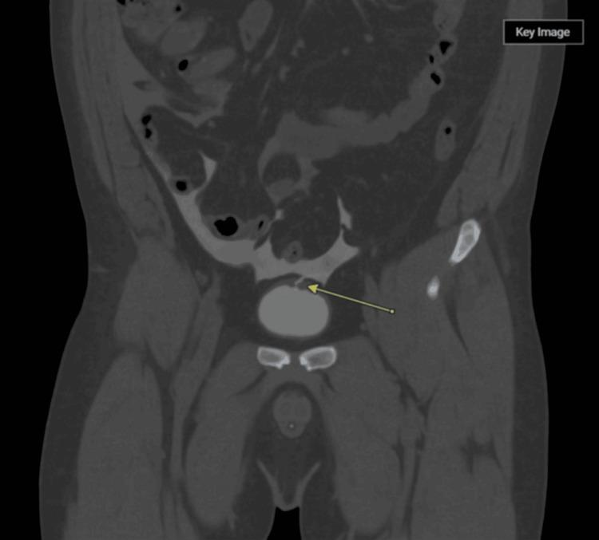

## 문제
A 39-year-old man comes to the emergency department because of abdominal pain and distension for 3 days. Three days ago, he fell at home after drinking heavily, striking his lower abdomen on the edge of a table. Since then he has passed only small amounts of urine. His temperature is 37.4°C, pulse is 104/min, and blood pressure is 118/74 mm Hg. The abdomen is distended with diffuse tenderness and shifting dullness. There is no blood at the urethral meatus. Serum urea nitrogen concentration is 62 mg/dL, and serum creatinine concentration is 3.4 mg/dL; one year ago, the creatinine concentration was 0.9 mg/dL. Creatinine concentration in fluid obtained by paracentesis is much higher than that in serum. Pelvic radiographs show no fracture. Contrast-enhanced CT of the abdomen and pelvis is shown. Which of the following is the most appropriate next step in management?

- A. Repeated large-volume paracentesis
- B. Bilateral percutaneous nephrostomy
- C. Surgical repair of the bladder
- D. Urethral catheter drainage alone for 2 weeks
- E. Hemodialysis

_Contrast-enhanced coronal CT of the abdomen and pelvis — single-panel figure as published, arrow as in the original (PMC Open Access Subset, CC BY; no cropping or color adjustment)_

## 정답 및 해설
> 정답: C

- **정답 핵심**: The CT shows a defect in the dome of the bladder wall with a large amount of free fluid around the bowel loops and in the pelvis. Ascitic fluid with a creatinine concentration far higher than serum is urine. A blow to a full bladder in an intoxicated man ruptures the dome, the weakest part covered by peritoneum, and urine leaks into the peritoneal cavity. The peritoneum reabsorbs urea and creatinine, raising serum values (pseudo-renal failure) even though the kidneys are normal. An intraperitoneal rupture does not heal with catheter drainage alone and requires operative repair.
- **원리**: <b>Why the dome ruptures</b>: when the bladder is full it rises out of the pelvis and its dome, the only part covered by peritoneum and the thinnest, faces the abdominal wall. A sudden rise in pressure from a blow bursts it like a balloon — typically in an intoxicated person whose full bladder and lax abdominal wall offer no protection. Extraperitoneal rupture, by contrast, is caused by pelvic fractures in which bone fragments or ligament shear tear the anterolateral bladder wall below the peritoneal reflection.  <b>Why the creatinine rises</b>: the peritoneum is a large semipermeable membrane (the basis of peritoneal dialysis). Urine in the peritoneal cavity allows urea, creatinine and potassium to diffuse back into the blood, so serum concentrations rise and look like acute kidney injury. Ascitic creatinine higher than serum creatinine identifies the fluid as urine, and serum values fall quickly after repair.  <b>Why surgery</b>: the dome defect is usually large, urine continues to flow into the peritoneum regardless of a catheter, and urinary ascites causes peritonitis and sepsis. Intraperitoneal rupture is repaired surgically (laparotomy or laparoscopy) with catheter drainage afterward; most uncomplicated extraperitoneal ruptures heal with catheter drainage alone.
- **비교**: <table><thead><tr><th style="width:22%">Feature</th><th style="width:39%">Intraperitoneal rupture (this patient)</th><th>Extraperitoneal rupture (closest distractor: catheter alone)</th></tr></thead><tbody> <tr><td>Mechanism</td><td>Blow to a full bladder</td><td>Pelvic fracture</td></tr> <tr><td>Site and leak</td><td>Dome; urine among bowel loops, paracolic gutters</td><td>Anterolateral wall; contrast in perivesical space</td></tr> <tr><td>Treatment</td><td>Surgical repair</td><td>Urethral catheter drainage for about 2 weeks</td></tr> </tbody></table> The site of leakage — peritoneal cavity or perivesical tissue — decides the treatment, not the size of the injury on the first look.
- **오답 이유**:
  - (A) Large-volume paracentesis treats tense ascites of cirrhosis; it would fit if the fluid had a serum-ascites albumin gradient above 1.1 g/dL and creatinine equal to serum, but here urine keeps leaking.
  - (B) Percutaneous nephrostomy relieves upper-tract obstruction; it would be appropriate for bilateral hydronephrosis from ureteral obstruction, which would not cause urine in the peritoneum.
  - (D) Catheter drainage alone is the standard treatment for uncomplicated extraperitoneal rupture after pelvic fracture; it would be correct if contrast extravasation were confined to the perivesical space.
  - (E) Hemodialysis treats true acute kidney injury with refractory hyperkalemia, acidosis or volume overload; here the creatinine is high because urine is reabsorbed from the peritoneum and falls once the leak is repaired.
- **함정**: Reading the raised creatinine as acute kidney injury needing dialysis, or treating the rupture like an extraperitoneal one with a catheter alone.
- **학습목표**: 복강 내 방광 파열을 알아보고, 복막의 소변 재흡수로 생긴 가성 신부전과 수술적 봉합이 필요함을 안다
- **근거·출처**: Morey AF, et al. Urotrauma: AUA guideline. J Urol 2014;192:327-335 (intraperitoneal bladder rupture — surgical repair) · Partin AW, et al. Campbell-Walsh-Wein Urology, 12th ed. Ch. Lower urinary tract trauma · PMC12331415 Figure 1 — case report of intraperitoneal bladder rupture after a ground-level fall (teacher-only) · 작성자 판독(2026-10-09): 복부·골반 관상 CT, 방광 꼭대기 벽 결손과 복강 내 다량 액체, 골반골 골절 없음

## 출처
- Traumatic Intraperitoneal Bladder Rupture Presenting With Massive Ascites and Acute Kidney Injury Following a Ground-Level Fall. Cureus. 2025 Jul 8;17(7):e87550. doi: 10.7759/cureus.87550 (CC BY) — Figure 1 · CC BY · https://creativecommons.org/licenses/
