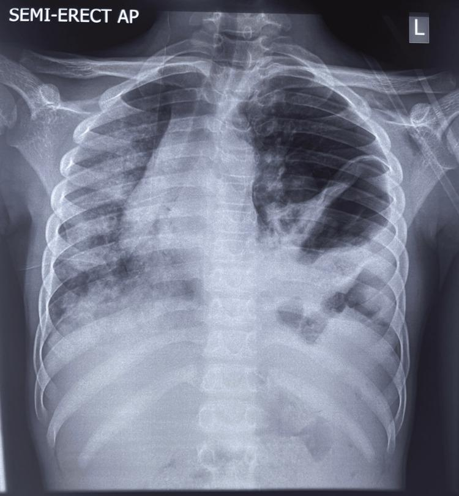

## 문제
13세 남자가 4시간 전 자전거를 타다 넘어져 핸들에 왼쪽 윗배를 부딪힌 뒤 숨이 차서 응급실에 왔다. 혈압 110/70 mmHg, 맥박 118회/분, 호흡 32회/분, 산소포화도 90 %(대기)이다. 왼쪽 가슴의 호흡음이 줄어 있고 그 부위에서 장음이 들린다. 기관은 오른쪽으로 치우쳐 있다. 배는 약간 꺼져 보이고 왼쪽 윗배에 압통이 있다. 혈색소는 13.2 g/dL 이다. 흉부 X선은 그림과 같다. 가장 적절한 처치는?

- A. 왼쪽 다섯째 갈비사이에 흉관을 넣는다
- B. 왼쪽 둘째 갈비사이에 바늘 감압을 한다
- C. 산소를 주고 6시간 뒤 흉부 X선을 다시 찍는다
- D. 기관지 내시경으로 왼쪽 주기관지를 확인한다
- E. 비위관을 넣어 감압한 뒤 응급 수술로 가로막을 교정한다

_반좌위 전후면 흉부 X선, 글자·좌우 표지는 원 그림의 것 — 출판된 증례 그림 한 컷 그대로 (PMC Open Access Subset, CC BY — 크롭·보정 없음)_

## 정답 및 해설
> 정답: E

- **정답 핵심**: X선에서 왼쪽 흉곽 아래·중간에 폐 혈관 음영이 없는 장관 가스 음영이 올라와 있고 왼쪽 가로막 윤곽이 보이지 않으며 종격이 오른쪽으로 밀려 있다. 왼쪽 윗배 둔상 뒤 왼쪽 가슴에서 장음이 들리고 배가 꺼져 보이는 것은 외상성 가로막 탈장이다. 흉관이나 바늘을 넣으면 탈출한 위·대장을 뚫을 수 있으므로 피하고, 비위관으로 위를 감압해 종격 압박을 줄인 뒤 수술(대개 개복)로 장기를 되돌리고 가로막을 봉합한다.
- **원리**: <b>왜 왼쪽인가</b>: 복부 둔상으로 복강 압력이 갑자기 오르면 가장 약한 경계인 가로막이 찢어진다. 오른쪽은 간이 가로막 아래를 받쳐 충격을 흩고 탈출을 막지만, 왼쪽은 위·비장·대장이 바로 아래에 있어 찢어진 틈으로 흉강에 쉽게 밀려 올라간다. 그래서 둔상 가로막 손상은 왼쪽이 훨씬 흔하다.  <b>왜 숨이 차고 종격이 밀리는가</b>: 흉강 압력은 음압이라 복강 장기가 계속 빨려 올라온다. 장기가 왼쪽 폐를 누르고 종격을 오른쪽으로 밀어 오른쪽 폐의 환기와 정맥 환류까지 줄인다. 위에 공기가 차면 긴장성 기흉처럼 행동한다(긴장성 위흉).  <b>왜 흉관이 위험한가</b>: X선의 공기·액체 음영을 기흉·혈흉으로 오인해 흉관을 넣으면 탈출한 위·대장을 뚫어 흉강이 오염된다. 비위관이 흉강 안에서 말려 보이면 진단이 확정되고, 동시에 위 감압으로 압박을 줄인다. 가로막은 저절로 붙지 않고 장기가 교액될 수 있어 수술로 교정하며, 급성기 둔상에는 동반 복부 장기 손상을 보려고 개복을 흔히 택한다.
- **비교**: <table><thead><tr><th style="width:22%">구분</th><th style="width:39%">외상성 가로막 탈장(이 환자)</th><th>혈기흉 — 흉관(가장 가까운 오답)</th></tr></thead><tbody> <tr><td>X선</td><td>흉곽 안 장관 가스·가로막 윤곽 소실</td><td>흉막선 바깥 공기·공기-액체 경계, 가로막은 보임</td></tr> <tr><td>청진·복부</td><td>가슴에서 장음, 배가 꺼져 보임</td><td>호흡음 감소만, 장음 없음</td></tr> <tr><td>처치</td><td>비위관 감압 → 수술적 교정</td><td>흉관 삽입</td></tr> </tbody></table> 흉곽 안 공기 음영에 장관의 주름·벽이 보이고 가로막 선이 끊겼으면, 흉관보다 비위관이 먼저다.
- **오답 이유**:
  - ① 흉관 삽입은 혈흉·기흉의 처치다. 흉막선 바깥의 공기나 공기-액체 경계가 보이고 가로막 윤곽이 유지되었다면 정답이지만, 여기서는 탈출한 장을 뚫을 수 있다.
  - ② 바늘 감압은 저혈압·목정맥 확장을 동반한 긴장성 기흉의 응급 처치다. 혈관 음영 없는 흉막 공기와 쇼크가 있었다면 적절하지만, 여기서는 위를 뚫을 위험이 있다.
  - ③ 관찰 후 재촬영은 소견이 애매하고 증상이 없을 때나 고려한다. 저산소혈증·종격 전위가 있는 이 환자에서는 교액과 호흡 악화를 놓친다 — 무증상의 작은 소견이었다면 가능하다.
  - ④ 기관지 내시경은 지속되는 대량 공기 누출이나 흉관 삽입 뒤에도 펴지지 않는 폐로 기관지 파열이 의심될 때 한다. 피하기종과 지속 공기 누출이 있었다면 정답에 가깝다.
- **함정**: 흉곽 안 공기 음영을 기흉으로 읽고 흉관을 넣는 것 — 가슴에서 장음이 들리고 가로막 윤곽이 없으면 가로막 탈장이다.
- **학습목표**: 복부 둔상 뒤 왼쪽 흉곽의 장관 가스와 가로막 소실로 외상성 가로막 탈장을 알아보고, 흉관을 넣지 않고 위 감압 후 수술함을 안다
- **근거·출처**: American College of Surgeons. ATLS Advanced Trauma Life Support, 10th ed. Ch. Thoracic trauma (traumatic diaphragmatic injury — nasogastric tube, avoid chest tube) · Townsend CM, et al. Sabiston Textbook of Surgery, 21st ed. Ch. The diaphragm / Ch. Thoracic trauma · PMC12335322 Figure 3 — case report of traumatic diaphragmatic hernia in a 13-year-old boy (teacher-only) · 작성자 판독(2026-10-09): 반좌위 흉부 X선, 왼쪽 흉곽 안 장관 가스·왼쪽 가로막 소실·종격 오른쪽 전위, 오른쪽 폐 반점상 음영

## 출처
- Point-of-Care Ultrasound for Traumatic Diaphragmatic Hernia in a Low- and Middle-Income Country: A Case Report. Cureus. 2025 Jul 9;17(7):e87630. doi: 10.7759/cureus.87630 (CC BY) — Figure 3 · CC BY · https://creativecommons.org/licenses/
