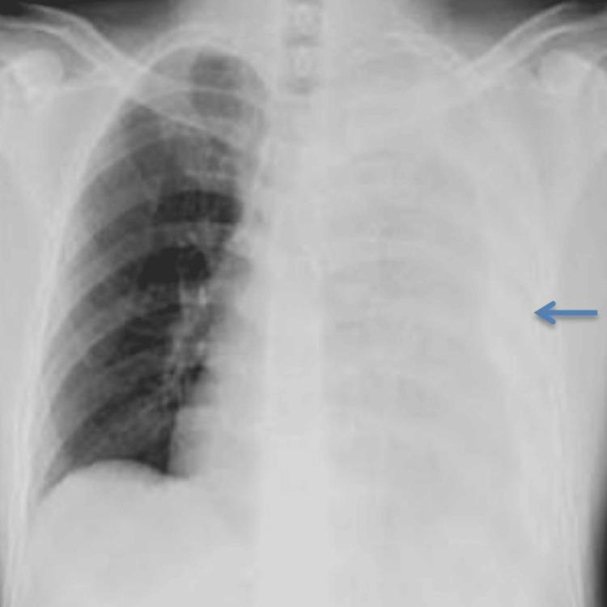

## 문제
A 20-year-old man is brought to the emergency department 1 hour after a motorcycle collision because of left-sided chest pain and shortness of breath. His blood pressure is 104/66 mm Hg, pulse is 114/min, respirations are 26/min, and oxygen saturation is 91% on room air. There is tenderness over the left chest wall. Breath sounds are decreased over the left hemithorax, and percussion is dull. The trachea is midline, and the jugular veins are not distended. Heart sounds are clearly heard. Hemoglobin concentration is 11.8 g/dL. A chest x-ray is shown. Which of the following is the most appropriate next step in management?

- A. Emergency thoracotomy
- B. Needle decompression of the left chest
- C. Ultrasound-guided pericardiocentesis
- D. Flexible bronchoscopy
- E. Left tube thoracostomy

_Anteroposterior chest x-ray, arrow as in the original — single-panel figure as published (PMC Open Access Subset, CC BY; no cropping or color adjustment)_

## 정답 및 해설
> 정답: E

- **정답 핵심**: The chest x-ray shows nearly uniform opacification of the entire left hemithorax from apex to base, obscuring the left hemidiaphragm and left heart border. After blunt chest trauma, together with decreased breath sounds and dullness to percussion, this is a large hemothorax. The first step is a large-bore chest tube to drain the blood and re-expand the lung; the initial output and the hourly drainage then decide whether thoracotomy is needed.
- **원리**: <b>Why the chest tube is both diagnosis and treatment</b>: blood in the pleural space compresses the lung and is itself a measure of the bleeding. A chest tube re-expands the lung, which improves oxygenation and tamponades bleeding from the lung parenchyma and intercostal vessels; about 85% of blunt hemothoraces need nothing more.  <b>When to proceed to thoracotomy</b>: an initial output of 1500 mL or more, continued drainage of 200 mL/h or more for 2 to 4 hours, or persistent instability despite transfusion suggests injury to great vessels, the heart, or the pulmonary hilum and calls for thoracotomy. The decision is therefore made <b>after</b> the tube is placed, from what it drains.  <b>Separating tension pneumothorax and tamponade</b>: both impair venous return and distend the neck veins; tension pneumothorax adds hyperresonance and tracheal deviation. This patient has flat neck veins, dullness, and clearly heard heart sounds.
- **비교**: <table><thead><tr><th style="width:22%">Feature</th><th style="width:39%">Tube thoracostomy (correct)</th><th>Emergency thoracotomy (closest distractor)</th></tr></thead><tbody> <tr><td>When</td><td>First step for nearly every traumatic hemothorax</td><td>Initial drainage of 1500 mL or more, or 200 mL/h or more persisting</td></tr> <tr><td>Hemodynamics</td><td>Responsive or relatively stable</td><td>Unstable despite transfusion</td></tr> <tr><td>Deciding information</td><td>Hemothorax on x-ray and examination</td><td>Chest tube output</td></tr> </tbody></table> The size of the opacity on the x-ray does not decide thoracotomy — the tube goes in first, and the blood it drains decides surgery.
- **오답 이유**:
  - (A) Emergency thoracotomy is indicated when the chest tube drains 1500 mL or more initially, 200 mL/h or more continues, or shock persists despite transfusion; it is not chosen from the x-ray before a tube is placed.
  - (B) Needle decompression treats tension pneumothorax with hyperresonance, tracheal deviation, and distended neck veins; dullness with a midline trachea means fluid, not air.
  - (C) Pericardiocentesis treats cardiac tamponade with distended neck veins, muffled heart sounds, and pulsus paradoxus; this patient's neck veins are flat and heart sounds are clear.
  - (D) Flexible bronchoscopy evaluates tracheobronchial rupture or mucus-plug atelectasis; it would be considered if a large air leak persisted and the lung failed to re-expand after a chest tube.
- **함정**: Going straight to thoracotomy because the whole hemithorax is white — thoracotomy is decided by chest tube output after drainage.
- **학습목표**: 흉부 둔상 뒤 한쪽 흉곽 전체의 음영·호흡음 감소·타진 둔탁을 대량 혈흉으로 판단하고 첫 처치가 흉관 삽입임을 안다
- **근거·출처**: American College of Surgeons. ATLS Advanced Trauma Life Support, 10th ed. Ch. 4 Thoracic trauma (massive hemothorax — tube thoracostomy, indications for thoracotomy) · Mowery NT, et al. Practice management guidelines for management of hemothorax and occult pneumothorax. J Trauma 2011;70:510-518 · PMC12633636 Figure 1 — case report of traumatic hemothorax (teacher-only) · 작성자 판독(2026-10-10): 전후면 흉부 X선, 왼쪽 흉곽 전체가 균일하게 하얗고 왼쪽 가로막·심장 왼쪽 경계 지워짐, 오른쪽 폐 정상, 기관은 대략 가운데

## 출처
- The Paradox of Relief: Recognizing and Managing Re-expansion Pulmonary Edema Following Traumatic Hemothorax. Cureus. 2025 Oct 21;17(10):e95061. doi: 10.7759/cureus.95061 (CC BY) — Figure 1 · CC BY · https://creativecommons.org/licenses/
