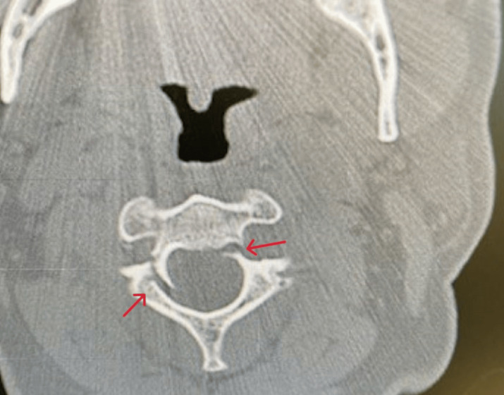

## 문제
A 59-year-old man is brought to the emergency department 2 hours after he fell down a flight of stairs and struck his forehead on the floor. He reports pain at the back of his neck. He did not lose consciousness. He has an abrasion on his forehead. Muscle strength, sensation, and deep tendon reflexes are normal in all extremities. Rectal tone is normal. A CT scan of the cervical spine at the level of the second cervical vertebra is shown. Which of the following is the most likely mechanism of this injury?

- A. Hyperflexion with anterior shear
- B. Rotation with lateral flexion
- C. Distraction of the occiput from the atlas
- D. Hyperextension with axial loading
- E. Vertical axial compression on the vertex

_Non-contrast axial CT — one panel cropped from a published case figure, arrows as in the original (PMC Open Access Subset, CC BY; no color adjustment)_

## 정답 및 해설
> 정답: D

- **정답 핵심**: The axial CT through C2 shows fracture lines through both sides of the neural arch at its junction with the vertebral body (the pars interarticularis/pedicles), separating the posterior elements from the body. This is a traumatic spondylolisthesis of the axis (hangman fracture). Striking the forehead in a fall drives the head into hyperextension while the body weight loads the spine axially, so the C2 neural arch fails between the C1 lateral masses above and the C3 facets below.
- **원리**: <b>Why the pars of C2 breaks in hyperextension</b>: the C2 pars interarticularis is the thin bridge between the superior articular facet (which carries the head through C1) and the inferior articular facet (which sits on C3). In hyperextension the posterior elements of C1 and C3 squeeze this bridge from above and below, and an axial load adds force. The weakest point — both sides of the neural arch — breaks, and the C2 body may slide forward on C3.  <b>Why the cord is usually spared</b>: the fracture separates the arch from the body, so the spinal canal at C2 becomes wider rather than narrower ("autodecompression"). The canal at C2 is also the widest in the cervical spine. Most patients, like this one, are neurologically intact.  <b>Mechanism names the fracture</b>: a blow to the vertex with a straight neck (diving) compresses C1 between the occipital condyles and C2 and bursts the atlas ring outward (Jefferson fracture). Hyperflexion produces anterior wedge or flexion-teardrop injuries, and distraction of the occiput produces atlanto-occipital dissociation. Treatment of a hangman fracture depends on displacement and angulation: most are stable and heal in a rigid collar or halo.
- **비교**: <table><thead><tr><th style="width:22%">Feature</th><th style="width:39%">Hangman fracture (correct)</th><th>Jefferson fracture (closest distractor)</th></tr></thead><tbody> <tr><td>Level</td><td>C2 — neural arch (pars/pedicles)</td><td>C1 — anterior and posterior arches of the atlas ring</td></tr> <tr><td>Mechanism</td><td>Hyperextension with axial load (forehead strike)</td><td>Vertical compression on the vertex with the neck straight (diving)</td></tr> <tr><td>Canal</td><td>Widened by separation of arch from body</td><td>Widened as the lateral masses spread outward</td></tr> </tbody></table> Both are usually neurologically silent because they widen the canal — the level of the ring and the direction of the force separate them.
- **오답 이유**:
  - (A) Hyperflexion with anterior shear causes anterior wedge compression or flexion-teardrop fractures of the vertebral body; it would fit a blow to the back of the head that forced the chin to the chest.
  - (B) Rotation with lateral flexion produces unilateral facet dislocation or atlantoaxial rotatory subluxation; it would fit a fixed rotated head posture and an asymmetric C1-C2 relationship on CT.
  - (C) Distraction of the occiput from the atlas is atlanto-occipital dissociation from high-energy deceleration; it would be favored by a widened condyle-C1 interval and usually severe neurologic injury.
  - (E) Vertical axial compression on the vertex with a straight neck bursts the C1 ring (Jefferson fracture); it would be the answer if the CT showed C1 arch fractures with lateral mass displacement after a diving injury.
- **함정**: Assuming every upper cervical fracture after a fall is a vertical compression (Jefferson) injury — a forehead strike forces hyperextension, which breaks the C2 neural arch.
- **학습목표**: C2 양쪽 신경궁(관절간부·척추경) 골절(Hangman 골절)의 기전이 과신전과 축성 부하임을 알고 신경 손상이 드문 이유를 설명한다
- **근거·출처**: Bucholz RW, et al. Rockwood and Green's Fractures in Adults, 9th ed. Ch. Cervical spine fractures and dislocations (traumatic spondylolisthesis of the axis) · Effendi B, et al. Fractures of the ring of the axis: a classification based on the analysis of 131 cases. J Bone Joint Surg Br 1981;63-B:319-327 · PMC11283068 Figure 1 — case report of hangman's fracture (teacher-only) · 작성자 판독(2026-10-10): C2 축상 CT, 양쪽 신경궁과 척추체 경계(척추경·관절간부)의 골절선(원 그림 화살표), 척추관은 넓어짐

## 출처
- Don’t Hang Around, It Could Be Incidental: A Case Report of Hangman’s Fracture and Review of the Literature. Cureus. 2024 Jun 27;16(6):e63285. doi: 10.7759/cureus.63285 (CC BY) — Figure 1 · CC BY · https://creativecommons.org/licenses/
