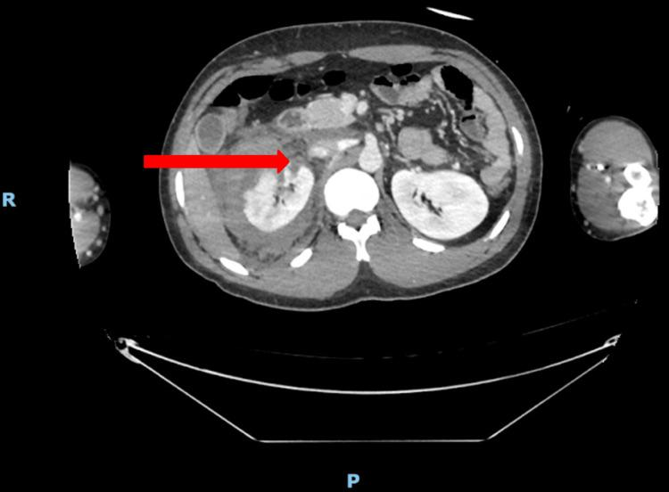

## 문제
26세 남자가 오토바이에서 떨어져 오른쪽 옆구리를 부딪친 뒤 3시간 만에 응급실에 왔다. 도착 당시 혈압 96/60 mmHg, 맥박 118회/분 이었고, 정질액 1 L 를 주입한 뒤 혈압 122/76 mmHg, 맥박 92회/분 으로 회복되어 6시간 동안 유지되었다. 오른쪽 옆구리에 압통과 멍이 있고 복막 자극 징후는 없다. 육안적 혈뇨가 있다. 혈색소는 도착 시 13.1 g/dL, 6시간 뒤 12.7 g/dL 이다. 동맥기 영상에서 조영제가 혈관 밖으로 새는 소견은 없었다. 복부 조영증강 CT 는 그림과 같다. 가장 적절한 처치는?

- A. 침상 안정과 연속 혈색소 측정
- B. 응급 개복 콩팥절제술
- C. 콩팥동맥 혈관색전술
- D. 즉시 요관 스텐트 삽입
- E. 경피적 콩팥창냄술

_조영증강 복부 CT 축상면, R·P 표지와 화살표는 원 그림의 것 — 출판된 증례 그림 한 컷 그대로 (PMC Open Access Subset, CC BY — 크롭·보정 없음)_

## 정답 및 해설
> 정답: A

- **정답 핵심**: CT 에서 오른쪽 콩팥이 여러 조각으로 갈라지고 콩팥 둘레와 후복막에 넓은 혈종이 있다(고등급 둔상 콩팥 손상). 그러나 정질액 1 L 에 혈압이 회복되어 6시간 동안 유지되고 혈색소도 거의 떨어지지 않았으며 조영제 혈관외 유출이 없다. 혈역학이 안정된 둔상 콩팥 손상은 등급과 관계없이 비수술적 관찰(침상 안정·활력징후·연속 혈색소 측정)이 원칙이다.
- **원리**: <b>왜 수술하지 않는가</b>: 콩팥은 단단한 Gerota 근막 안에 들어 있어, 실질이 갈라져도 주위 혈종이 그 근막 안에서 압력을 높여 출혈을 스스로 누른다(눌림 효과). 이때 개복하면 그 근막이 열려 눌림이 풀리고, 지혈하려다 콩팥을 통째로 떼어 내게 되는 경우가 많다. 그래서 혈역학이 안정되면 고등급 손상도 관찰이 콩팥을 가장 많이 살린다.  <b>관찰의 내용</b>: 침상 안정, 활력징후와 혈색소를 연속 측정하고, 육안적 혈뇨가 맑아질 때까지 지켜본다. 소변 누출(요종)은 대부분 저절로 흡수되며, 커지거나 감염되거나 열이 날 때에만 요관 스텐트를 넣는다.  <b>개입이 필요한 때</b>: 혈관외 유출(활동성 동맥 출혈)이나 가성동맥류가 보이면 혈관색전술을 한다. 수액·수혈에도 불안정하거나, 팽창하거나 박동하는 혈종이 있거나, 콩팥문 혈관이 뜯겨 나갔으면 수술(대개 콩팥절제술)을 한다.
- **비교**: <table><thead><tr><th style="width:22%">구분</th><th style="width:39%">비수술적 관찰(정답)</th><th>응급 콩팥절제술(가장 가까운 오답)</th></tr></thead><tbody> <tr><td>혈역학</td><td>수액에 반응해 안정 유지</td><td>수액·수혈에도 불안정</td></tr> <tr><td>CT</td><td>실질 파열·혈종, 혈관외 유출 없음</td><td>콩팥문 혈관 손상, 팽창하는 혈종</td></tr> <tr><td>혈색소 추이</td><td>거의 일정(13.1 → 12.7)</td><td>계속 떨어짐</td></tr> </tbody></table> 손상 등급이 높다는 것만으로는 수술하지 않는다 — 혈역학과 활동성 출혈 여부가 처치를 정한다.
- **오답 이유**:
  - ② 응급 콩팥절제술은 수액·수혈에도 혈역학이 불안정하거나 콩팥문 혈관이 뜯겨 나간 경우의 처치다. 혈압이 회복되어 유지되는 이 환자에서는 살릴 수 있는 콩팥을 잃게 한다.
  - ③ 혈관색전술은 CT 에서 조영제가 혈관 밖으로 새거나 가성동맥류가 보이는 활동성 동맥 출혈에 쓴다. 이 환자는 혈관외 유출이 없다.
  - ④ 요관 스텐트는 소변 누출로 생긴 요종이 커지거나 감염되거나 열이 날 때 넣는다. 처음부터 넣을 필요는 없고 대부분 저절로 흡수된다.
  - ⑤ 경피적 콩팥창냄술은 요관 폐쇄로 생긴 감염된 수신증을 빼낼 때 쓴다. 손상 직후 혈종이 있는 콩팥에 바늘을 넣을 이유가 없다.
- **함정**: 콩팥이 여러 조각으로 갈라진 CT 를 보고 수술을 고르는 것 — 혈역학이 안정되고 혈관외 유출이 없으면 관찰한다.
- **학습목표**: 혈역학이 안정된 고등급 둔상 콩팥 손상은 활동성 출혈이 없으면 비수술적으로 관찰함을 안다
- **근거·출처**: Morey AF, et al. Urotrauma Guideline 2020: AUA Guideline. J Urol 2021;205:30-35 (renal trauma — nonoperative management of hemodynamically stable patients) · Kitrey ND, et al. EAU Guidelines on Urological Trauma, 2024 ed. (renal trauma) · PMC12718121 Figure 1 — case report of conservatively managed high-grade blunt renal injury (teacher-only) · 작성자 판독(2026-10-10): 조영증강 복부 CT 축상, 오른쪽 콩팥이 여러 조각으로 갈라지고 불균질하게 조영, 콩팥 둘레·후복막 혈종, 왼쪽 콩팥 정상

## 출처
- Conservatively Managed Grade V Blunt Renal Injury. Cureus. 2025 Nov 20;17(11):e97369. doi: 10.7759/cureus.97369 (CC BY) — Figure 1 · CC BY · https://creativecommons.org/licenses/
