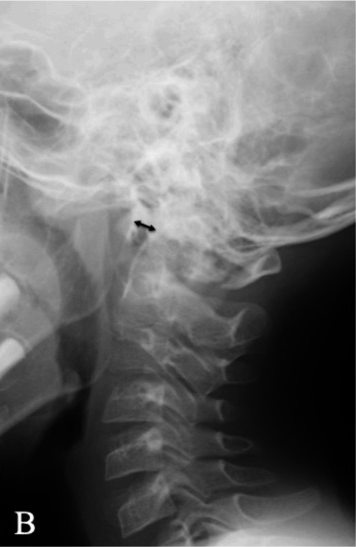

## 문제
8세 남아가 트램펄린에서 떨어져 머리 위쪽을 부딪친 뒤 목 통증과 고개가 오른쪽으로 기울어진 채 움직이지 않으려 하여 응급실에 왔다. 의식은 명료하고 팔다리의 근력·감각·반사는 정상이다. 목 뒤쪽 윗부분에 압통이 있다. 중립 자세에서 찍은 측면 경추 X선은 그림과 같고, 양방향 화살표 사이 간격은 6 mm 로 측정되었다. 손상되었을 가능성이 가장 높은 구조물은?

- A. 앞세로인대
- B. 목덜미인대
- C. 뒤세로인대
- D. 환추 횡인대
- E. 익상인대

_중립 자세 측면 경추 X선, 양방향 화살표와 패널 문자는 원 그림의 것 — 출판된 증례 그림에서 한 패널만 잘라냄 (PMC Open Access Subset, CC BY — 보정 없음)_

## 정답 및 해설
> 정답: D

- **정답 핵심**: X선에서 C1 앞고리 뒷면과 치아돌기 앞면 사이(환추치간격, ADI)가 6 mm 로 넓어져 있다. 이 간격을 일정하게 붙잡아 두는 구조가 치아돌기 뒤를 가로지르는 환추 횡인대다. 소아의 정상 ADI 는 5 mm 이하(성인 3 mm 이하)이므로 6 mm 는 횡인대 손상으로 C1 이 C2 위에서 앞으로 미끄러진 환축추 불안정이다.
- **원리**: <b>무엇이 ADI 를 정하는가</b>: 치아돌기는 C1 앞고리 뒷면에 붙어 회전축 역할을 한다. 그 뒤를 환추 횡인대가 띠처럼 감싸 C1 이 앞으로 미끄러지지 못하게 한다. 횡인대가 끊어지면 고개를 숙일 때 C1 이 앞으로 밀려 ADI 가 넓어지고, 치아돌기가 척수 쪽으로 다가가 척수를 누를 수 있다.  <b>왜 소아 기준이 다른가</b>: 소아는 인대가 느슨하고 치아돌기·C1 앞고리의 뼈 형성이 아직 덜 되어 연골 부분이 X선에 보이지 않는다. 그래서 정상 ADI 가 성인(3 mm 이하)보다 넓은 5 mm 이하까지 허용된다. 6 mm 는 소아 기준으로도 넓다.  <b>다른 인대는 무엇을 막는가</b>: 익상인대는 치아돌기 끝에서 후두과로 가서 과도한 <b>회전</b>을 막는다 — 손상되면 회전 범위가 커지지만 ADI 는 변하지 않는다. 앞세로인대는 과신전을, 뒤세로인대·목덜미인대는 과굴곡을 제한하며 손상되면 아래 경추의 정렬·추간 간격이 변한다.
- **비교**: <table><thead><tr><th style="width:22%">구분</th><th style="width:39%">환추 횡인대(정답)</th><th>익상인대(가장 가까운 오답)</th></tr></thead><tbody> <tr><td>위치</td><td>C1 양쪽 외측괴 사이, 치아돌기 뒤를 가로지름</td><td>치아돌기 끝 → 양쪽 후두과</td></tr> <tr><td>막는 움직임</td><td>C1 의 앞쪽 미끄러짐</td><td>머리의 과도한 회전·옆굽힘</td></tr> <tr><td>측면 X선</td><td>ADI 확대(소아 5 mm, 성인 3 mm 초과)</td><td>ADI 정상 — CT·MRI 에서 회전 비대칭</td></tr> </tbody></table> 측면 X선에서 앞뒤로 넓어진 간격은 횡인대, 축상 영상에서 돌아간 관계는 익상인대 쪽이다.
- **오답 이유**:
  - ① 앞세로인대는 과신전을 제한한다. 아래 경추에서 추간판 앞쪽 간격이 벌어지고 척추 앞 연부조직이 부었다면 손상을 의심한다.
  - ② 목덜미인대는 극돌기 끝을 잇는 뒤쪽 인대로 과굴곡을 제한한다. 극돌기 사이가 부채꼴로 벌어진 측면 X선이었다면 의심한다.
  - ③ 뒤세로인대는 척추체 뒷면을 따라 과굴곡을 제한한다. 아래 경추에서 척추체 사이가 뒤쪽으로 벌어지고 뒤 관절이 탈구되었다면 의심한다.
  - ⑤ 익상인대는 머리의 과도한 회전을 막는다. 측면 X선의 ADI 는 정상이고 CT 에서 C1-C2 회전 비대칭이나 치아돌기 끝 견열 골편이 보였다면 의심한다.
- **함정**: 소아의 ADI 를 성인 기준(3 mm)으로만 외우거나, 고개가 기울어 있다는 이유로 회전을 막는 익상인대를 고르는 것 — 넓어진 ADI 는 횡인대다.
- **학습목표**: 소아 측면 경추 X선에서 환추치간격(ADI) 확대가 환추 횡인대 손상을 뜻함을 알고 소아·성인 정상값의 차이를 안다
- **근거·출처**: Herman MJ, et al. Pediatric cervical spine clearance and injury. In: Rockwood and Wilkins' Fractures in Children, 9th ed. (atlantodental interval up to 5 mm in children) · Standring S, ed. Gray's Anatomy, 42nd ed. Craniovertebral joints — transverse and alar ligaments · PMC11416153 Figure 1 — pediatric case report (teacher-only) · 작성자 판독(2026-10-10): 중립 측면 경추 X선, C1 앞고리 뒷면과 치아돌기 앞면 사이(양방향 화살표)가 넓어짐(원 논문 6 mm)

## 출처
- Successful Non-operative Management of Unstable Jefferson Fracture With Transverse Atlantal Ligament Injury (Dickman Type I and IIb) in a Pediatric Patient: A Case Report. Cureus. 2024 Aug 22;16(8):e67522. doi: 10.7759/cureus.67522 (CC BY) — Figure 1 · CC BY · https://creativecommons.org/licenses/
