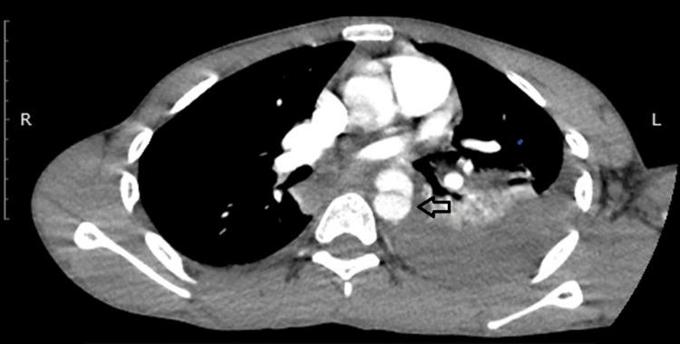

## 문제
An 18-year-old man is brought to the emergency department 1 hour after he was thrown from a motorcycle at high speed. He reports chest and back pain. A left chest tube placed on arrival drained 250 mL of blood, and drainage has since stopped. After 1 L of crystalloid, his blood pressure is 156/94 mm Hg in both arms and pulse is 108/min. Oxygen saturation is 96% on 4 L/min of oxygen by nasal cannula. He is alert, and pulses are palpable and symmetric in all four extremities. Abdominal ultrasonography shows no free fluid. Hemoglobin concentration is 12.9 g/dL and remains unchanged 1 hour later. A contrast-enhanced CT angiogram of the chest is shown. Vascular surgery is consulted. Which of the following is the most appropriate initial pharmacotherapy?

- A. Intravenous tranexamic acid
- B. Intravenous esmolol
- C. Intravenous nitroprusside
- D. Intravenous hydralazine
- E. Intravenous norepinephrine

_Axial contrast-enhanced CT angiography of the chest, arrow and R/L markers as in the original — single-panel figure as published (PMC Open Access Subset, CC BY; no cropping or color adjustment)_

## 정답 및 해설
> 정답: B

- **정답 핵심**: The CT angiogram shows a thin linear filling defect within the lumen of the proximal descending thoracic aorta (intimal flap) with surrounding periaortic and left paravertebral soft tissue (mediastinal hematoma), plus left pleural fluid. After high-speed blunt trauma this is a blunt thoracic aortic injury distal to the left subclavian artery. While repair is arranged, the first step is anti-impulse therapy: an intravenous beta-blocker such as esmolol to bring the heart rate below about 100/min and the systolic pressure to roughly 100 to 120 mm Hg, which lowers the shear force on the injured wall.
- **원리**: <b>Why lower dP/dt, not only pressure</b>: the injured aortic wall tears further when each ejection strikes it hard and fast. Wall stress depends on both the pressure and the rate at which pressure rises with each beat (dP/dt). A beta-blocker lowers heart rate and contractility, so it reduces dP/dt as well as pressure — this is called anti-impulse therapy. Esmolol is preferred because its very short half-life lets it be stopped at once if bleeding elsewhere makes the patient hypotensive.  <b>Why a vasodilator alone is wrong</b>: nitroprusside or hydralazine lowers pressure, but the baroreflex responds with tachycardia and a stronger contraction, which raises dP/dt and can extend the tear. A vasodilator is added only after the beta-blocker has controlled the heart rate.  <b>Where it fits in trauma care</b>: anti-impulse therapy is used once hemorrhage elsewhere is controlled and the patient is not hypotensive — here the chest tube drainage stopped, the abdomen has no free fluid, and hemoglobin is stable. Definitive treatment is usually thoracic endovascular aortic repair (TEVAR); open repair is an alternative.
- **비교**: <table><thead><tr><th style="width:22%">Feature</th><th style="width:39%">Esmolol first (correct)</th><th>Nitroprusside first (closest distractor)</th></tr></thead><tbody> <tr><td>Heart rate</td><td>Falls (beta-1 blockade)</td><td>Rises (reflex sympathetic response)</td></tr> <tr><td>dP/dt (shear on the tear)</td><td>Falls</td><td>Can rise despite lower pressure</td></tr> <tr><td>Role</td><td>First agent — target HR &lt; 100/min</td><td>Second agent, only after beta-blockade if pressure stays high</td></tr> </tbody></table> Whichever way it is asked, the order is "rate first, then pressure": a vasodilator without a beta-blocker is the classic error in aortic injury and aortic dissection.
- **오답 이유**:
  - (A) Tranexamic acid reduces mortality when given within 3 hours to bleeding trauma patients in hemorrhagic shock; it would be a reasonable adjunct if he were hypotensive from ongoing hemorrhage, but it does not protect the aortic wall.
  - (C) Nitroprusside is added when systolic pressure remains high after the heart rate is controlled with a beta-blocker; used first, it causes reflex tachycardia that increases shear on the torn aorta.
  - (D) Hydralazine is a direct arteriolar dilator that provokes marked reflex tachycardia; it would be considered for hypertension in pregnancy, not as the first drug for an aortic wall injury.
  - (E) Norepinephrine raises pressure and would be used only for vasodilatory shock after hemorrhage is excluded; this patient is hypertensive, and raising pressure would stress the injured aorta.
- **함정**: Choosing a pure vasodilator because the blood pressure is high — the heart rate must be controlled first, or reflex tachycardia increases shear on the tear.
- **학습목표**: 둔상 흉부 대동맥 손상(하행대동맥 내막 피판)에서 수술·혈관내 수복 전 첫 약물 처치가 정맥 베타차단제로 심박수와 혈압을 낮추는 것임을 안다
- **근거·출처**: Fox N, et al. Evaluation and management of blunt traumatic aortic injury: a practice management guideline from the Eastern Association for the Surgery of Trauma. J Trauma Acute Care Surg 2015;78:136-146 · Isselbacher EM, et al. 2022 ACC/AHA Guideline for the Diagnosis and Management of Aortic Disease. Circulation 2022;146:e334-e482 (anti-impulse therapy: beta-blocker first, HR < 60-80, SBP < 120) · PMC13086891 Figure 2 — case report of traumatic thoracic aortic injury after motorcycle trauma (teacher-only) · 작성자 판독(2026-10-11): 조영증강 흉부 CT 축상, 하행대동맥 근위부 내강 안 선상 결손(원 화살표 — 내막 피판), 대동맥 둘레·왼쪽 척추 옆 연부조직 음영, 왼쪽 흉강 뒤쪽 액체와 왼쪽 아래엽 경화

## 출처
- Successful Open Surgical Repair of Traumatic Stanford Type B Thoracic Aortic Dissection Following Motorcycle Trauma: A Case Report. Cureus. 2026 Mar 17;18(3):e105408. doi: 10.7759/cureus.105408 (CC BY) — Figure 2 · CC BY · https://creativecommons.org/licenses/
