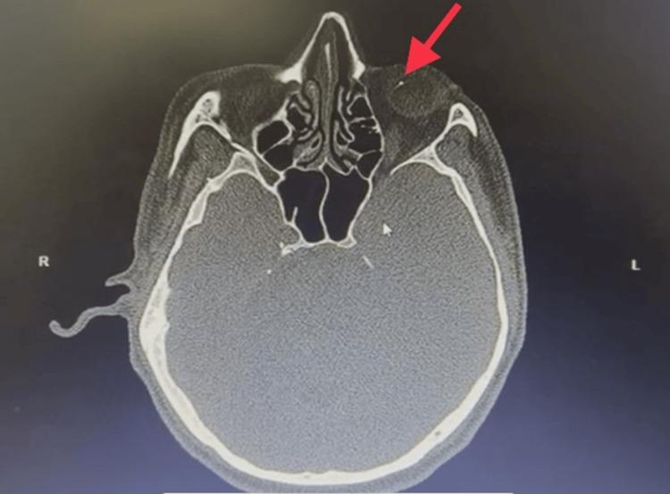

## 문제
43세 남자가 왼쪽 눈이 1년 전부터 조금씩 흐려지고 자주 충혈되어 왔다. 다른 병원에서 만성 앞포도막염으로 스테로이드 점안을 여러 차례 받았으나 재발하였다. 10년 동안 금속 연마 작업을 해 왔고, 눈을 다친 기억은 없다. 교정시력은 오른쪽 1.0, 왼쪽 0.4 이다. 왼쪽 홍채는 오른쪽보다 짙은 적갈색이고, 왼쪽 동공은 오른쪽보다 크며 빛반사가 느리다. 왼쪽 수정체 앞낭 아래에 갈색 점들이 흩어져 있다. 안압은 양쪽 16 mmHg 이다. 오른쪽 눈은 정상이다. 안와 높이의 뇌 CT 축상면(뼈 창)은 그림과 같다. 진단은?

- A. 안구 구리침착증
- B. Fuchs 이색성 홍채모양체염
- C. 교감성 안염
- D. HLA-B27 연관 앞포도막염
- E. 안구 철침착증

_안와 축상 CT(뼈 창, 모니터 화면 촬영본), 빨간 화살표와 R·L 표지는 원 그림의 것 — 출판된 증례 그림 그대로 (PMC Open Access Subset, CC BY — 크롭·보정 없음)_

## 정답 및 해설
> 정답: E

- **정답 핵심**: CT 에서 왼쪽 안구 앞쪽 가장자리에 점 모양의 고음영 이물이 있다. 금속 연마 작업자가 다친 기억 없이 한쪽 눈에 만성·재발성 포도막염을 겪고, 같은 눈의 홍채가 짙은 적갈색으로 변하고 동공이 커지며 수정체 앞낭 아래 갈색 침착이 생긴 것은 안구 안에 남은 철 이물에서 철이온이 녹아 조직에 쌓인 안구 철침착증이다.
- **원리**: <b>왜 철이 눈을 망가뜨리는가</b>: 눈 속에 남은 철 조각은 천천히 산화되어 철이온을 내놓고, 이 철이온은 상피세포(홍채·수정체·섬모체·망막 색소상피)에 쌓여 Fenton 반응으로 활성산소를 만든다. 그래서 홍채가 적갈색으로 짙어지고(이색증), 동공 괄약근이 손상되어 동공이 커지며, 수정체 앞낭 아래에 갈색 점이 생기고, 섬유주에 쌓이면 이차 녹내장, 망막에 쌓이면 시야 좁아짐과 망막전위도의 b파 감소가 온다.  <b>왜 다친 기억이 없는가</b>: 망치질·연마 중 튄 작은 금속 조각은 빠른 속도로 각막이나 공막을 뚫고 들어가 상처가 금방 닫힌다. 그래서 「원인 모를 한쪽 포도막염」으로 오랫동안 치료받다가 늦게 발견되는 일이 많다. 금속 이물이 의심되면 CT 로 찾는다(MRI 는 자성 금속이 움직일 수 있어 금기).  <b>치료</b>: 망막전위도가 더 나빠지기 전에 유리체절제술로 이물을 빼낸다.
- **비교**: <table><thead><tr><th style="width:22%">구분</th><th style="width:39%">안구 철침착증(정답)</th><th>Fuchs 이색성 홍채모양체염(가장 가까운 오답)</th></tr></thead><tbody> <tr><td>홍채 색</td><td>침범 눈이 <b>더 짙다</b>(철 침착)</td><td>침범 눈이 <b>더 옅다</b>(기질 위축)</td></tr> <tr><td>CT</td><td>안구 안 금속성 고음영 이물</td><td>이물 없음</td></tr> <tr><td>그 밖의 소견</td><td>동공 확대, 수정체 앞낭 아래 갈색 점</td><td>각막 뒷면 작은 별 모양 침착물, 후낭하 백내장</td></tr> </tbody></table> 두 질환 모두 한쪽 만성 포도막염과 이색증을 일으킨다 — 홍채가 짙어졌는지 옅어졌는지, CT 에 이물이 있는지가 가른다.
- **오답 이유**:
  - ① 안구 구리침착증은 구리 함량이 높은 이물(황동 등)에서 생기며 각막 Descemet 막의 녹색 고리와 해바라기 백내장이 특징이다. 이 환자처럼 적갈색 홍채와 갈색 침착이면 철이 원인이다.
  - ② Fuchs 이색성 홍채모양체염도 한쪽 만성 포도막염과 이색증을 보이지만 침범 눈의 홍채가 더 옅어지고 CT 에 이물이 없을 때 진단한다.
  - ③ 교감성 안염은 한쪽 눈의 관통상 뒤 수주~수개월에 다치지 않은 반대쪽 눈까지 양쪽 육아종성 포도막염이 생길 때 진단한다. 이 환자의 오른쪽 눈은 정상이다.
  - ④ HLA-B27 연관 앞포도막염은 강직척추염 등과 함께 갑자기 생겼다 낫는 급성 한쪽 포도막염이며, 홍채 색 변화나 안구 내 이물이 있으면 진단하기 어렵다.
- **함정**: 이색증과 한쪽 만성 포도막염만 보고 Fuchs 이색성 홍채모양체염을 고르는 것 — 침범 눈의 홍채가 짙어졌고 CT 에 이물이 있다.
- **학습목표**: 눈 속 철 이물이 오래 남아 생기는 안구 철침착증을 한쪽 만성 포도막염·홍채 색 변화·동공 확대와 CT 의 안구 내 고음영 이물로 진단한다
- **근거·출처**: Kanski's Clinical Ophthalmology, 9th ed. Ch. Trauma — intraocular foreign bodies: siderosis bulbi, chalcosis · American Academy of Ophthalmology. Basic and Clinical Science Course, Section 9 Uveitis and Ocular Inflammation (Fuchs uveitis syndrome — hypochromic heterochromia) · PMC12888828 Figure 2 — case report of ocular siderosis masquerading as chronic anterior uveitis (teacher-only) · 작성자 판독(2026-10-11): 안와 축상 CT(화면 촬영본), 왼쪽 안구 앞쪽 가장자리에 점 모양 고음영 이물(원 빨간 화살표), 안와벽 골절 없음

## 출처
- The Rusty Eye: Ocular Siderosis Masquerading as Chronic Anterior Uveitis. Cureus. 2026 Jan 11;18(1):e101280. doi: 10.7759/cureus.101280 (CC BY) — Figure 2 · CC BY · https://creativecommons.org/licenses/
