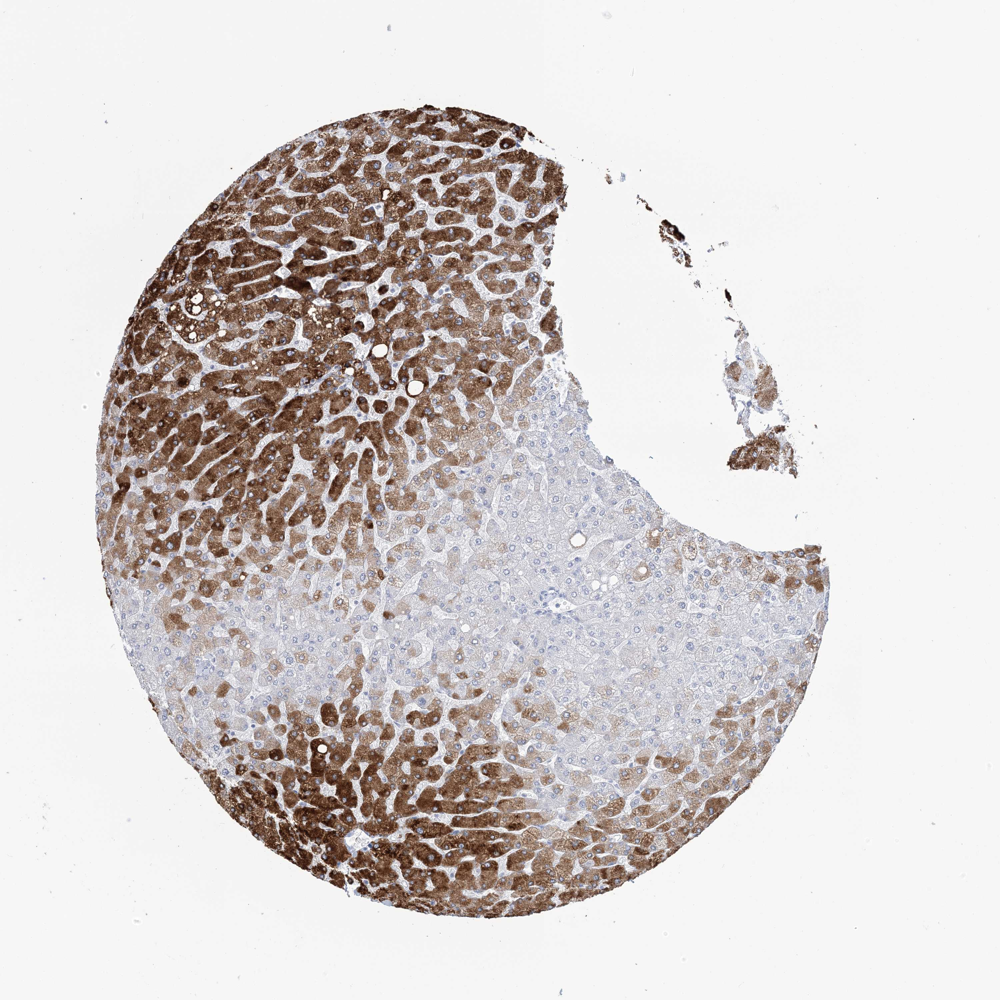

## 문제
55세 남자가 대장암 간 전이로 간 부분절제술을 받았다. 수술 전 간기능 검사는 정상이었고, 음주력과 간질환 병력은 없다. 절제 검체 중 종양에서 떨어진 정상 간 조직으로 약물을 산화시키는 대사 효소에 대한 면역조직화학염색을 하였다. 그림처럼 간세포의 갈색 염색은 소엽의 한 구역에 띠 모양으로 진하고, 그 사이 문맥역 쪽 간세포 띠는 거의 염색되지 않는다. 이 효소가 진하게 발현되는 소엽 구역에 괴사가 주로 생기는 것은?

- A. 아세트아미노펜 과다복용
- B. 황린 중독
- C. 자간증
- D. 만성 B형간염의 경계판 괴사
- E. 원발 담즙성 담관염

_조직 마이크로어레이 코어의 면역조직화학염색(DAB 갈색, 헤마톡실린 대조염색), 원 배율 (Human Protein Atlas, CC BY 4.0 — 크롭·보정 없음)_

## 정답 및 해설
> 정답: A

- **정답 핵심**: 그림의 효소는 간세포에만 발현되고 소엽 안에서 한 구역에 띠 모양으로 진하다. 산화 반응을 하는 시토크롬 P450 효소는 산소 분압이 낮은 중심정맥 주위(3구역) 간세포에 몰려 있고, 문맥역 쪽(1구역)은 약하다. 아세트아미노펜은 이 효소(CYP2E1·CYP3A4 등)가 독성 대사물 NAPQI 로 바꾸므로, 과다복용하면 효소가 많은 3구역에서 글루타티온이 먼저 고갈되어 중심소엽 괴사가 생긴다.
- **원리**: <b>왜 3구역에 대사 효소가 많은가</b>: 혈액은 문맥역(1구역)에서 들어와 동양혈관을 지나 중심정맥(3구역)으로 빠진다. 1구역 간세포는 산소가 풍부해 산화적 대사(포도당신생합성, 요소 생성)를 맡고, 3구역은 산소가 적은 대신 시토크롬 P450 에 의한 약물·독소의 산화, 해당, 지방 합성을 맡는다(대사 구역화). 그래서 그림처럼 CYP 효소 면역염색은 중심정맥 주위에 띠 모양으로 진하다.  <b>왜 아세트아미노펜 괴사가 3구역에 생기는가</b>: 치료 용량에서는 대부분 포합(글루쿠론산·황산)되고 일부만 CYP 가 NAPQI 로 산화시켜 글루타티온과 결합해 해독된다. 과량이면 포합이 포화되어 NAPQI 가 많이 생기는데, 효소가 많은 3구역에서 가장 많이 생기고 그곳은 산소도 적어 글루타티온이 먼저 바닥난다. 남은 NAPQI 가 단백질과 결합해 간세포가 죽는다. 같은 이유로 사염화탄소·할로탄 독성과 허혈(쇼크 간)도 3구역에 온다.  <b>1구역 손상의 예</b>: 황린·철 중독처럼 독소가 대사 없이 바로 작용하면 처음 닿는 문맥역 쪽이 먼저 죽고, 자간증은 문맥역 둘레에 섬유소 침착과 출혈성 괴사를 일으킨다.
- **비교**: <table><thead><tr><th style="width:22%">구분</th><th style="width:39%">아세트아미노펜(정답)</th><th>황린 중독(가장 가까운 오답)</th></tr></thead><tbody> <tr><td>괴사 구역</td><td>3구역(중심소엽)</td><td>1구역(문맥역 주위)</td></tr> <tr><td>독성의 원천</td><td>CYP 가 만든 대사물(NAPQI) — 효소가 많은 곳</td><td>독소 자체 — 혈액이 처음 닿는 곳</td></tr> <tr><td>그림과의 관계</td><td>효소가 진한 구역 = 손상 구역</td><td>효소가 거의 없는 구역이 손상</td></tr> </tbody></table> 대사를 거쳐야 독이 되는 물질은 3구역을, 그 자체로 독인 물질과 자간증은 1구역을 먼저 망가뜨린다.
- **오답 이유**:
  - ② 황린 중독은 대사 없이 직접 독성을 내므로 혈액이 처음 닿는 문맥역 주위(1구역)에 괴사가 생긴다. 효소가 거의 없는 띠 쪽이 손상될 때 답이 된다.
  - ③ 자간증은 문맥역 주위 동양혈관에 섬유소가 침착되며 1구역에 출혈성 괴사를 일으킨다. 임신 말기 고혈압·단백뇨 환자의 간 손상 구역을 물을 때 답이다.
  - ④ 만성 B형간염의 경계판 괴사는 문맥역 염증이 경계판을 넘어 들어가며 문맥역 바로 옆 간세포가 죽는 것이다. 대사 효소 분포와는 무관한 면역 손상이다.
  - ⑤ 원발 담즙성 담관염은 문맥역의 소엽간 담관을 림프구가 파괴하는 질환이다. 간세포 효소가 아니라 담관세포가 표적이며, 이 효소는 담관세포에서 음성이다.
- **함정**: 갈색 띠가 문맥역을 둘러싼다고 여겨 1구역 질환을 고르는 것 — 산화 약물대사 효소는 산소가 적은 중심정맥 주위에 몰려 있다.
- **학습목표**: 간 소엽에서 시토크롬 P450 약물대사 효소가 중심정맥 주위(3구역)에 몰려 있어 아세트아미노펜 독성 대사물에 의한 괴사가 그 구역에 생김을 안다
- **근거·출처**: Kumar V, Abbas AK, Aster JC. Robbins and Cotran Pathologic Basis of Disease, 10th ed. Ch. 18 Liver and Gallbladder (hepatic zonation; drug- and toxin-induced injury — centrilobular necrosis by acetaminophen, periportal injury) · Lee WM. Drug-induced acute liver failure. Clin Liver Dis 2013;17:575-586 · Human Protein Atlas — CYP3A4 liver tissue, hepatocytes high, cholangiocytes not detected (teacher-only) · 작성자 판독(2026-10-11): 간 TMA 코어, 간세포 세포질의 진한 갈색 염색이 넓은 띠를 이루고 그 사이 띠는 거의 음성, 담관세포 음성

## 출처
- Human Protein Atlas, CYP3A4 / Liver (CC BY 4.0), https://images.proteinatlas.org/33671/76592_A_8_4.jpg · Creative Commons Attribution 4.0 International · https://www.proteinatlas.org/about/licence
