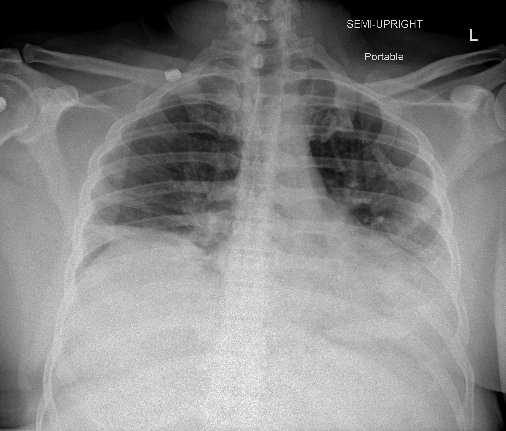

## 문제
A 63-year-old man is admitted to the hospital because of fever, dry cough, and progressive shortness of breath for 8 days. He has type 2 diabetes mellitus treated with metformin. A nasopharyngeal swab is positive for SARS-CoV-2 by RT-PCR. Temperature is 38.4°C (101.1°F), pulse is 102/min, respirations are 26/min, and blood pressure is 134/80 mm Hg. Oxygen saturation is 88% on room air and rises to 94% with 4 L/min of oxygen by nasal cannula. Crackles are heard at both lung bases. Leukocyte count is 6800/mm3 with lymphocytes 9%. Serum procalcitonin concentration is 0.08 ng/mL (N < 0.1). A portable chest x-ray is shown. Which of the following is most likely to reduce this patient's risk of death?

- A. Azithromycin
- B. Lopinavir-ritonavir
- C. Dexamethasone
- D. Hydroxychloroquine
- E. Ivermectin

_Portable semi-upright anteroposterior chest radiograph, position markers as in the original (TCIA, CC BY 4.0; DICOM converted with standard windowing, no cropping)_

## 정답 및 해설
> 정답: C

- **정답 핵심**: The chest x-ray shows hazy ground-glass and consolidative opacities in both lower lung zones with low lung volumes — bilateral viral pneumonia. He has confirmed SARS-CoV-2 infection on day 8 of illness and needs supplemental oxygen. In this phase, lung injury is driven mainly by the host inflammatory response, and dexamethasone 6 mg daily for up to 10 days reduced 28-day mortality in patients needing oxygen or mechanical ventilation (RECOVERY trial).
- **원리**: <b>Why a corticosteroid helps in this phase</b>: COVID-19 has an early viral replication phase (first week) and a later inflammatory phase. By the second week, when patients become hypoxemic, viral load is falling, and alveolar damage comes from cytokine release and immune cell infiltration. A corticosteroid dampens this inflammation, so it helps most when the disease is severe enough to need oxygen.  <b>Why timing and severity matter</b>: in RECOVERY, dexamethasone lowered mortality in patients on oxygen and most in those on mechanical ventilation, but showed no benefit (and a trend toward harm) in patients not needing oxygen, in whom suppressing immunity during active replication offers no gain.  <b>Why the other drugs fail</b>: hydroxychloroquine, ivermectin, lopinavir-ritonavir, and azithromycin each failed to reduce mortality in large randomized trials. Antiviral treatment with remdesivir is most useful early, and immunomodulators such as tocilizumab or baricitinib are added to dexamethasone when oxygen needs rise rapidly.
- **비교**: <table><thead><tr><th style="width:22%">Feature</th><th style="width:39%">Dexamethasone (correct)</th><th>Azithromycin (closest distractor)</th></tr></thead><tbody> <tr><td>Target</td><td>Host inflammatory lung injury</td><td>Bacterial co-infection (atypical organisms)</td></tr> <tr><td>Mortality in hospitalized COVID-19</td><td>Reduced in patients needing oxygen</td><td>No benefit in randomized trials</td></tr> <tr><td>Clue in this patient</td><td>Day 8, hypoxemia requiring oxygen</td><td>Procalcitonin is low — bacterial co-infection is unlikely</td></tr> </tbody></table> Bilateral opacities with hypoxemia in the second week call for an anti-inflammatory drug; an antibiotic is added only when bacterial infection is suggested.
- **오답 이유**:
  - (A) Azithromycin would be added if a bacterial co-infection were suggested by a high procalcitonin or lobar consolidation; in RECOVERY it did not reduce mortality from COVID-19 itself.
  - (B) Lopinavir-ritonavir failed to reduce mortality in hospitalized COVID-19 patients; ritonavir-boosted nirmatrelvir is the protease inhibitor used early in outpatients at high risk, not in this hypoxemic inpatient.
  - (D) Hydroxychloroquine showed no mortality benefit in hospitalized patients in RECOVERY and other trials; it remains a treatment for lupus and rheumatoid arthritis, not COVID-19.
  - (E) Ivermectin did not shorten illness or reduce mortality in randomized trials of COVID-19; it is indicated for strongyloidiasis, which should be treated before steroids in patients from endemic areas.
- **함정**: Choosing an antibiotic for bilateral opacities — the low procalcitonin argues against bacterial co-infection, and only a corticosteroid lowers mortality in hypoxemic patients.
- **학습목표**: 산소 보충이 필요한 SARS-CoV-2 폐렴 입원 환자에서 사망률을 낮추는 약이 덱사메타손임을 안다
- **근거·출처**: RECOVERY Collaborative Group. Dexamethasone in hospitalized patients with Covid-19. N Engl J Med 2021;384:693-704 · NIH COVID-19 Treatment Guidelines Panel. Therapeutic management of hospitalized adults with COVID-19 (final version, 2024) · 작성자 판독(2026-10-11): 이동식 반직립 AP 흉부 X선, 양쪽 아래 폐야의 흐린 간유리·경화 음영, 폐용적 작음, 위쪽 폐야 비교적 보존, 기흉 없음

## 출처
- COVID-19-AR, The Cancer Imaging Archive (CC BY 4.0) · series …60874921 · Creative Commons Attribution 4.0 International · https://www.cancerimagingarchive.net/data-usage-policies-and-restrictions/
